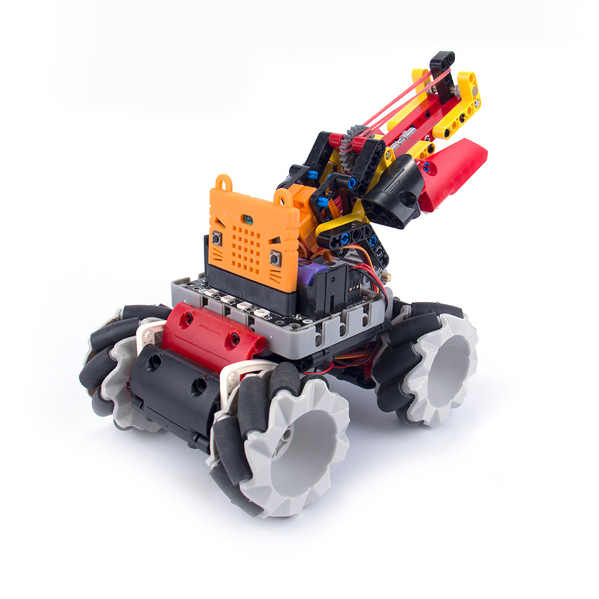
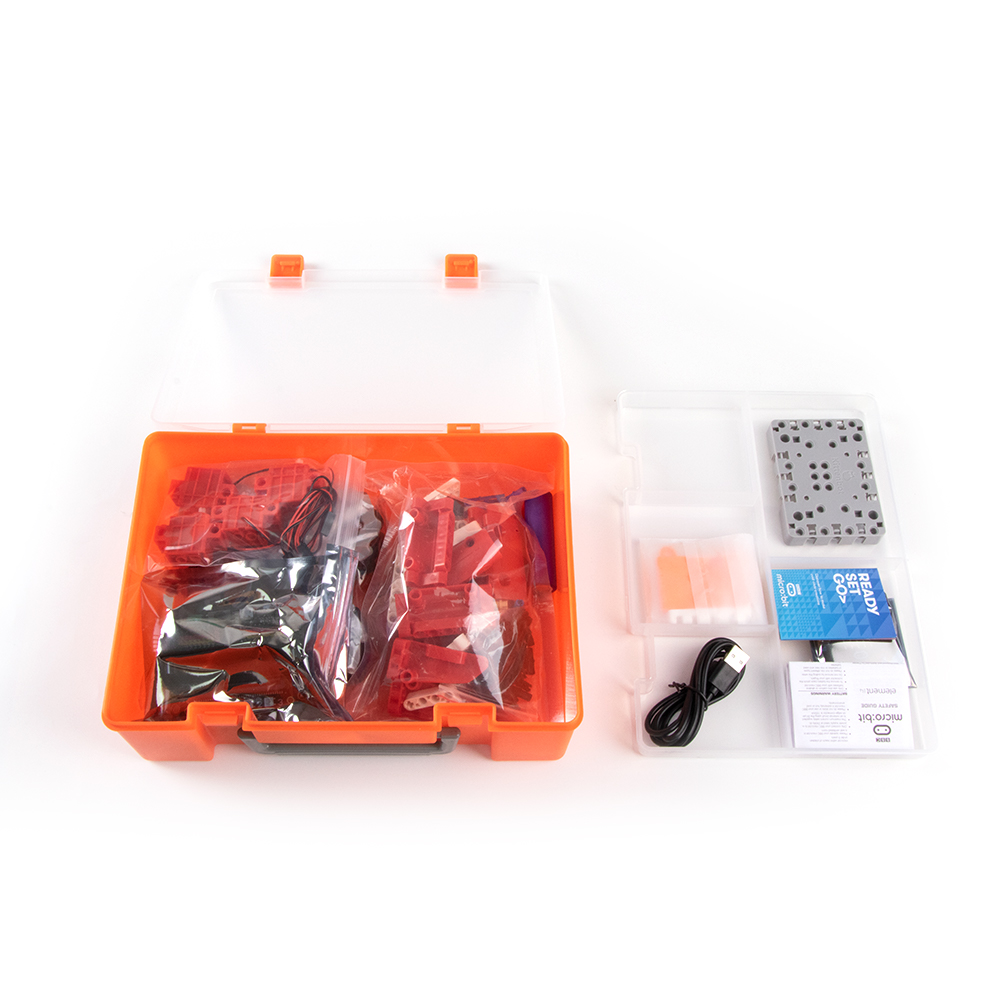

# Mecanum Wheel Robotic Car Kit

### Mecanum Wheel Robotic Car(Basic) (HKBK8021A)

### Mecanum Wheel Robotic Car(Shooter) (HKBK8032B)

## Product Information

Mecanum Wheel Robotic Car is an advanced educational kit for BBC Micro:bit. Mecanum Wheels have the unique ability of omnidirectional movement, allowing extremely flexible and agile robots to be made, as these wheels are able to traverse tight and narrow spaces.

There are 2 versions of this kit, the Shooter version comes with extra building blocks to build a turret capable of shooting rubber bands. It also comes with a JoyFrog controller for finer and more precise control.

## Package Contents

- Robotbit Expansion Board x1
- GeekServo 9G Motor x4
- Mecanum Wheel x4
- Mecanum Wheel Adapter x4
- Building Blocks Set x1
- 18650 Lithium Battery x1
- USB Cablex1
- Microbit Silicon Case x1
- GeekServo 9G Servo x1 (Shooter Version)
- GeekServo 360 Servo x1 (Shooter Version)
- Extra Building Blocks Set x1 (Shooter Version)
- JoyFrog x1 (Shooter Version)
- Battery Box x1 (Shooter Version)
- Rubber Band x1 (只限射擊版)

## 產品特色

- 基於Microbit的圖形化編程，更容易上手
- 兼容樂高積木，擴展性高
- 全方位移動，新穎兼靈活性高
- 支援MakeCode和Kittenblock編程

## 產品參數

- 包裝盒尺寸：251x182x81mm
- 重量：880g(基礎版)，1140g(射擊版)
- 麥輪尺寸：64mm外經

## 介紹短片

