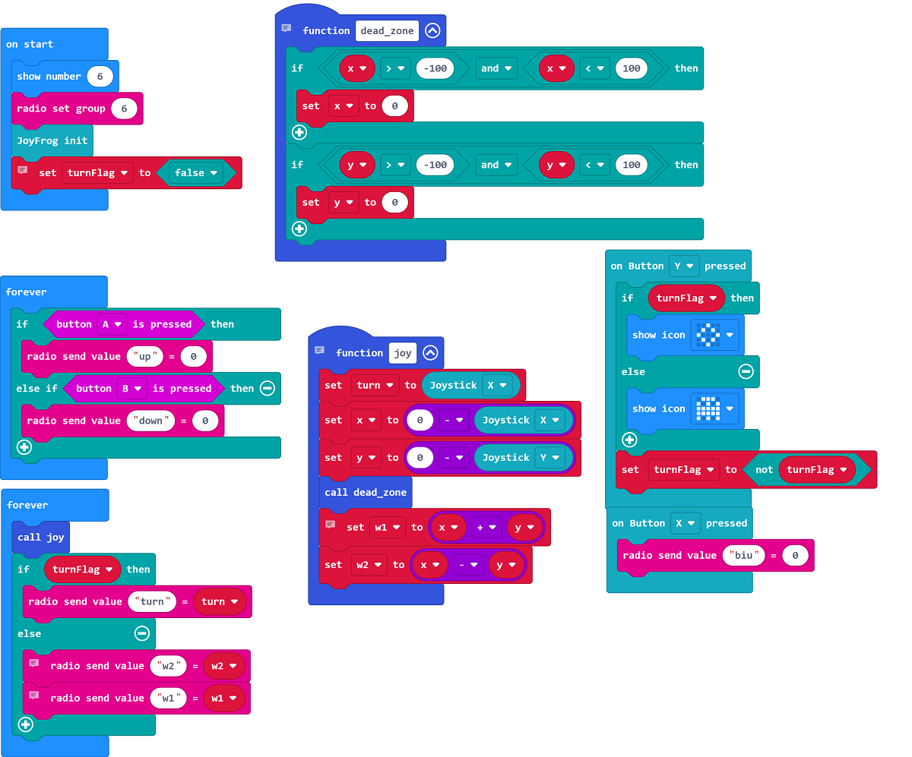

# Sample Programs

## Robotic Car Main Program

[Sample Program](https://makecode.microbit.org/_iYvD2CDYaM4Y)

## JoyFrog Controller Program

[Sample Program](https://makecode.microbit.org/_2yoUfrd7JHvV)

## Program Instructions

1. Load some rubber bands onto the gear.
2. Turn on the model.
3. Control the movement of the robot using the JoyStick.
4. Press Y to switch between steering modes.
5. Press A and B to adjust turret angle.
6. Press X to shoot a rubber band.