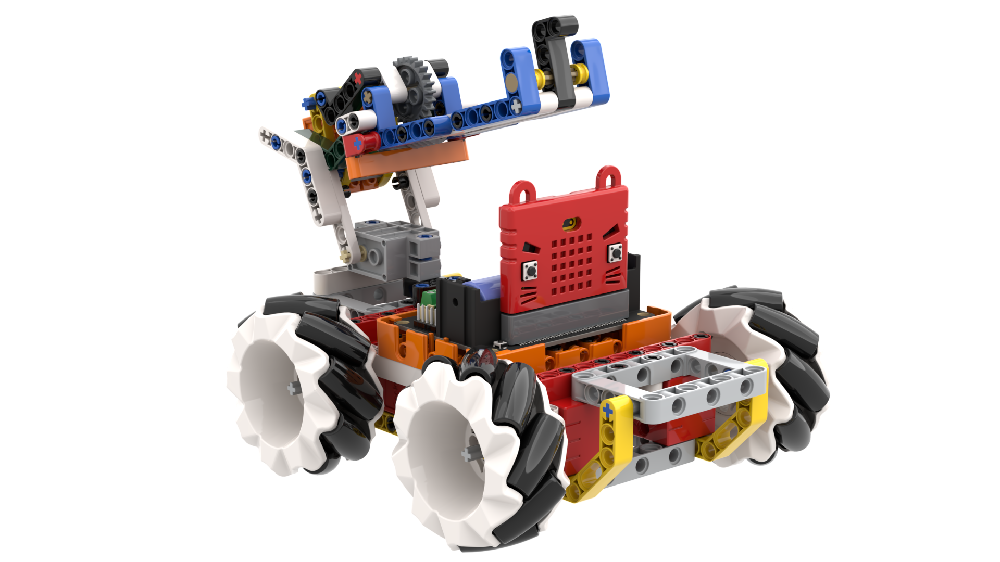
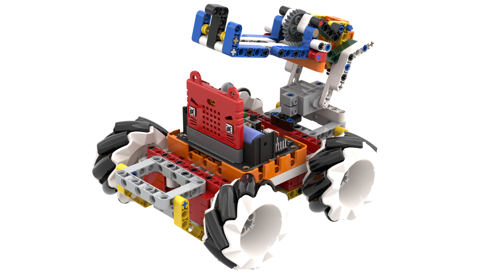
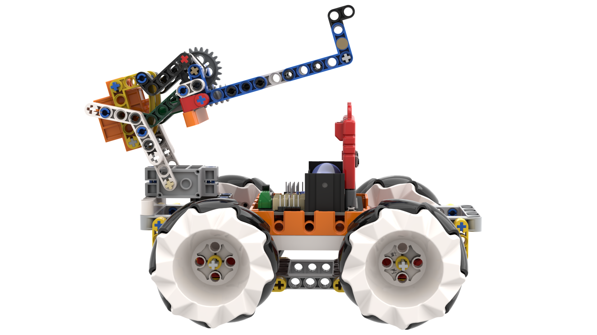
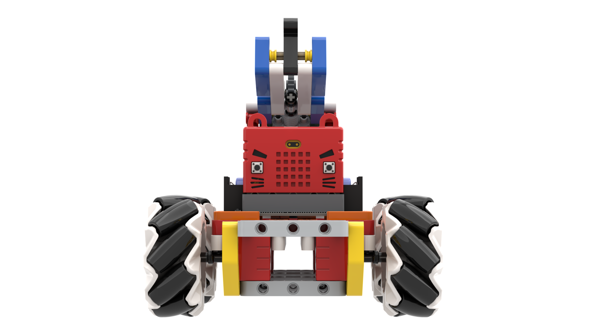

# Mecanum Wheel Robot 2KG

Mecanum Wheel Robot is the upgraded version of the Mecannum Wheel Robot, this version uses 4 Geekservo 2KG motors to provide more speed and power to the robot.

## Speical Features

- Supports graphical programming for Micro:bit
- Compatible with plastic building bricks for high expandability
- Omni-directional movement, unique and highly flexible
- Powerful thanks to its 2KG Geekservo Motors
- Supports MakeCode and Kittenblock

## Kit Contents

- Robotbit Edu x1
- Plastic Building Brick Set x1
- GeekServo 2KG Motor x4
- Mecanum Wheel x4
- GeekServo O360 Motor x1
- Turret Expansion Set x1
- 18650 Lithium Ion Battery x1

## Product Showcase

