# Meowbit Creator Kit

### Meowbit Creator Kit

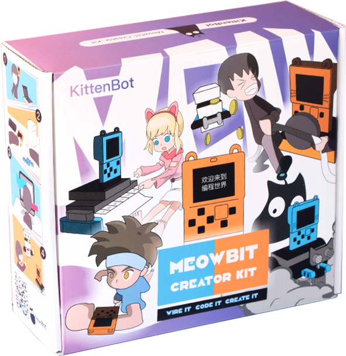

Meowbit Creator Kit is an education kit developed for Meowbit to utilise the hardware capabilities of Meowbit. This kit comes with multiple sensors and actuators, combining with building bricks, this kit expands the flexibility of Meowbit, allowing more unique games to be created.

## Meowbit Creator Kit Contents

- Robotbit Expansion Board x1
- Sliding Potentialmeter x1
- Infra Red Line Follow Sensor x1
- Ambient Sound Sensor x1
- RGB LED Module x1
- NekoUltrasound Module x1
- GeekServo 9G Motor x1
- GeekServo 9G Servo x1
- Male to Male Dupont Wires x20
- Male to Female Dupont Wires x20
- 18650 Litihum Battery x1
- Conductive Copper Stickers x1 Sheet
- USB Cable x1
- Building Bricks x1 Bag
- Decorative Cardboard x1 Sheet
- Double Sided Adhesive Tape x1 Roll
- Robotbit Base x1

## Special Features

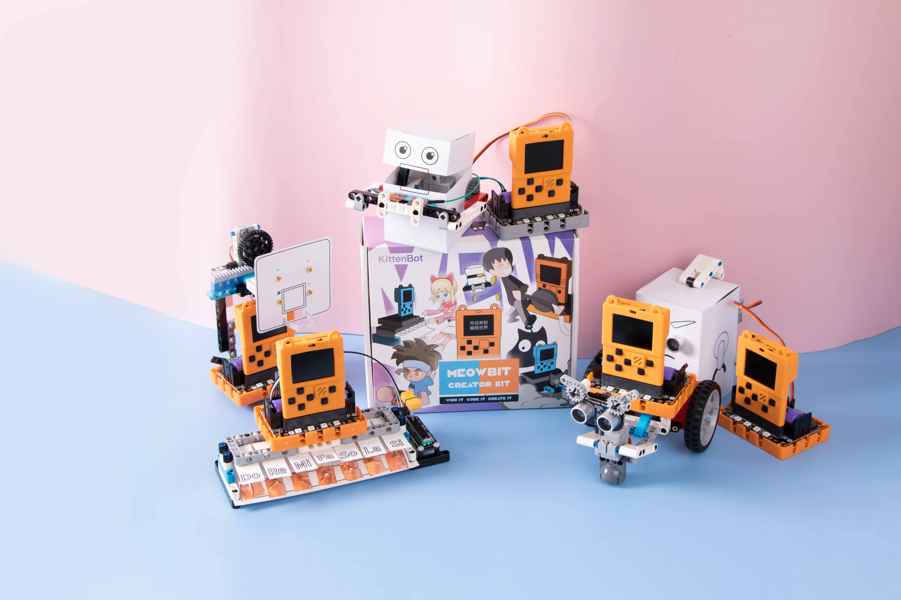

1. Meowbit can display dynamic graphics and text in many languages, allowing your creations to be more flexible and visually appealing
2. Supports coding with both MakeCode Arcade or Kittenblock, lowering the requirements for coding skills

## Specifications

- Package Size: 195x175x70mm
- Weight: 650g

## Model Showcase

### 1. Step Counter

### 2. Tug-Of-War

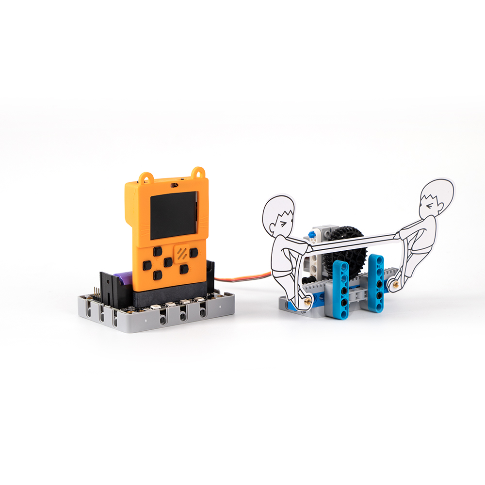

### 3. Coin Collector

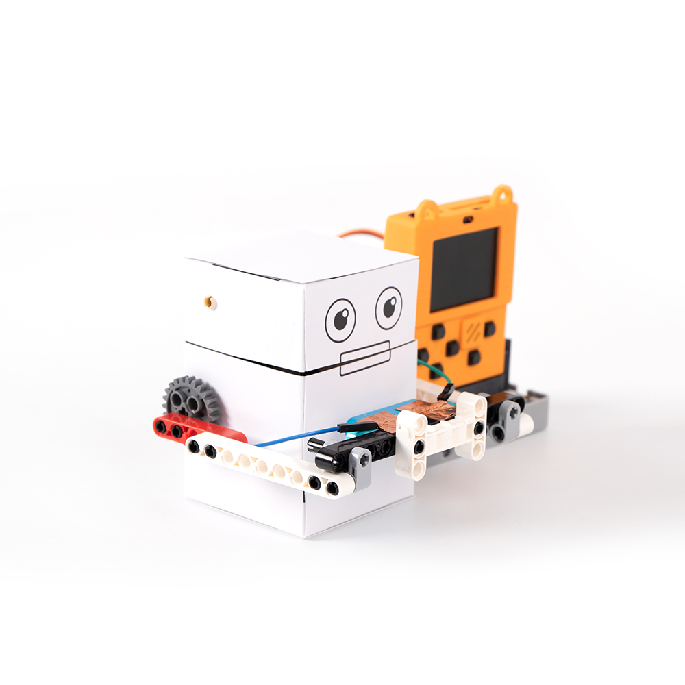

### 4. Rubbish Bin

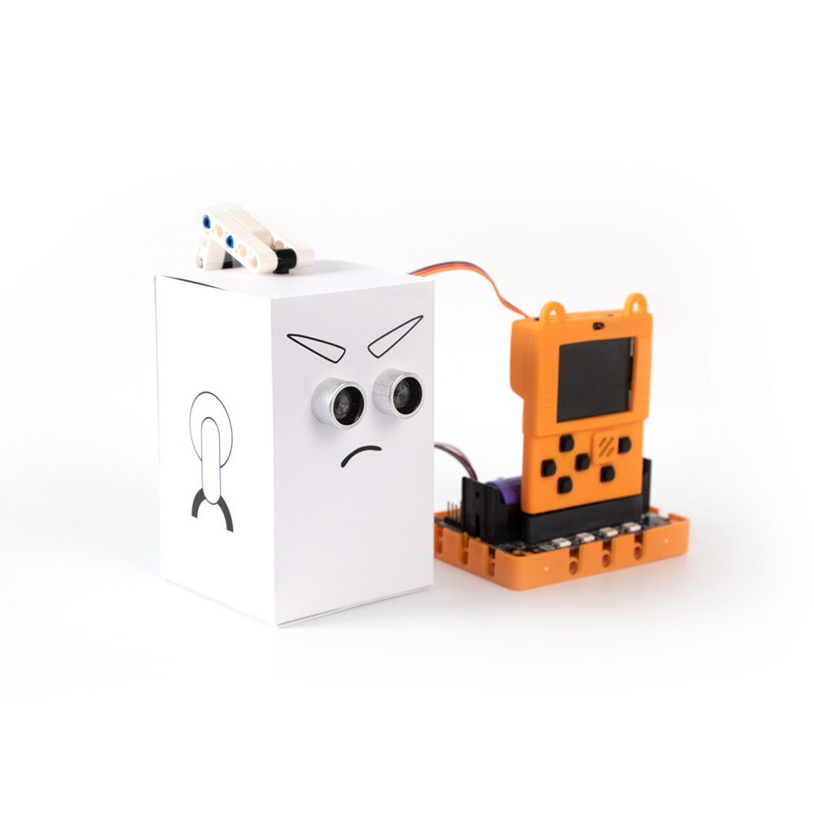

### 5. Basketball Game

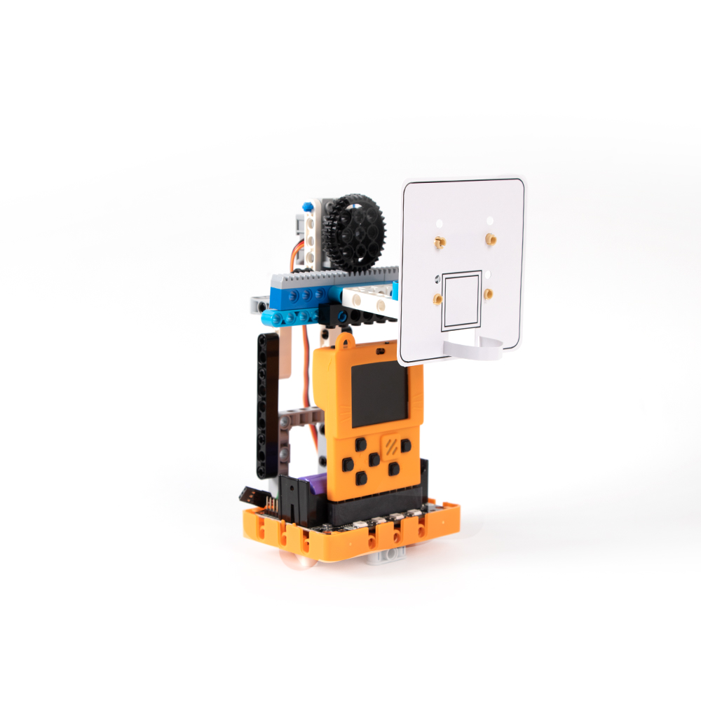

### 6. Piano Master

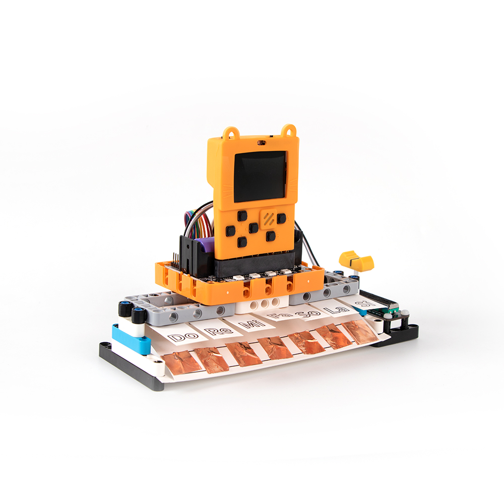

### 7. Voice Control Lights

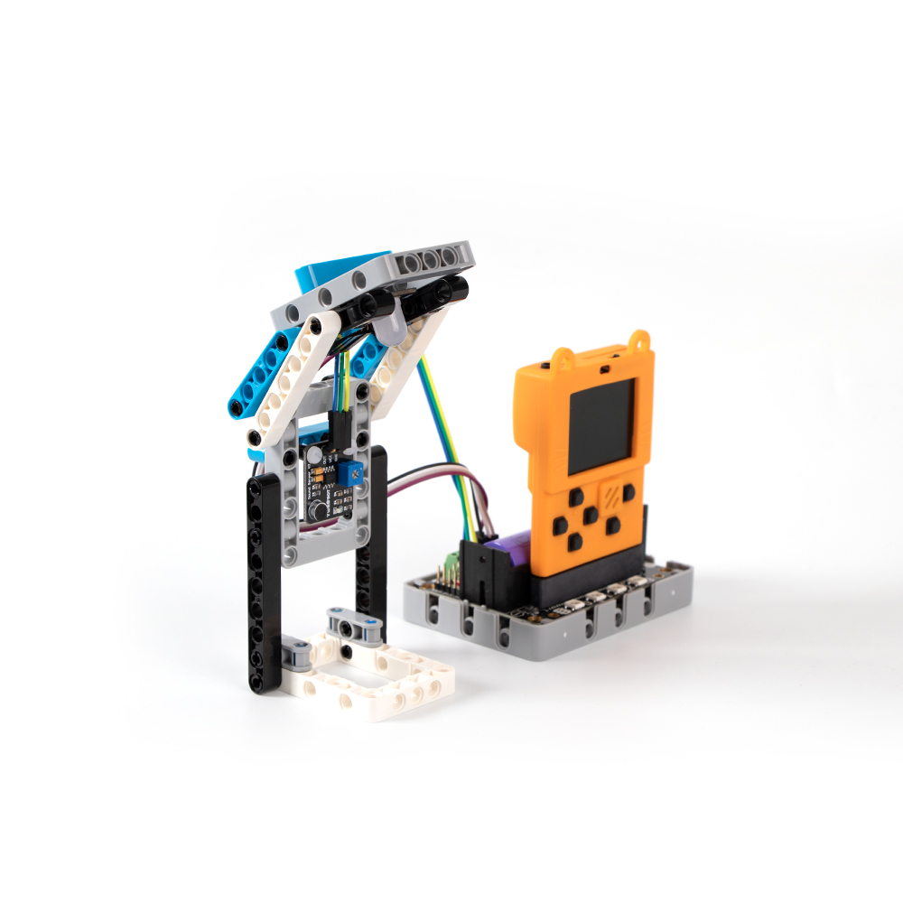

### 8. Anti-Noise Window

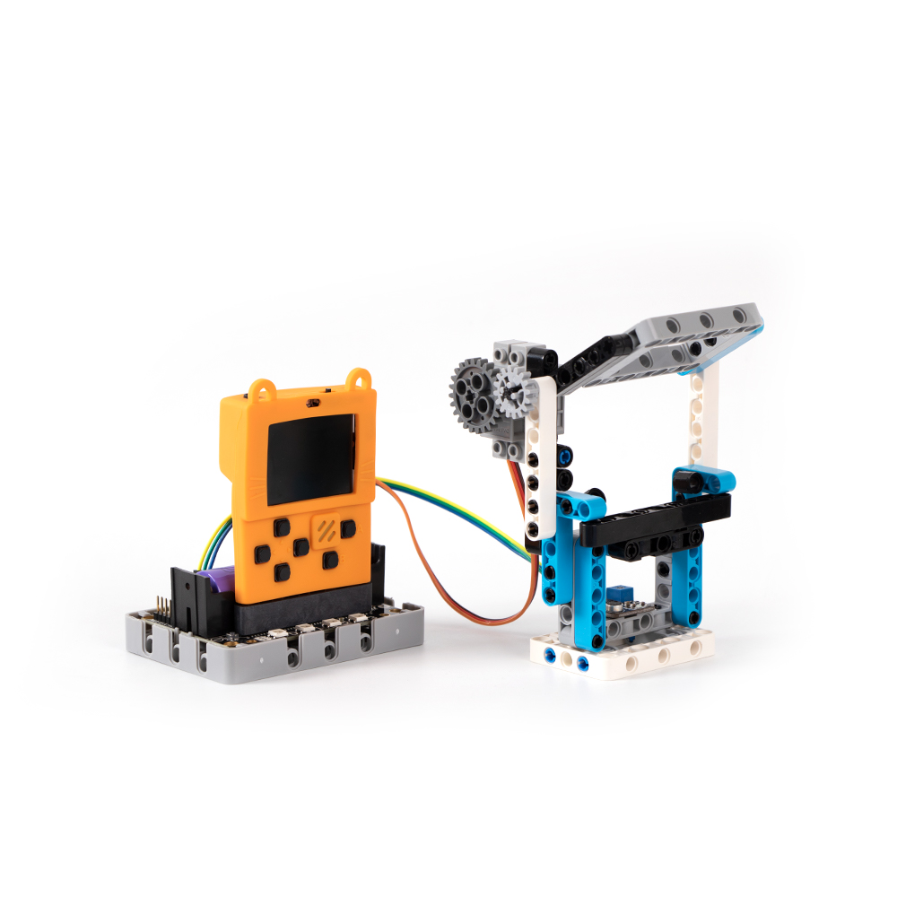

### 9. Line Follower Robot

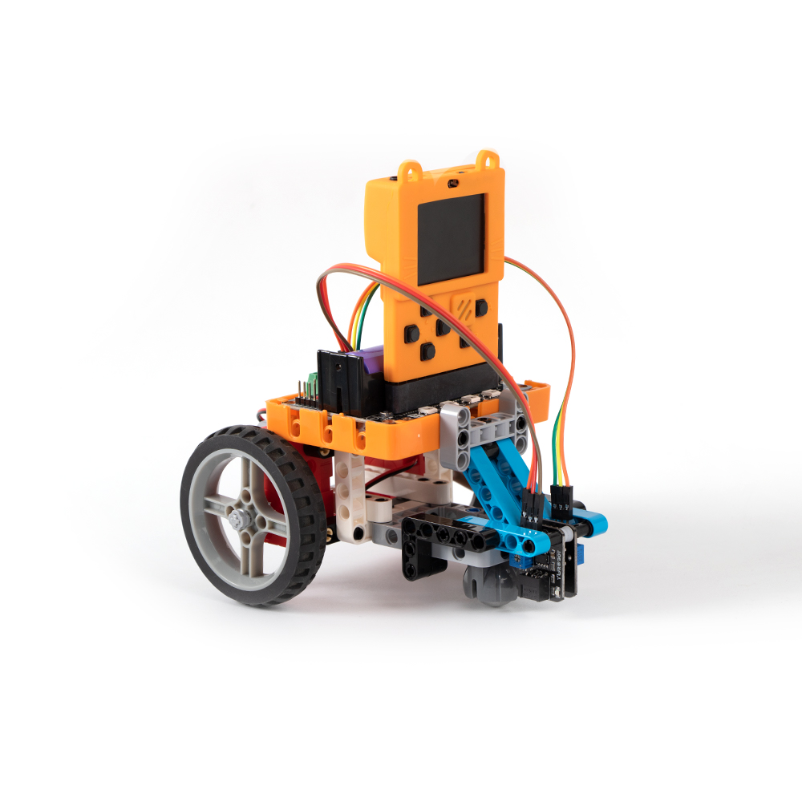

### 10. Obstacle Avoiding Robot Cat

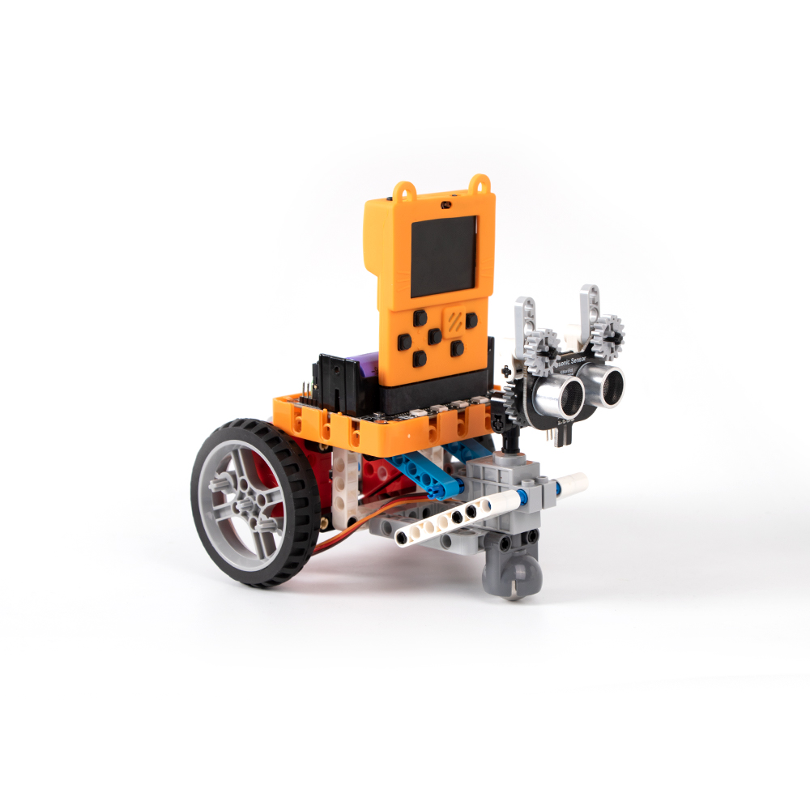

### 11. Smart Parking Lot

