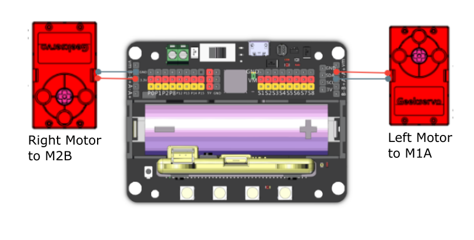

# 10. Obstacle Avoiding Robot Cat

## Building Instructions Download

[Building Instructions Download](https://drive.google.com/drive/folders/16T0mfS0QbxXfHf4GvNz62Xd2x8dvOq4m?usp=sharing)

## Sample Wiring

## Sample Programs

[Sample Program Download](https://makecode.com/_eDEbk6C7yUjH)

[Sample Program Resource Pack](https://bit.ly/AIHealthCareSetHex)

## Model Instructions

The car will roam on the ground freely, upon detection of an obstacle, the car will avoid the obstacle.

