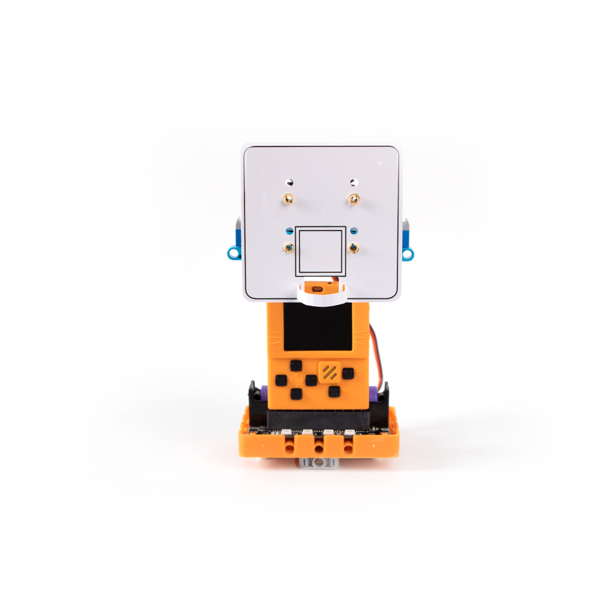
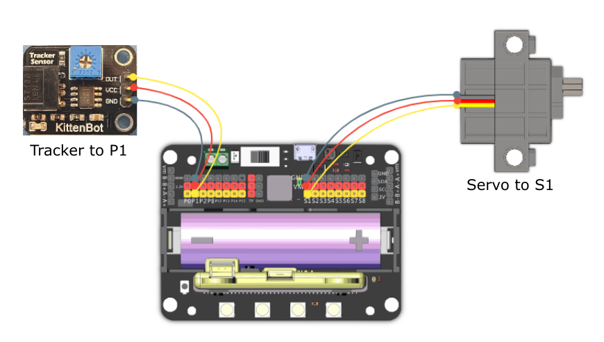

# 5. Basketball Game

## Building Instructions Download

[Building Instructions Download](https://drive.google.com/drive/folders/16T0mfS0QbxXfHf4GvNz62Xd2x8dvOq4m?usp=sharing)

## Sample Wiring

## Sample Programs

[Sample Program Download](https://makecode.com/_LzWXEo3V5PgM)

[Sample Program Resource Pack](https://bit.ly/AIHealthCareSetHex)

## Model Instructions

Meowbit will begin countdown after powering on, the basket will move left and right, try to get the highest score!

## Troubleshooting

### 1: The sensitivity of the IR sensor is low.

### The sensitivity can be adjusted via a potentiometer on the sensor, use a screwdriver to adjust to preference.

