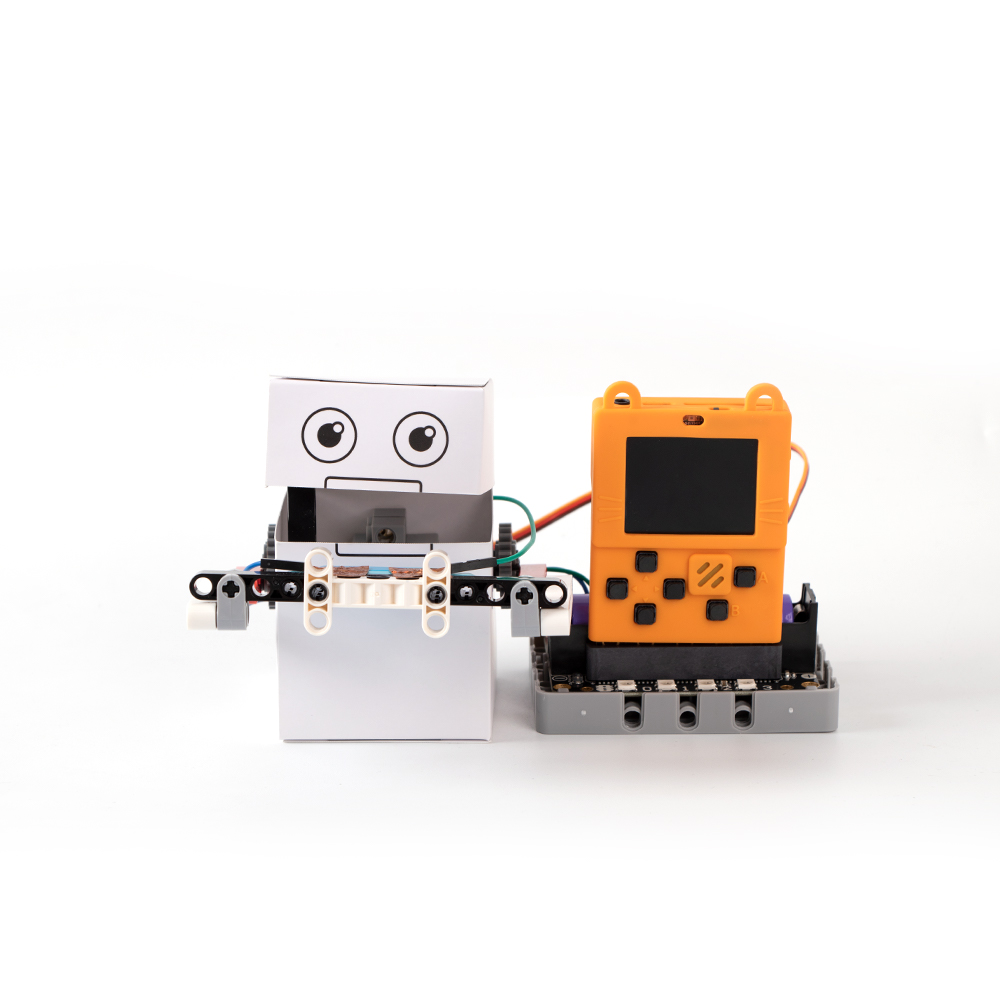
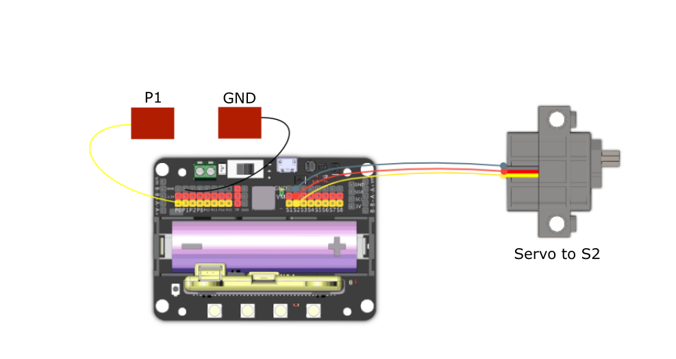

# 3. Coin Collector

## Building Instructions Download

[Building Instructions Download](https://bit.ly/AIHealthCareSetBuildingGuide)

## Sample Wiring

## Sample Program

[Sample Program Download](https://makecode.com/_MFFLfW0RUKuX)

[Sample Program Resource Pack](https://bit.ly/AIHealthCareSetHex)

## Model Instructions

This coin box can help you save up coins. Place a coin onto his hands, then he will swallow the coin. The coin box can only be opened after 20 coins have been saved up, press A to open the coin box.
