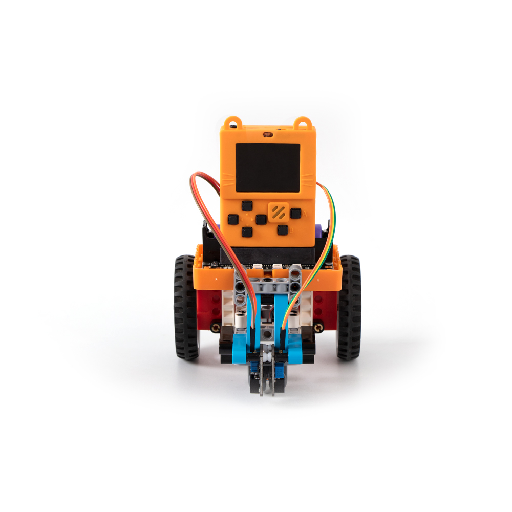
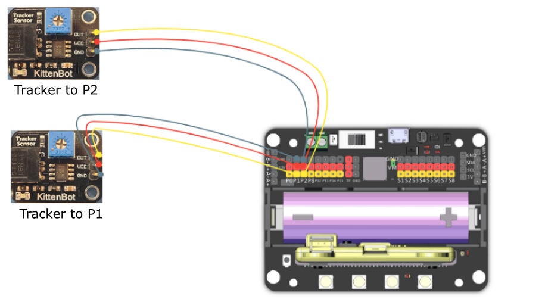
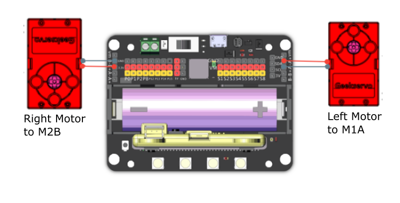

# 9. Line Follower Robot

## Building Instructions Download

[Building Instructions Download](https://drive.google.com/drive/folders/16T0mfS0QbxXfHf4GvNz62Xd2x8dvOq4m?usp=sharing)

## Sample Wiring

## Sample Program

[Sample Program Download](https://makecode.com/_Esy3C4PssDDE)

[Sample Program Resource Pack](https://bit.ly/AIHealthCareSetHex)

## Model Instructions

The cart will follow the black line.

## Troubleshooting

### 1: The sensitivity of the IR sensor is low.

### The sensitivity can be adjusted via a potentiometer on the sensor, use a screwdriver to adjust to preference.

