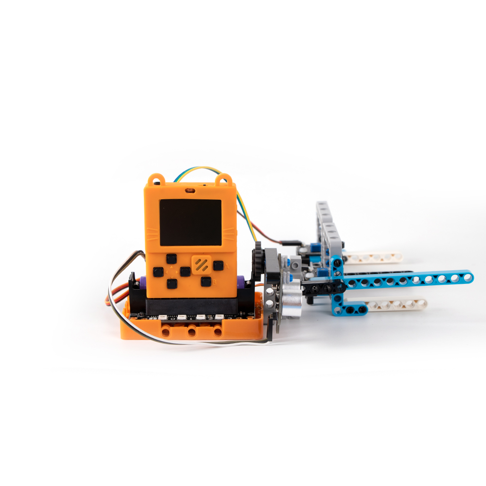
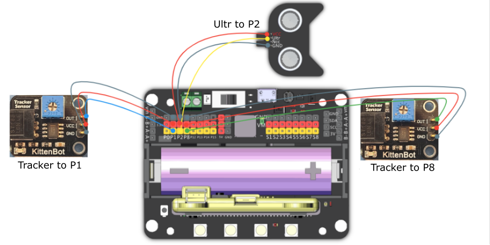

# 11. Smart Parking Lot

## Building Instructions Download

[Building Instructions Download](https://bit.ly/AIHealthCareSetBuildingGuide)

## Sample Wiring

## Sample Program

[Sample Program Download](https://makecode.com/_DkLE863zqT8h)

[Sample Program Resource Pack](https://bit.ly/AIHealthCareSetHex)

## Model Instructions

The gate will open when a car approaches, park the car in front of the IR sensor, Meowbit will display the number of available spaces.

## Troubleshooting

### 1: The sensitivity of the IR sensor is low.

### The sensitivity can be adjusted via a potentiometer on the sensor, use a screwdriver to adjust to preference.

