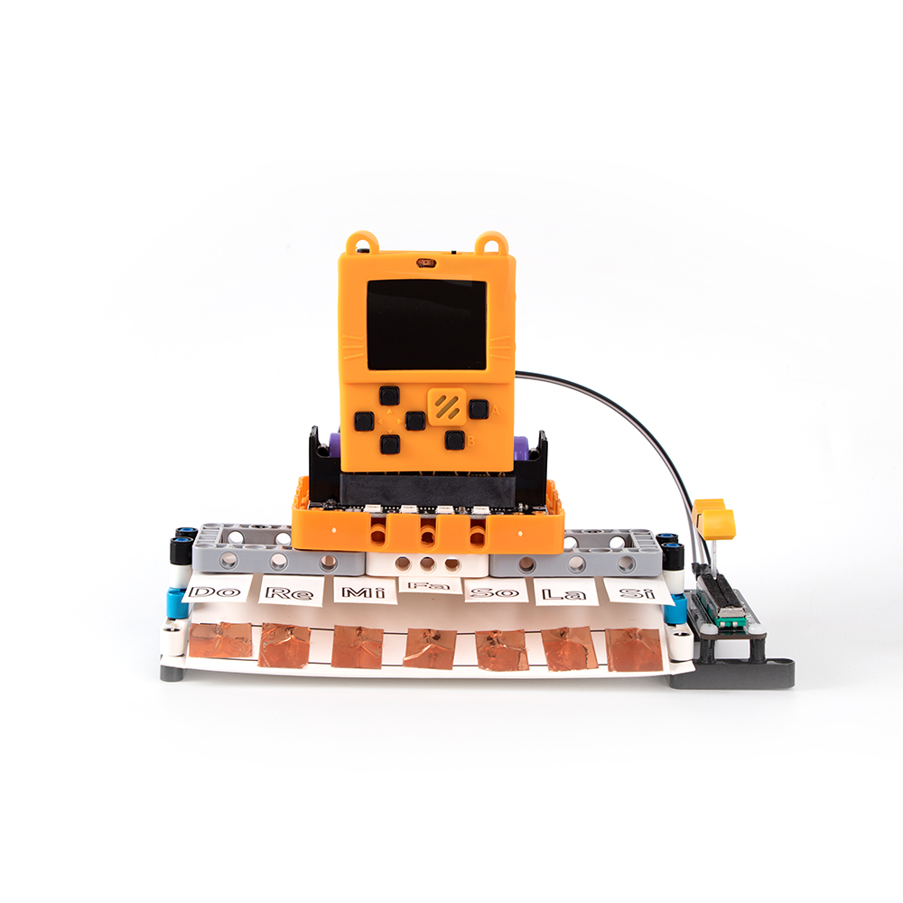
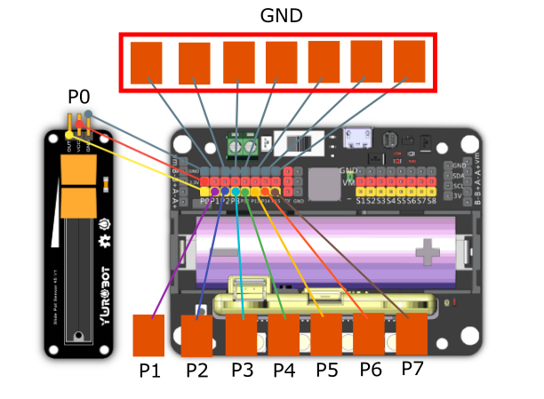

# 6. Piano Master

## Building Instructions Download

[Building Instructions Download](https://drive.google.com/drive/folders/16T0mfS0QbxXfHf4GvNz62Xd2x8dvOq4m?usp=sharing)

## Sample Wiring

## Sample Program

[Sample Program Download](https://makecode.com/_WYvCypA0AJ8L)

[Sample Program Resource Pack](https://bit.ly/AIHealthCareSetHex)

## Model Instructions

Press the keys to play the note, the octave can be adjusted using the sliding potentiometer.

