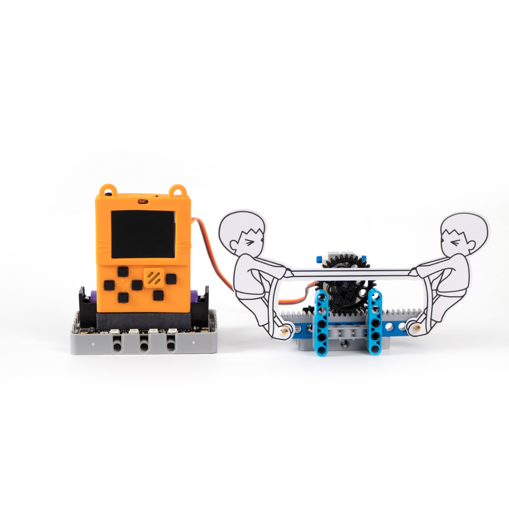
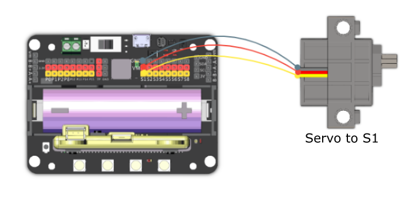

# 2. Tug-Of-War

## Building Instructions Download

[Building Instructions Donwload](https://drive.google.com/drive/folders/16T0mfS0QbxXfHf4GvNz62Xd2x8dvOq4m?usp=sharing)

## Sample Wiring

## Sample Program Download

[Sample Program Download](https://makecode.com/_hfm1J9JMs8EA)

[Sample Program Resource Pack](https://bit.ly/AIHealthCareSetHex)

## Model Instructions

This is a 2 player game, player A uses the left button and player B uses the A button, the players must compete by pressing the button repeatedly.