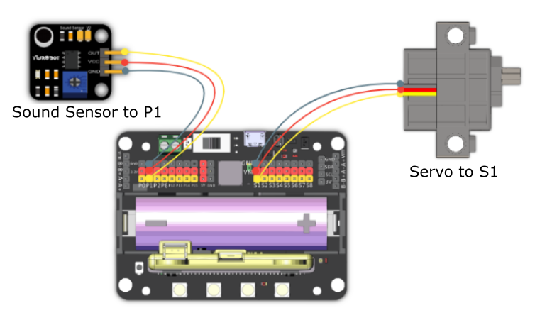

# 8. Anti-Noise Window

## Building Instructions Download

[Building Instructions Download](https://bit.ly/AIHealthCareSetBuildingGuide)

## Sample Wiring

## Sample Program

[Sample Program Download](https://makecode.com/_PLWY3se9MFqD)

[Sample Program Resource Pack](https://bit.ly/AIHealthCareSetHex)

## Model Instructions

The window will close when the environment is too loud, and will remain shut until the environment becomes quiet again.

