# Circuitry Experiments Kit Component List

Circuitry Experiments Kit has a total of 47 components across 12 lessons, please count and make sure there are no missing components.

## List of electric components

### 1. Button Battery Holder

#### Amount：12

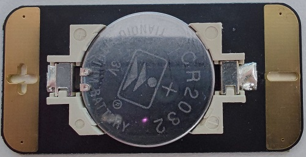

### 2. Self-locking Switch

#### Amount：6

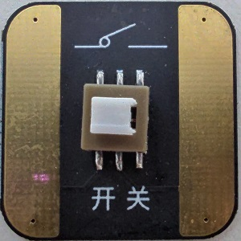

### 3. LED Module

#### Red LED Amount：3
#### Green LED Amount：1
#### Blue LED Amound：3
#### Yellow LED Amount：2

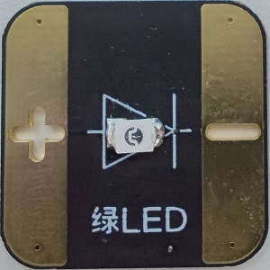

### 4. Potentialmeter

#### Amount：1

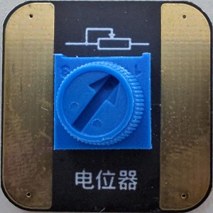

### 5. Jukebox Module

#### Amount：1

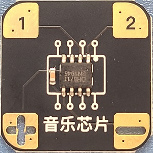

### 6. Speaker

#### Amount：1

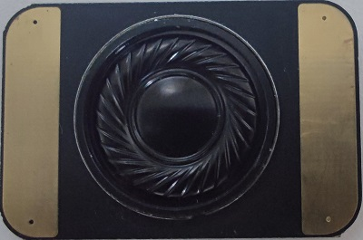

### 7. RGB LED

#### Amount：1

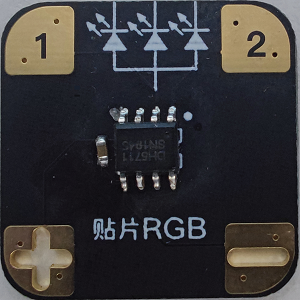

### 8. 3-way Dip Switch Module

#### Amount：1

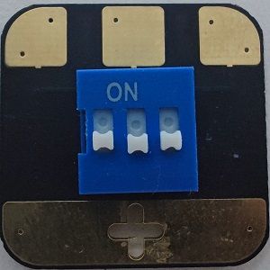

### 9. 7-way Dip Switch Module

#### Amount：1

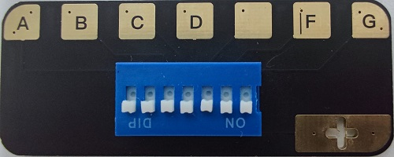

### 8. Digit Display

#### Amount：1

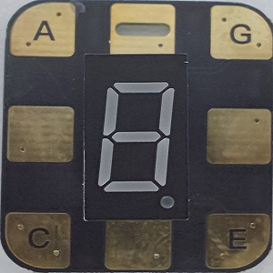

### 9. Touch Sensor

#### Amount：2

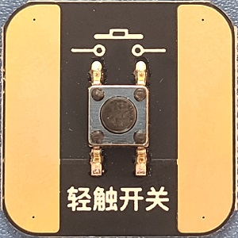

### 10. Buzzer

#### Amount：1

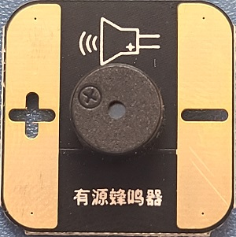

### 11. RGB LED

#### Amount：1

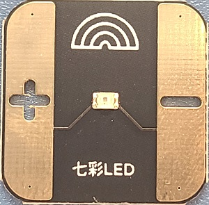

### 12. Magnetic Switch

#### Amount：1

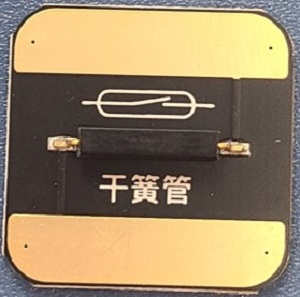

### 13. 100K Resistor

#### Amount：1

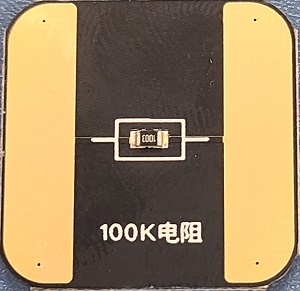

### 14. 10K Resistor

#### Amount：2

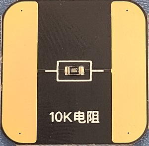

### 15. Photoresistor

#### Amount：1

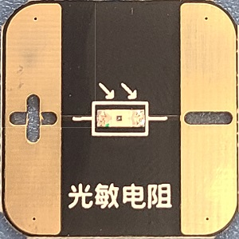

### 16. NPN Triode

#### Amount：2

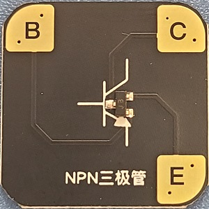

### 17. 10uf Capacitor

#### Amount：1

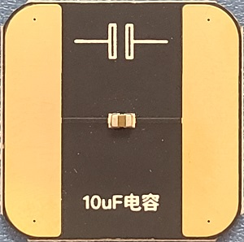

### 18. LED Rainbow

#### Amount：1

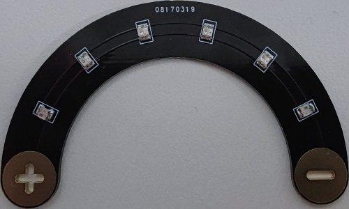