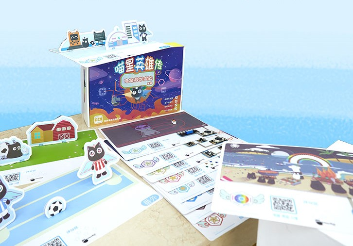
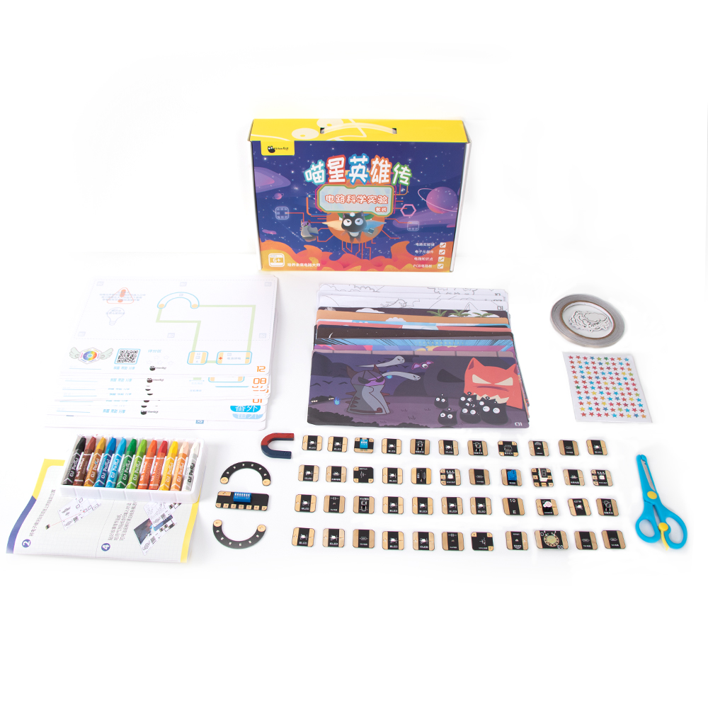
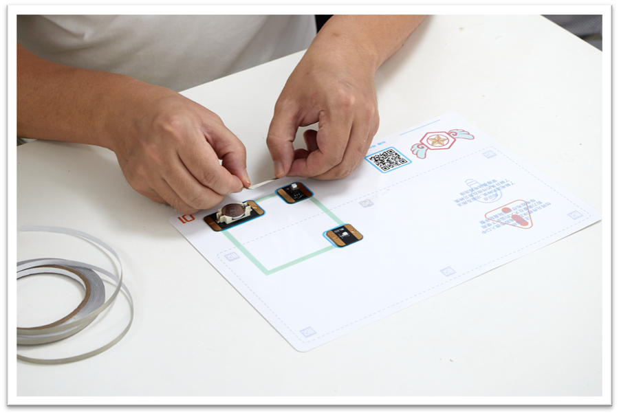
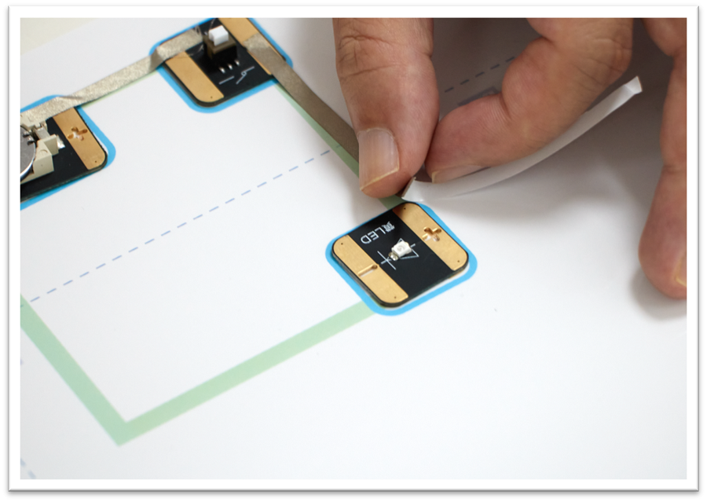
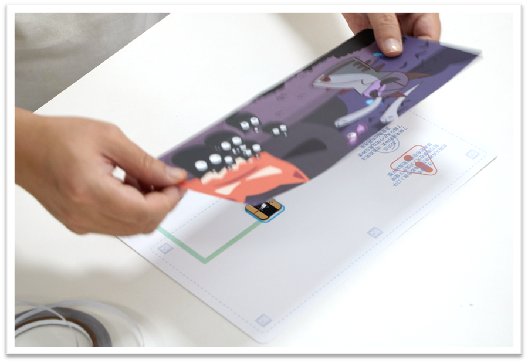
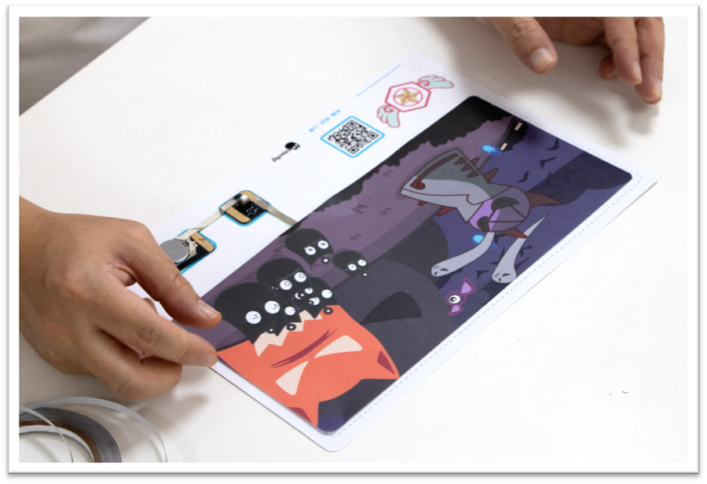
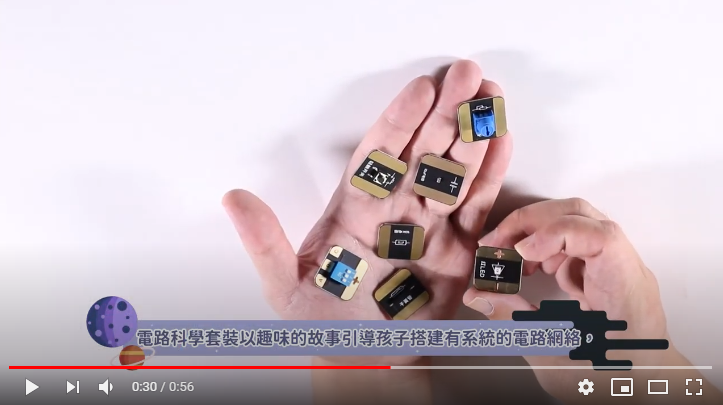

# Circuitry Experiments Education Kit

In Hong Kong, most STEM education focuses on Senior Primary School or Junior Secondary School pupils, resulting in a lack of STEM education among Junior Primary School pupils. Kittenbot believes that a strong understanding in fundamental STEM knowledge is important, and that STEM education should begin way before coding training begins.

In sight of this, Kittenbot has developed the Circuitry Experiments Education Kit, a STEM education kit designed for junior primary school students. This kit focuses on the basics for electrical circuits, while including topics about sound and light.

The kit includes 12 story-based scenarios and a total of 47 electronic components scattered in 12 lessons. Students will be able to learn the basics of electric circuits and electronic components through vivid and engaging stories as well as hands-on experiments.

## Kit Contents

1. 12 Story Cardboard

2. 12 Coloured Story Illustrations

3. 12 Black and White Story Illustrations

4. 12 Packs of electronic components

5. 12 Button Cell Batteries

6. 1 Roll of Conductive Adhesive Tape

7. 1 Roll of Double Sided Adhesive Tape

8. 1 Pair of Safety Scissors

9. 1 Set of Crayons

10. 1 Sheet of Speech Bubble Stickers

11. 1 Sheet of Stickers

12. 4 DIY Story Cardboard

13. 4 Sheets of Fold-Out Carboard Decorations

## Special Features

- Designed for junior primary schools

- 12 interesting and engaging lessons told in stories

- 12 packs of electronic components, totalling 47 pieces

- No wiring required

- No coding knowledge required

- Topics are closely related to General Studies

## Child-proof Design

- The large CR2032 Button Cells prevent swallowing

- The PCBs feature rounded corners to prevent cutting

- The PCBs are oversived to prevent swallowing

- The conductive tape is flexible and soft

- Comes with a pair of safety scissors

- Ease of storage

## Learning by Playing

#### 1. Place the corresponding component on the cardboard.

#### 2. Complete the circuit with conductive tape.

#### 3. Paste the illustration onto the cardboard.

### 4. Play with the circuit.

## Video Showcase

