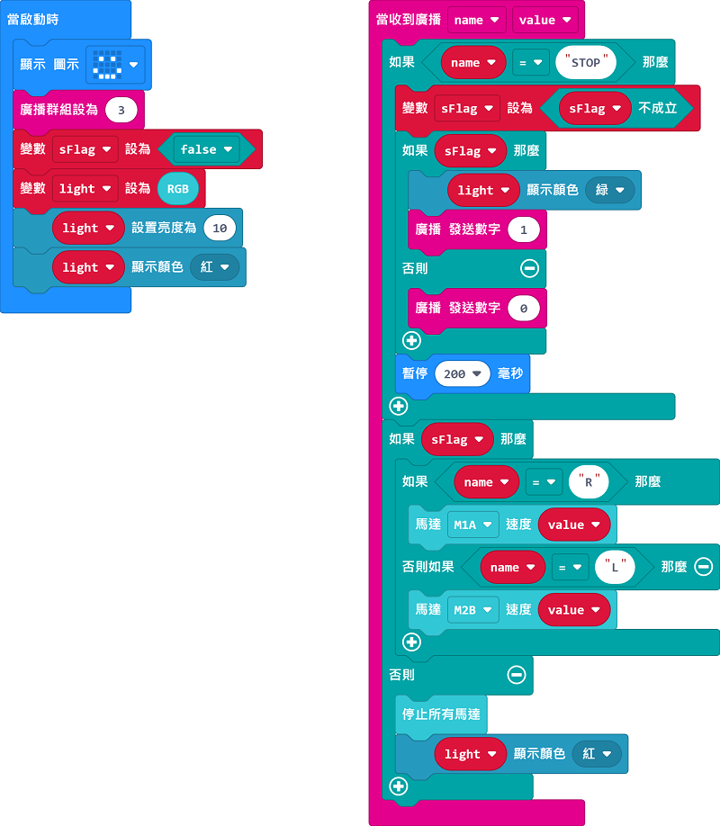
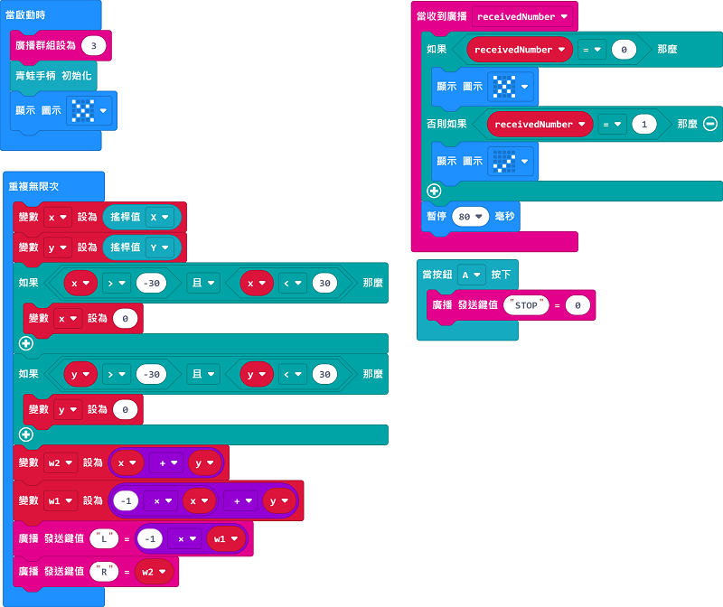
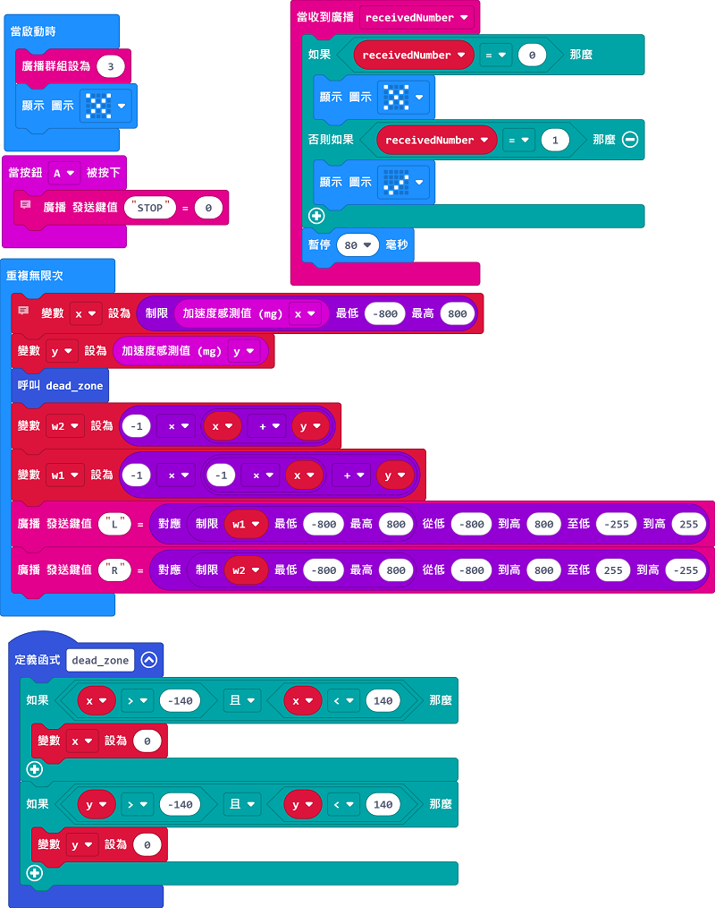

# All Terrain RC Rover Sample Program

## Robot Sample Program

[Sample Program](https://makecode.microbit.org/_4pciubgEt0vy)

## Joyfrog Controller Sample Program

[Sample Program](https://makecode.microbit.org/_aqCi4hEJV8sW)

### JoyFrog Instructions

1. Press A to start
2. Control the robot using the Joystick

## Micro:bit Controller Sample Program

[Sample Program](https://makecode.microbit.org/_EtfckhT6Rccu)

### Micro:bit Instructions

1. Press A to start
2. Control the robot using the gyroscope