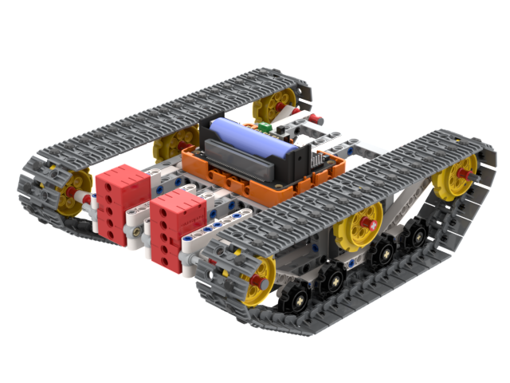
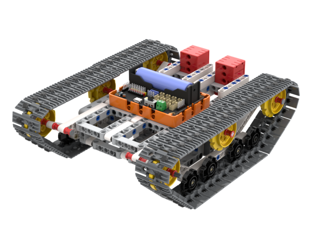
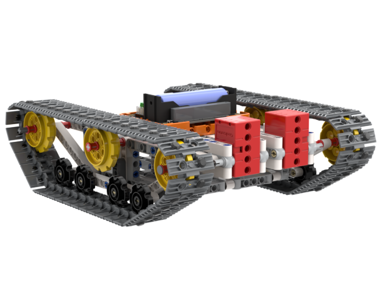

# All Terrain RC Rover

The All Terrarin RC Rover Kit is a RC Robot designed for obstacle courses. Powered by 2 2KG GeekMotors, ensuring the robot will have enough power to climb over obstacles.

## Special Features

- Block-based programming
- High expandability using plastic building bricks
- Strong power from 2KG GeekServo Motors
- Supports MakeCode and KittenBlock programming

## Kit Contents

- Robotbit Edu x1
- Plastic Building Bricks Set x1
- GeekServo 2KG Motors x2
- 18650 Lithium Battery x1

## Product Showcase

