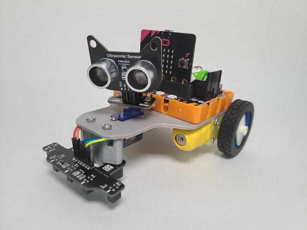
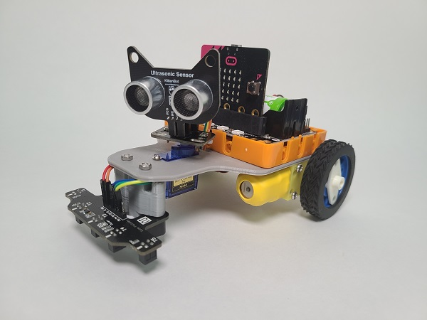
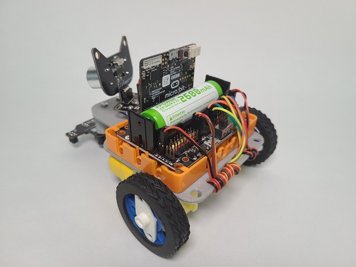
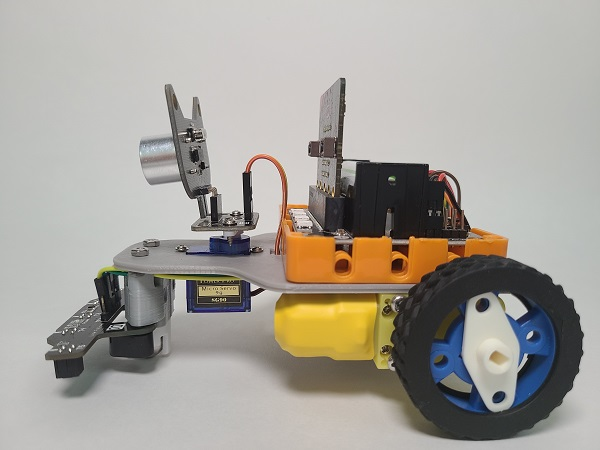
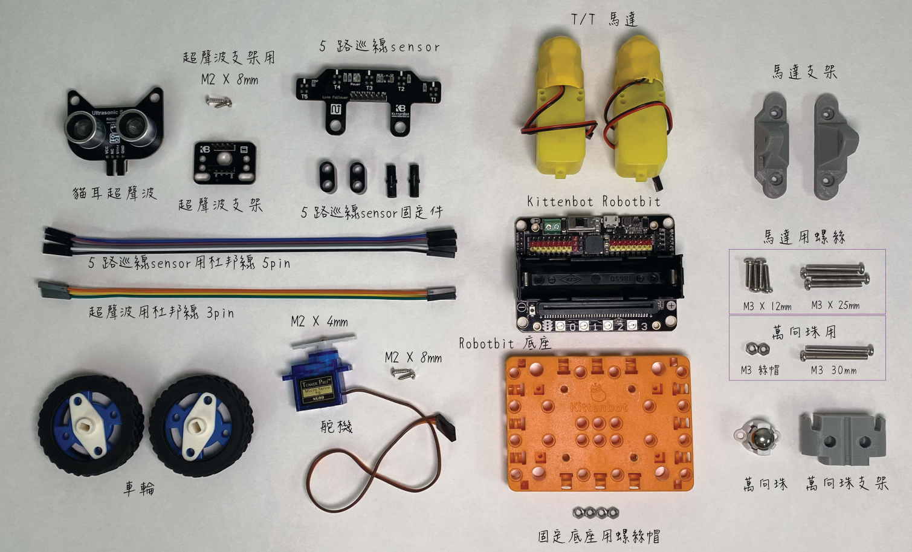
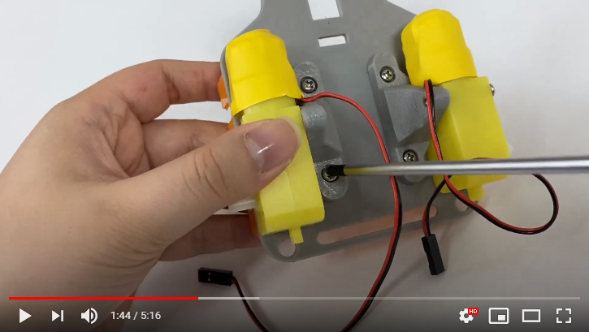
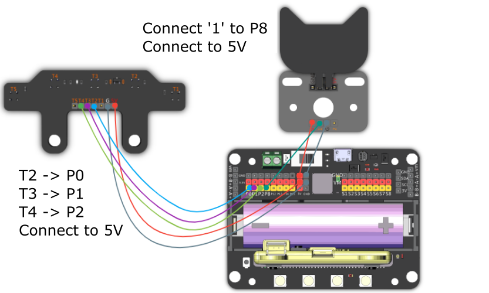
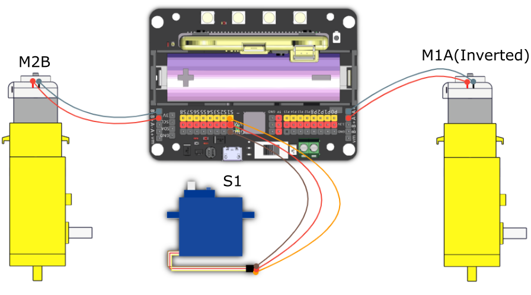
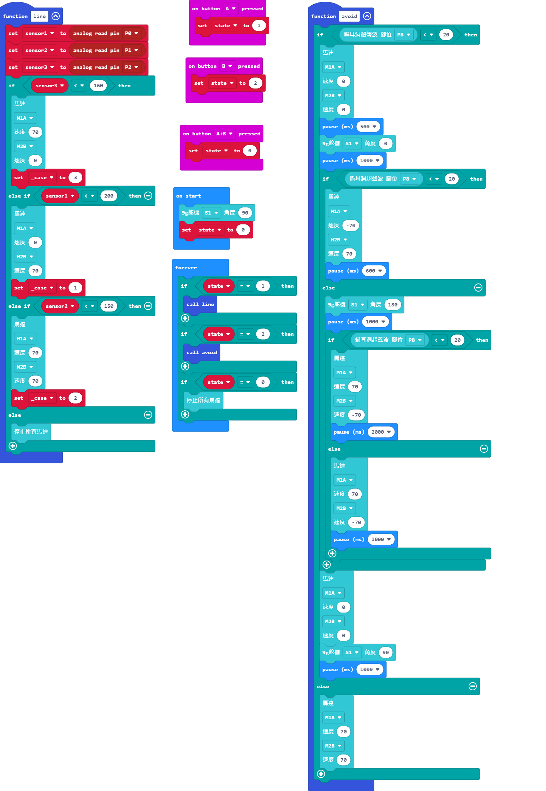

# MR STEMer Kart Lite

MR STEMer Kart Lite(HKBK6006A)

This is a mini line follower kart designed for BBC Micro:bit.

This kit makes use of a 3D printed chassis to create an extremely lightweight body.

This easy-to-assemble kart is able to avoid obstacles and trace lines, making this a good start for learning roboting coding.

## Product Showcase

## Package Contents

1. Neko Ultrasound Sensor Module x1
2. Ultrasound Sensor Adapter x1
3. 5 Way Line Tracing Sensor Module x1
4. T/T Motor x2
5. 9g Servo x1
6. Dupont Wires
8. 3D Printed Chassis x1
8. 3D Printed Motor Mount x2
9. 3D Printed Ball Bearing Mount x1
10. Ball Bearing x1
11. Wheels x2
12. Line Tracing Sensor Connector x1
13. Nuts and Screws

## Assembly Video

## Sample Wiring

## Sample Programs

[Mr Stemer Kart Lite](https://makecode.microbit.org/_MkVb0A6ghiqC)

## Extension Updates

There may be updates for the extensions used, please check the following document for details on updating your extensions.

[Makecode Extension Update](../Makecode/makecode_extensionUpdate)