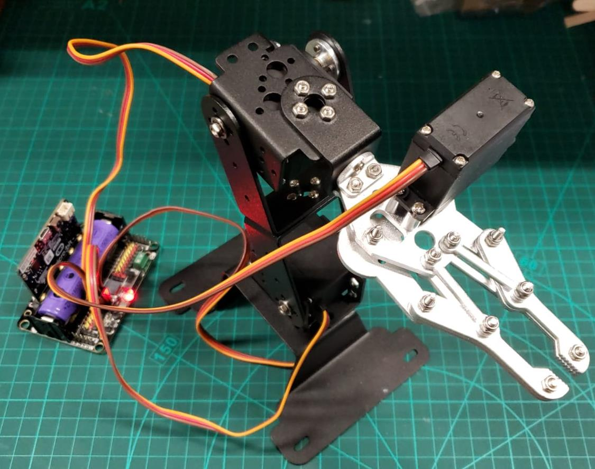
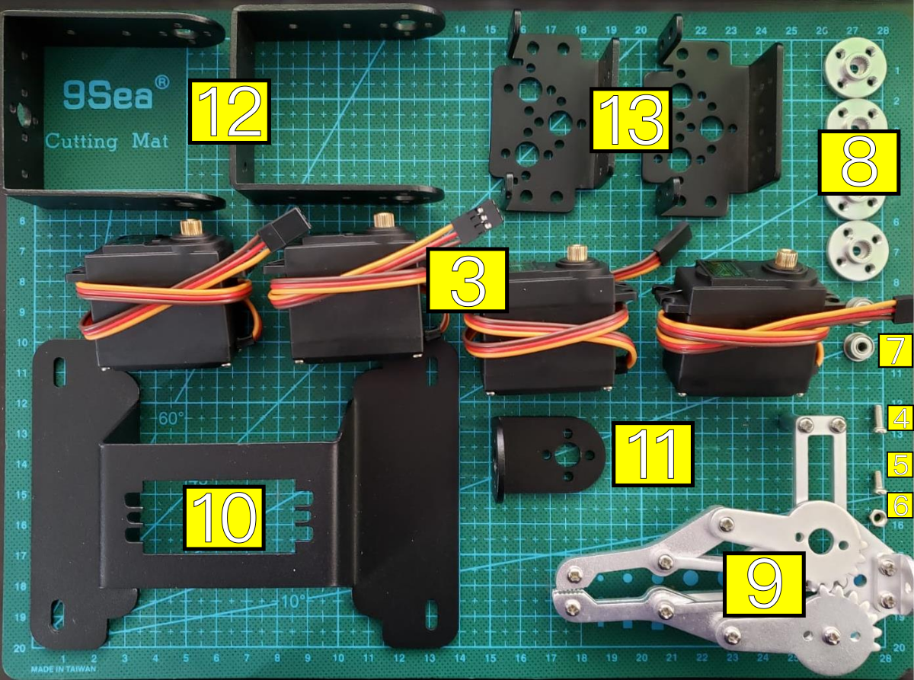
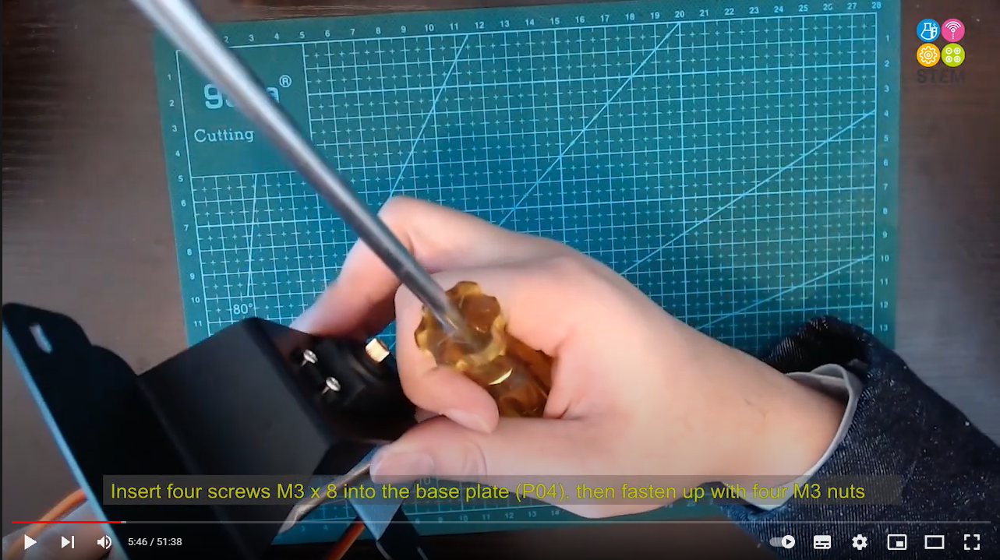
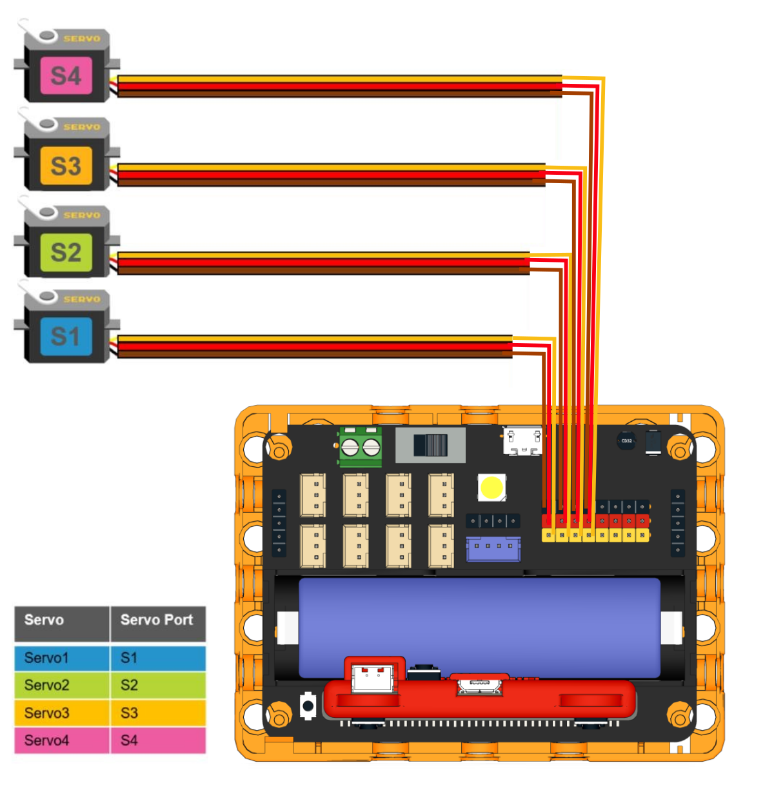
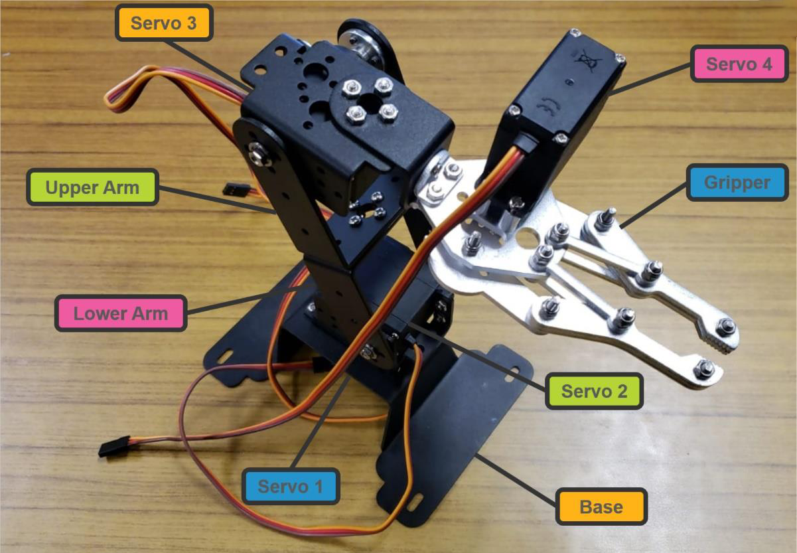
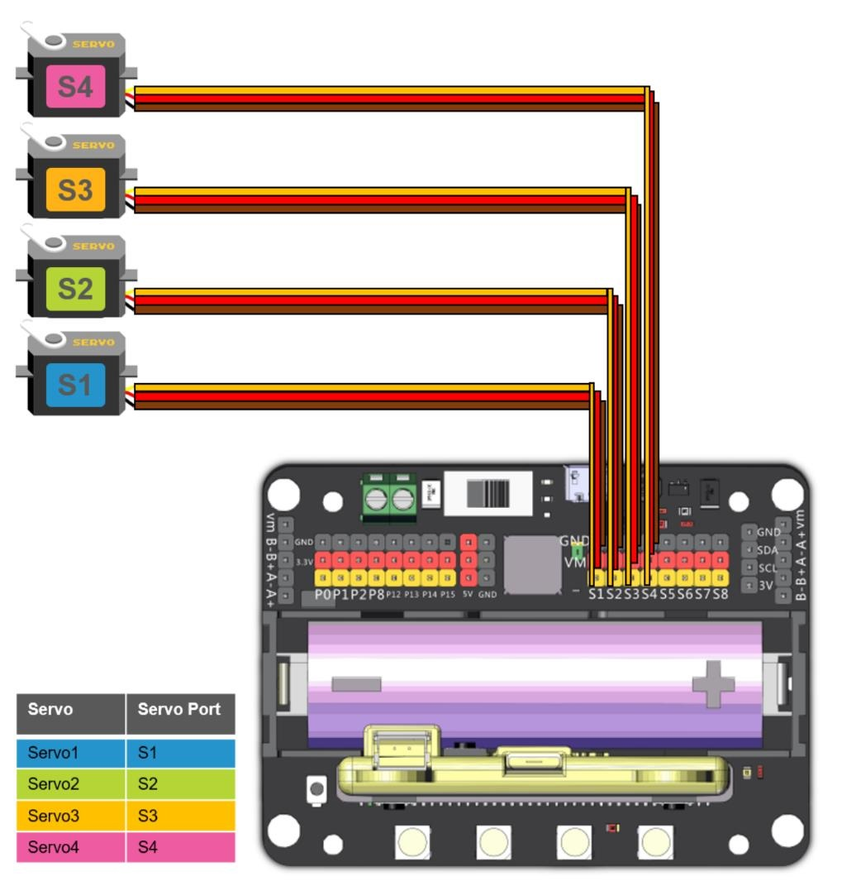
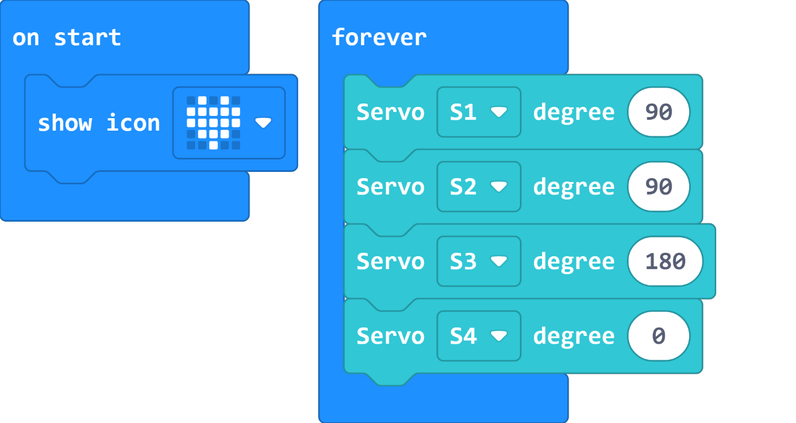
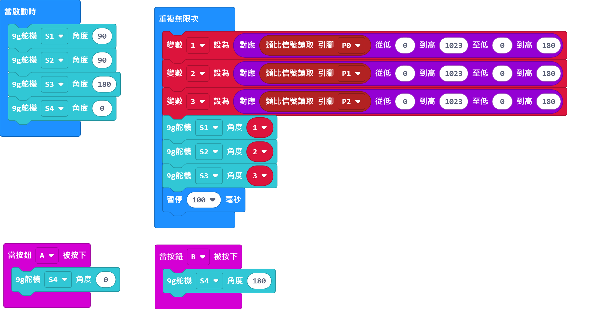

# Robotbit Robot Arm

Make a robotic arm controlled by 4 high torque servos with this kit.

## 套件內容

1. Robotbit Edu x1
2. 18650 Lithium Ion Battery x1
3. MG995 Metal Servo x4
4. M3x8 Screws x28
5. M3x6 Screw x18
6. M3 Nuts x24
7. Bearing x2
8. Servo Turning Plate x4
9. Claw x1
10. Base x1
11. Right Angle Plate x1
12. U Plate x2
13. Servo Mounts x2

## Special Features

- Using high torque servos to allow a stable and strong grip
- Learn the concepts of levers by studying the mechanism
- Improve motor skills by building the robotic arm

## Assembly Instructions

[Instuction Manual](https://drive.google.com/file/d/14HiV-SxTQf4h2BVGj84Xaj43P_JxT1di/view?usp=sharing)

[Instrucion Video](https://www.youtube.com/watch?v=qofKKztL0PU)

## Wiring

### Robotbit EDU

### Robotbit 2.2

## Sample Program

### Servo Calibration

[Servo Calibration](https://makecode.microbit.org/_J7XFYa2pDDPt)

### Robot Arm

[Robot Arm](https://makecode.microbit.org/_Yfp13uUDEPrz)

## Extension Version and Updates

There may be updates to extensions periodically, please refer to the following link to update/downgrade your extension.

[Makecode Extension Update](../../Makecode/makecode_extensionUpdate)