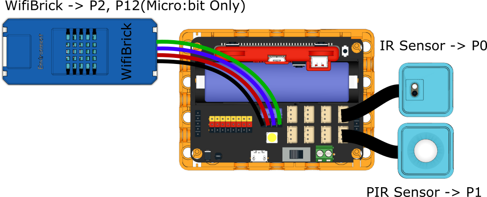
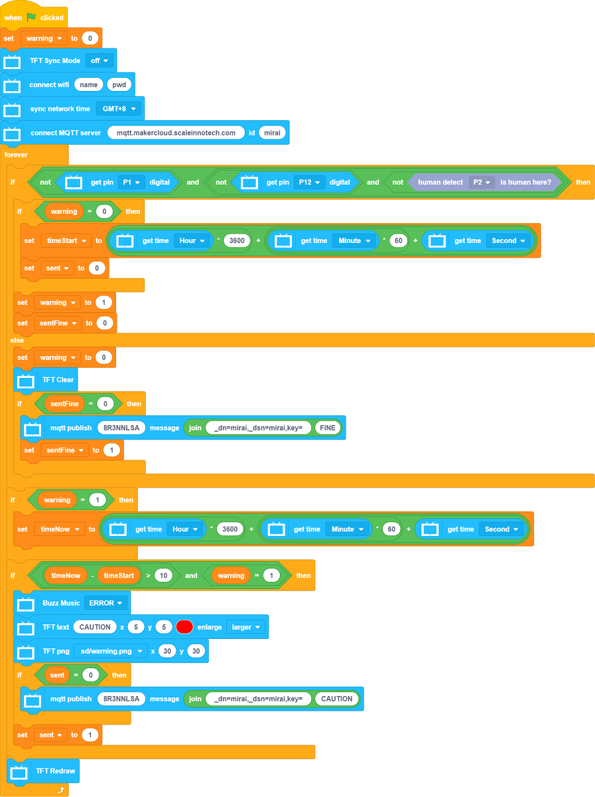

# Safety Bathtub

If the user faints when taking a bath, the system sends an alert to the family members.

## Building Instructions

[Building Instructions]()

## Sample Program

### For Micro:bit

[Sample Program](https://makecode.microbit.org/_ChLPTHW9uiUh)

### For FutureBoard

## Demonstration Video

[Demonstration Video](https://www.youtube.com/watch?v=tRQiIUIZCpo&t=1s)