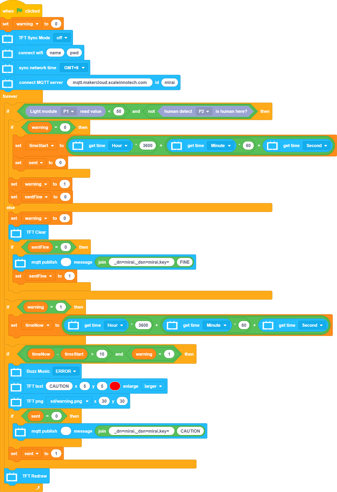
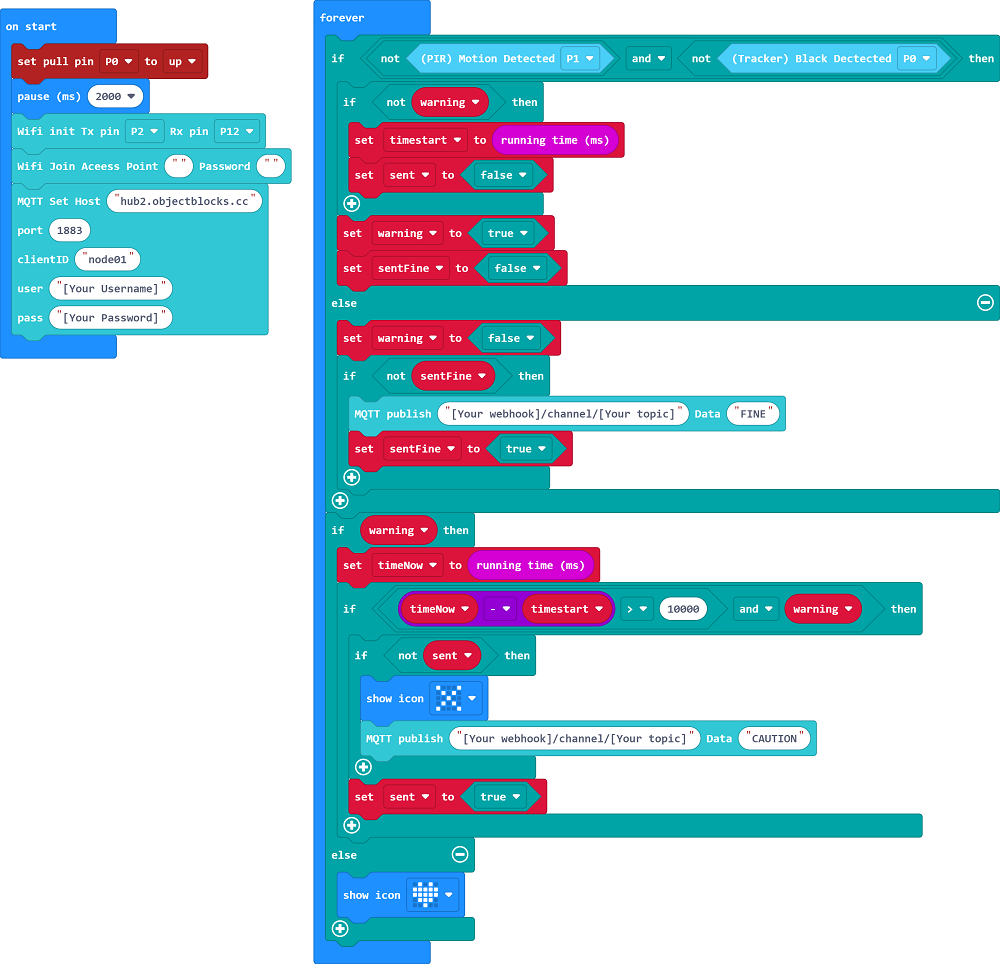
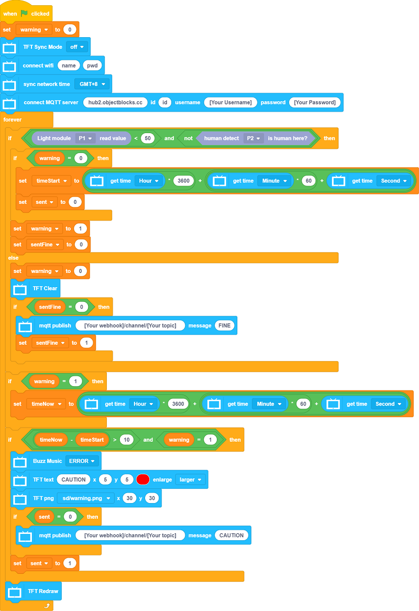
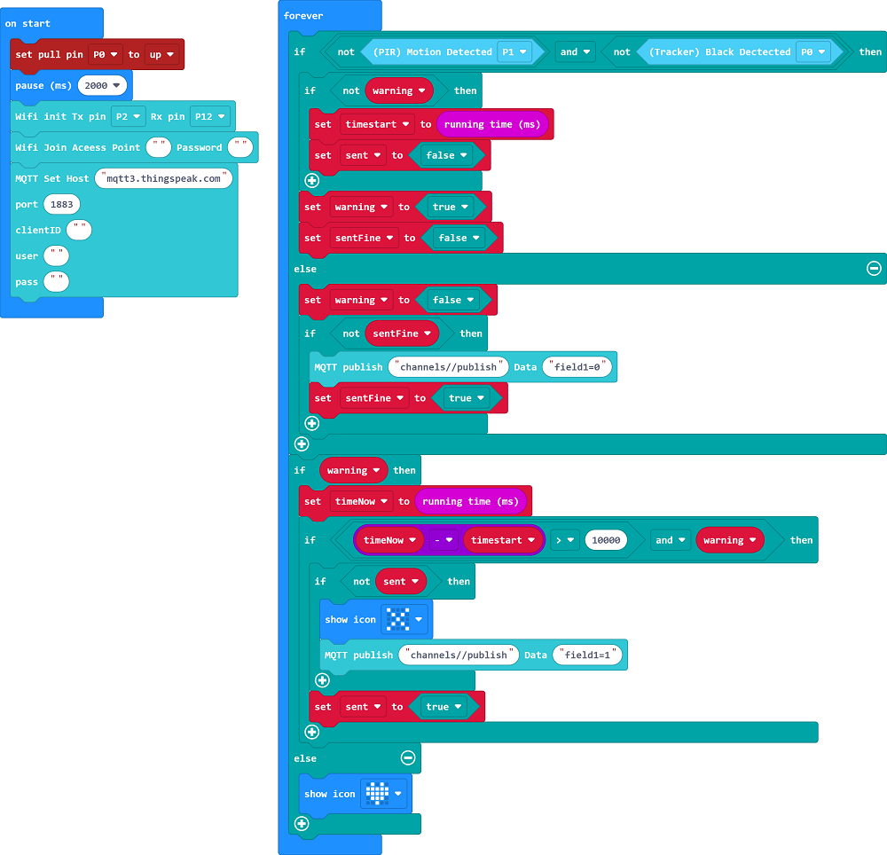
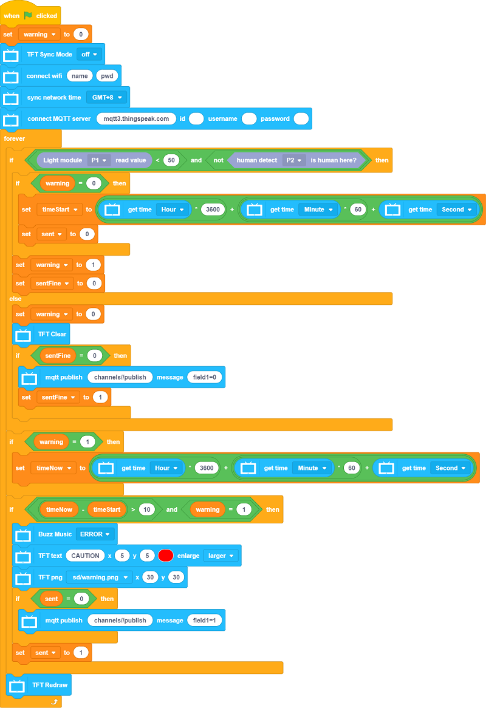

# Safety Bathtub

If the user faints when taking a bath, the system sends an alert to the family members.

## Building Instructions

[Building Instructions](https://github.com/kittenbothk/kittenbothk-Eng/raw/master/Kits/smart_home_iot/images/bathtub.pdf)

## Sample Wiring

## MakerCloud Version

### Micro:bit

[Sample Program](https://makecode.microbit.org/_ChLPTHW9uiUh)

### Futureboard

[Sample Program](https://github.com/kittenbothk/kittenbothk-Eng/raw/master/Kits/smart_home_iot/instructions/smartBathtub.sb3)

[Sample Image Files](https://github.com/kittenbothk/kittenbothk-Eng/raw/master/Kits/smart_home_iot/instructions/bathpic.rar)

## ObjectBlocks Version

### Micro:bit

[Sample Program](https://makecode.microbit.org/_HKCbzPb8yLqJ)

### Futureboard

[Sample Program](https://github.com/kittenbothk/kittenbothk-Eng/raw/master/Kits/smart_home_iot/instructions/smartBathtub_objectblocks.sb3)

[Sample Image Files](https://github.com/kittenbothk/kittenbothk-Eng/raw/master/Kits/smart_home_iot/instructions/bathpic.rar)

## ThingSpeak Version

### Micro:bit

[Sample Program](https://makecode.microbit.org/_hikfod0kXi2V)

### Futureboard

[Sample Program](https://github.com/kittenbothk/kittenbothk-Eng/raw/master/Kits/smart_home_iot/instructions/smartBathtub_thingspeak.sb3)

[Sample Image Files](https://github.com/kittenbothk/kittenbothk-Eng/raw/master/Kits/smart_home_iot/instructions/bathpic.rar)

## Demo Video

[Demo Video](https://www.youtube.com/watch?v=tRQiIUIZCpo&t=1s)