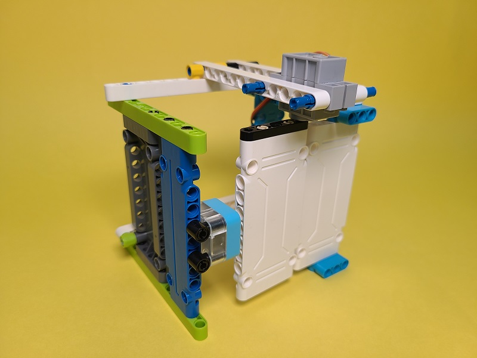
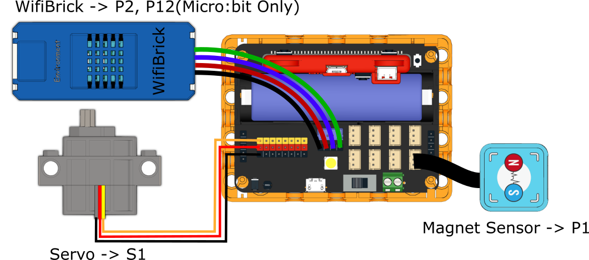
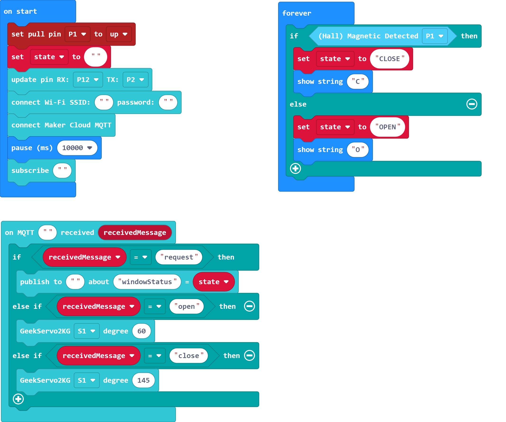
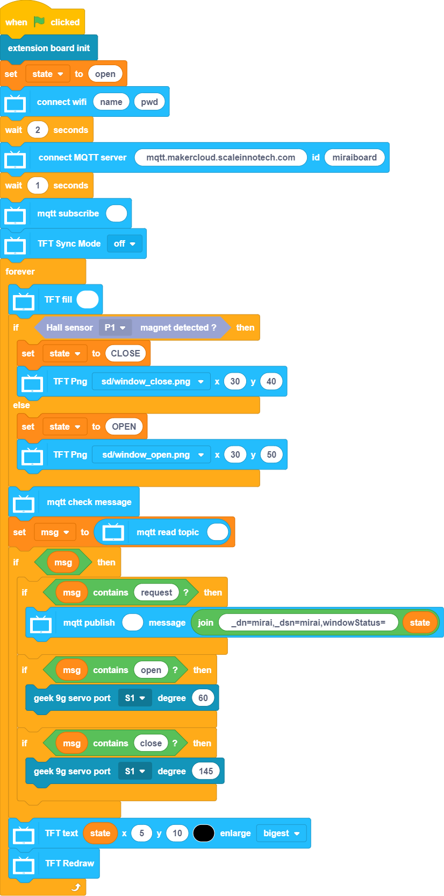
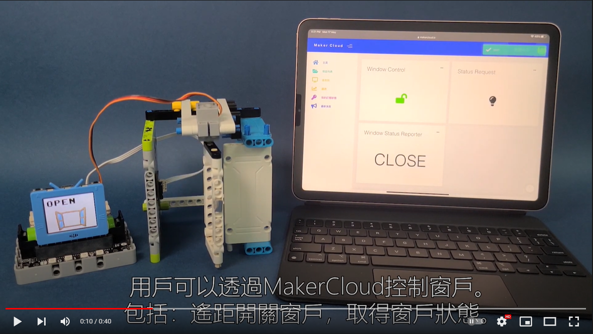

# Remote Security Door

Control the opening and closing of the window through an IoT platform.

## Building Instructions

[Building Instructions]()

## Sample Program

### For Micro:bit

[Sample Program](https://makecode.microbit.org/_RwAY9rfbuMhc)

### For FutureBoard

[Sample Program]()

## Demonstration Video

[Demonstration Video](https://www.youtube.com/watch?v=nLj0LCgN1Uk)
