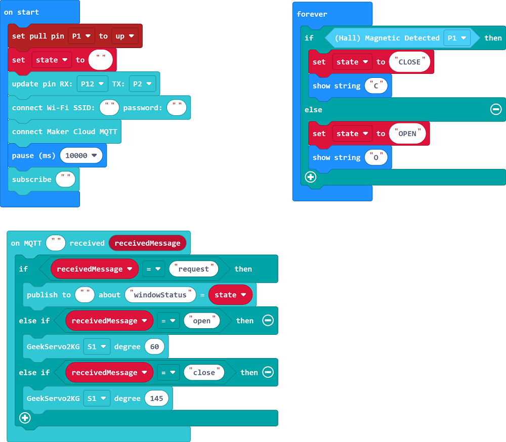
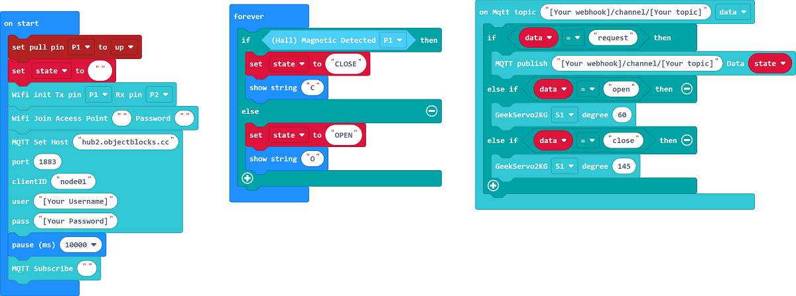
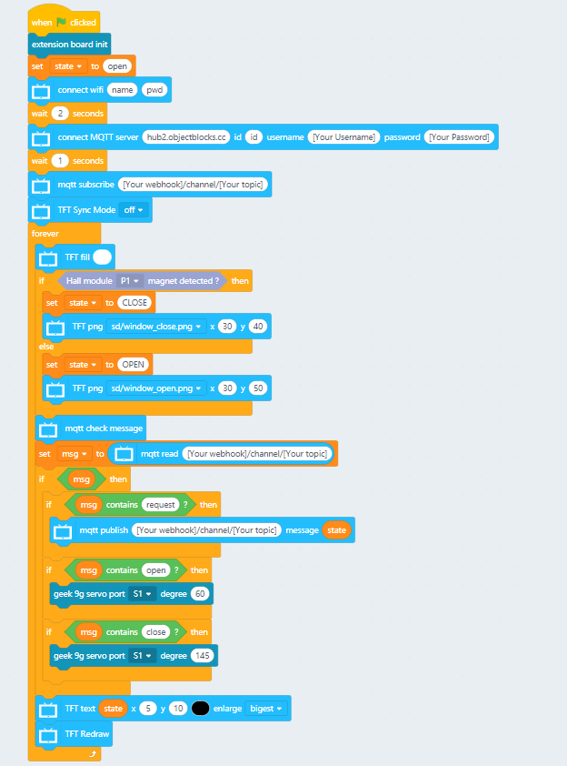
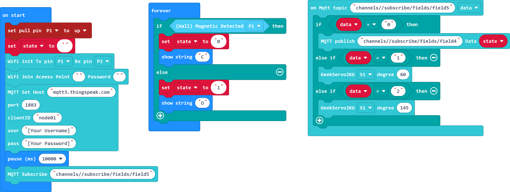
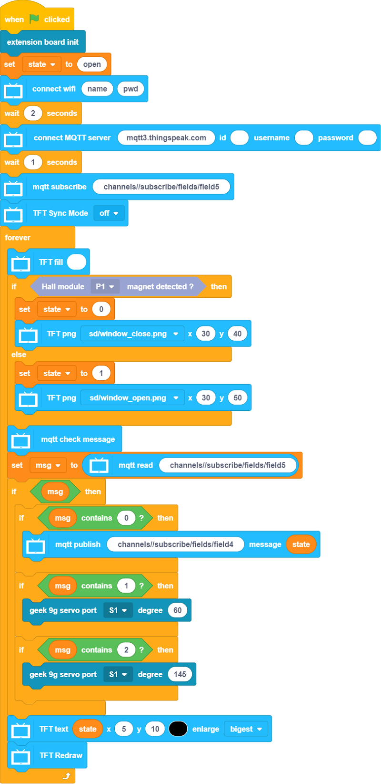
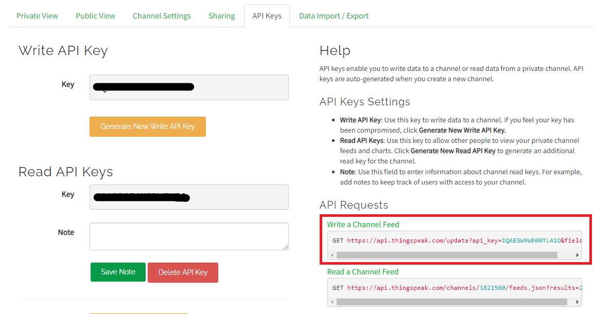
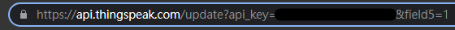

# Remote Security Door

Control the opening and closing of the window through an IoT platform.

## Building Instructions

[Building Instructions](https://github.com/kittenbothk/kittenbothk-Eng/raw/master/Kits/smart_home_iot/images/stove.pdf)

## Sample Wiring

## MakerCloud Version

### Micro:bit

[Sample Program](https://makecode.microbit.org/_FT8d1A07q9Rf)

### Futureboard

[Sample Program](https://github.com/kittenbothk/kittenbothk-Eng/raw/master/Kits/smart_home_iot/instructions/smartWindow_makercloud.sb3)

[Sample Image Files](https://github.com/kittenbothk/kittenbothk-Eng/raw/master/Kits/smart_home_iot/instructions/windowpic.rar)

## ObjectBlocks Version

### Micro:bit

### Futureboard

[Sample Program](https://github.com/kittenbothk/kittenbothk-Eng/raw/master/Kits/smart_home_iot/instructions/smartWindow_objectblocks.sb3)

[Sample Image Files](https://github.com/kittenbothk/kittenbothk-Eng/raw/master/Kits/smart_home_iot/instructions/windowpic.rar)

## Thingspeak Version

### Micro:bit

[Sample Program](https://makecode.microbit.org/_f3w3Pj2wP12x)

### Futureboard

[Sample Program](https://github.com/kittenbothk/kittenbothk/raw/master/Kits/smart_home_iot/instructions/smartWindow_thingspeak.sb3)

[Sample Image Files](https://github.com/kittenbothk/kittenbothk/raw/master/Kits/smart_home_iot/instructions/windowpic.rar)

### How to publish ThingSpeak data manually

Copy and paste the following link to the browser and change the field to field5, substitute the desired value(0/1/2) into after the = sign.

## Demonstration Video

[Demonstration Video](https://www.youtube.com/watch?v=nLj0LCgN1Uk)
