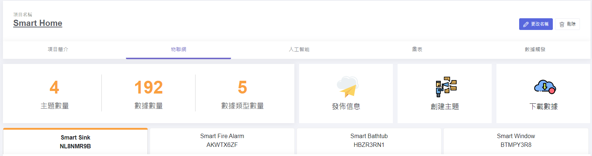
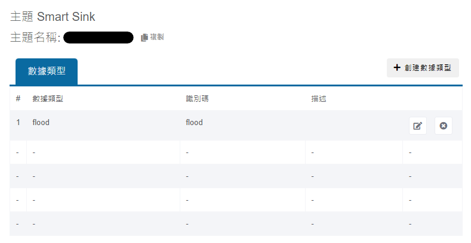
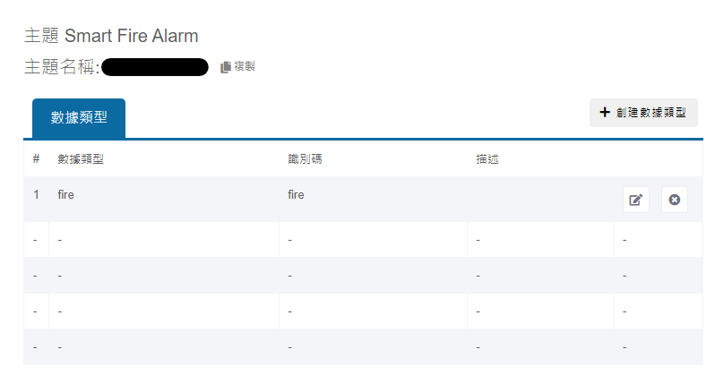
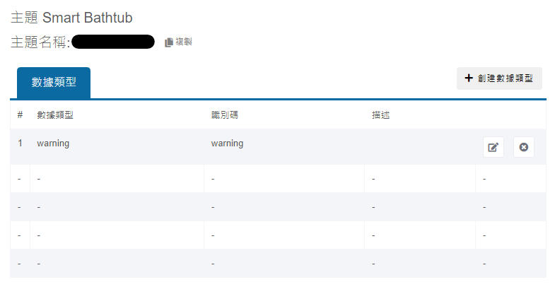
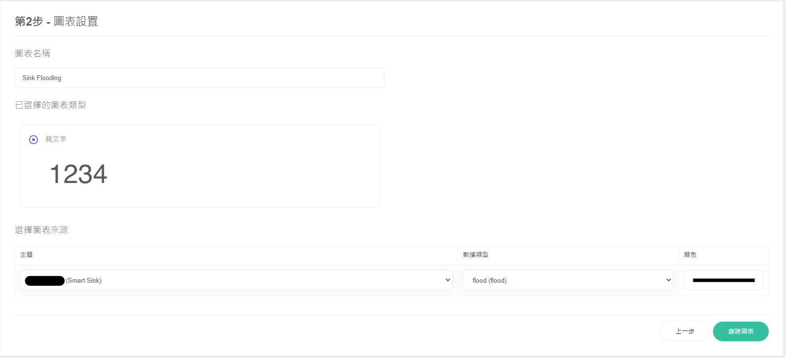
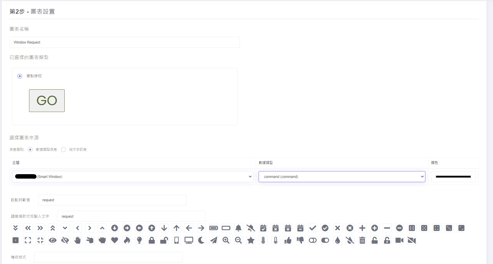

# Set Up for MakerCloud

## 1. Create MakerCloud project with 4 MQTT topics

## 2. Create Data Type "flood" in topic Smart Sink

## 3. Create Data Type "fire" in topic Smart Fire Alarm

### 4. Create Data Type "warning" in topic Smart Bathtub

### 5. Create Data Type "status" and "command" in Smart Window
 

### 6. Create charts for each topic to view the data

### 7. Create charts for "command" data type of Smart Window to publish data "request", "open", "close"

