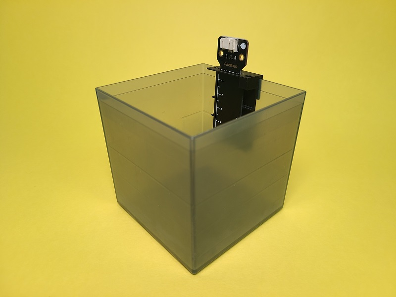
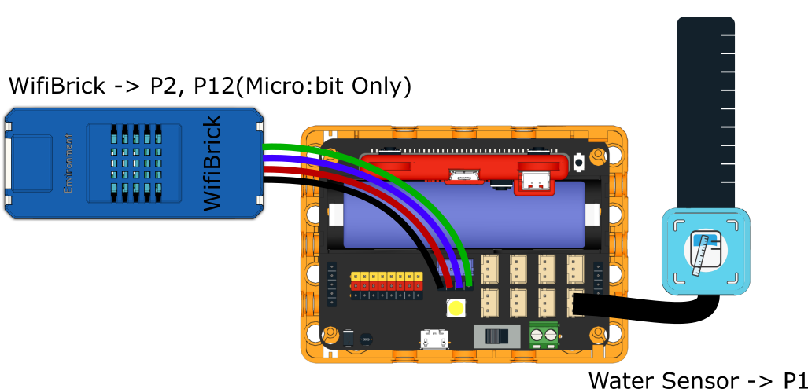
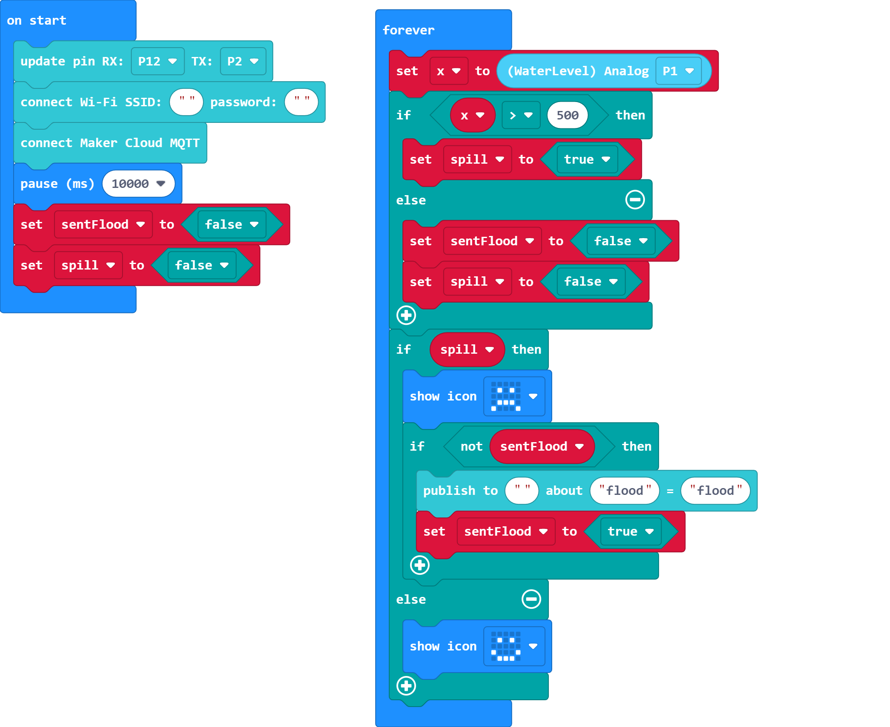
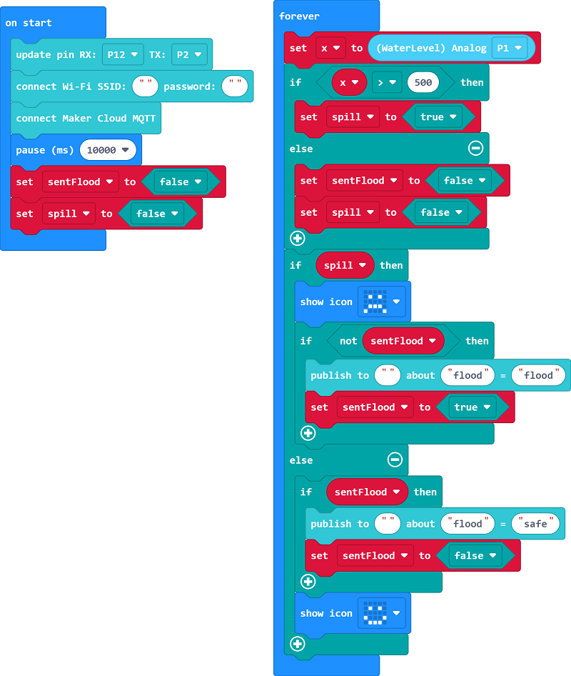
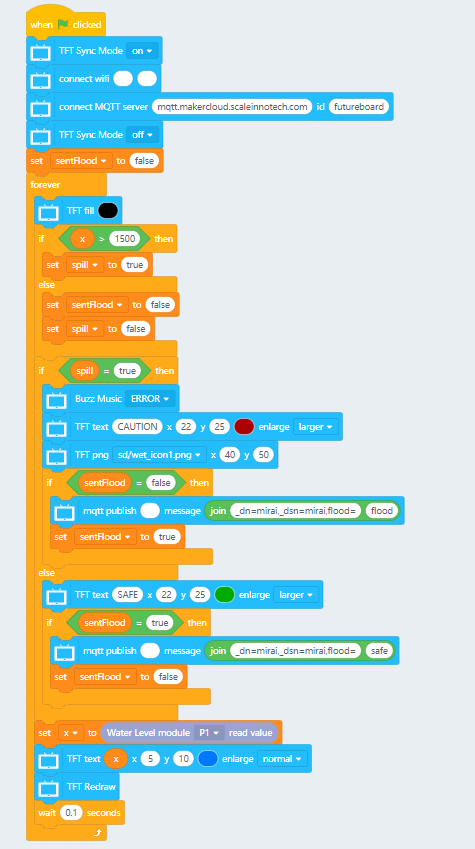
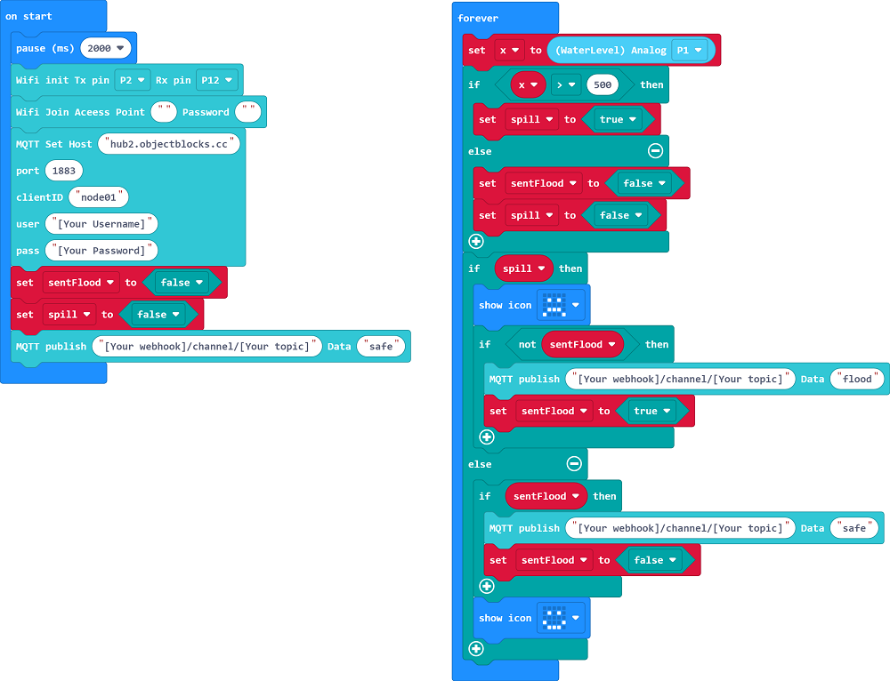
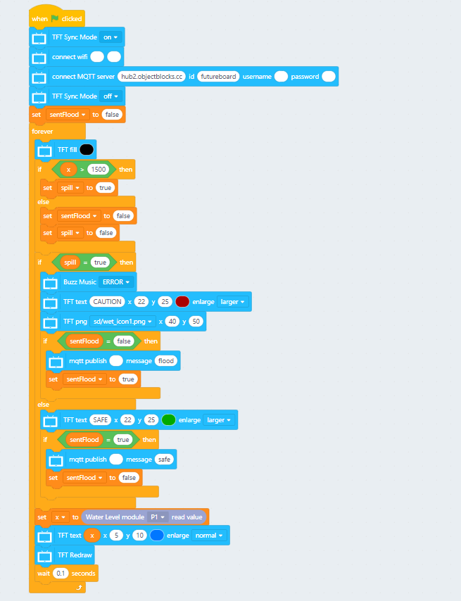
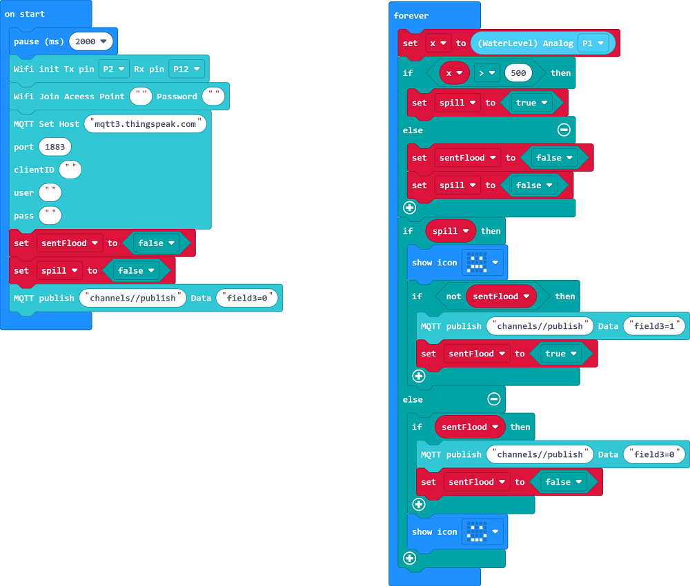
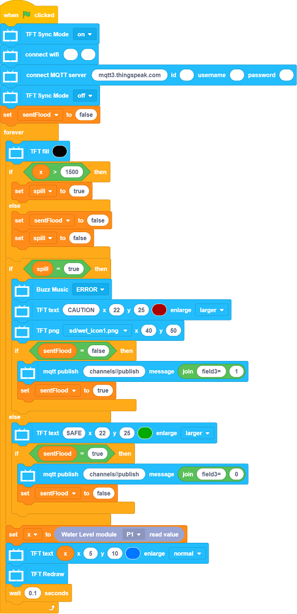
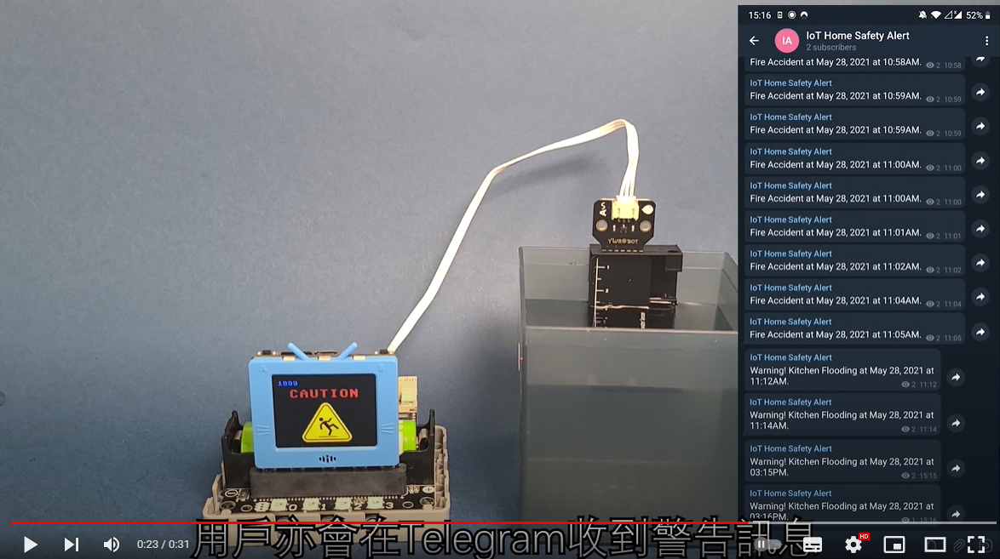

# Anti-Spilling Sink

The system will send an alert to the user if the water level is over limit.

## Building Instructions

[Building Instructions](https://github.com/kittenbothk/kittenbothk-Eng/raw/master/Kits/smart_home_iot/images/sink.pdf)

## Sample Program

### For Micro:bit

[Sample Program](https://makecode.microbit.org/_4iCLs6HERhci)

## Sample Wiring

## MakerCloud Version

### Micro:bit

[Sample Program](https://makecode.microbit.org/_heKcs9fRFK5c)

### Futureboard

[Sample Program](https://github.com/kittenbothk/kittenbothk-Eng/raw/master/Kits/smart_home_iot/instructions/smartSink_makercloud.sb3)

## ObjectBlocks Version

### Micro:bit

[Sample Program](https://makecode.microbit.org/_YKtCCzWz7PsY)

### Futureboard

[Sample Program](https://github.com/kittenbothk/kittenbothk-Eng/raw/master/Kits/smart_home_iot/instructions/smartSink_objectblocks.sb3)

## ThingSpeak Version

### Micro:bit

[Sample Program](https://makecode.microbit.org/_8omTCjHcjDi0)

### Futureboard

[Sample Program](https://github.com/kittenbothk/kittenbothk-Eng/raw/master/Kits/smart_home_iot/instructions/smartSink_thingspeak.sb3)

## Demo Video

[Demo Video](https://www.youtube.com/watch?v=LwzhAub01sQ)