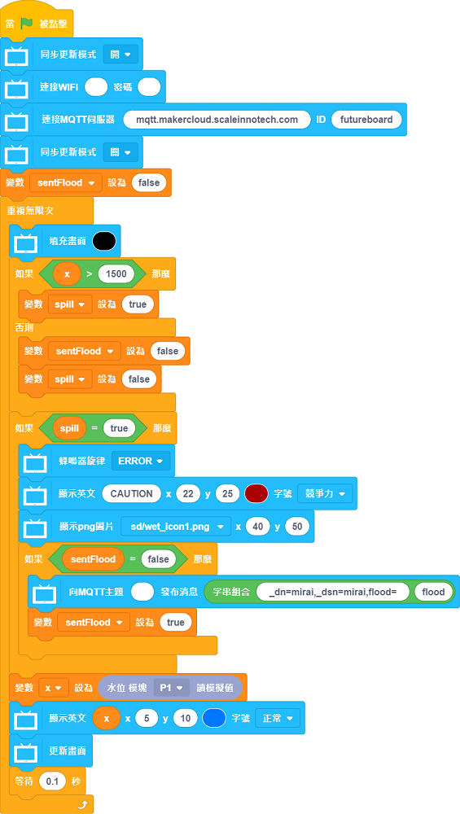

# Anti-Spilling Sink

The system will send an alert to the user if the water level is over limit.

## Building Instructions

[Building Instructions]()

## Sample Program

### For Micro:bit

[Sample Program](https://makecode.microbit.org/_4iCLs6HERhci)

### For FutureBoard

## Demonstration Video

[Demonstration Video](https://www.youtube.com/watch?v=LwzhAub01sQ)