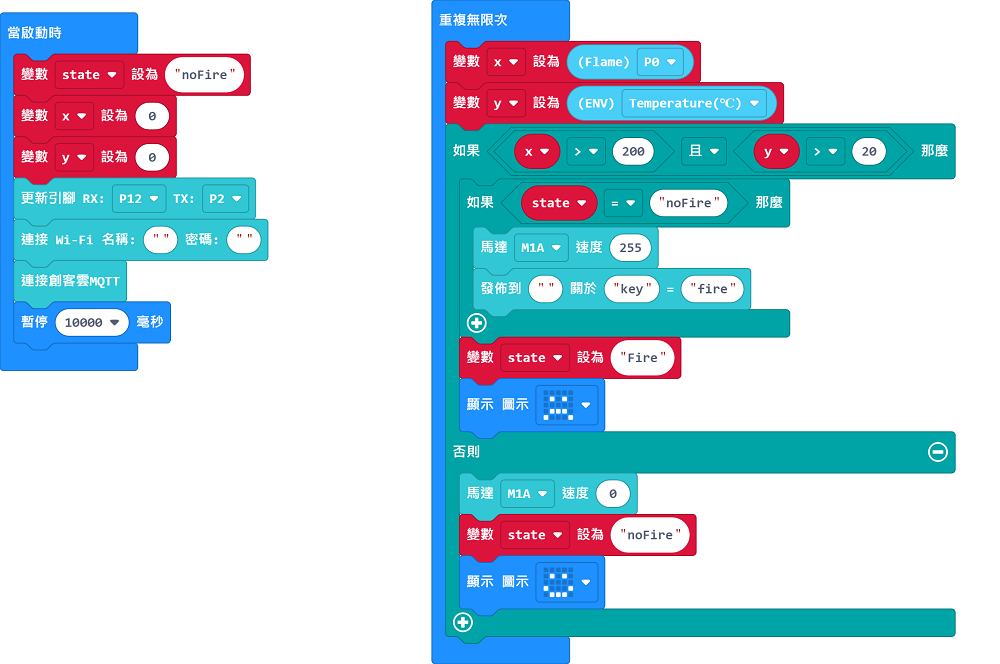
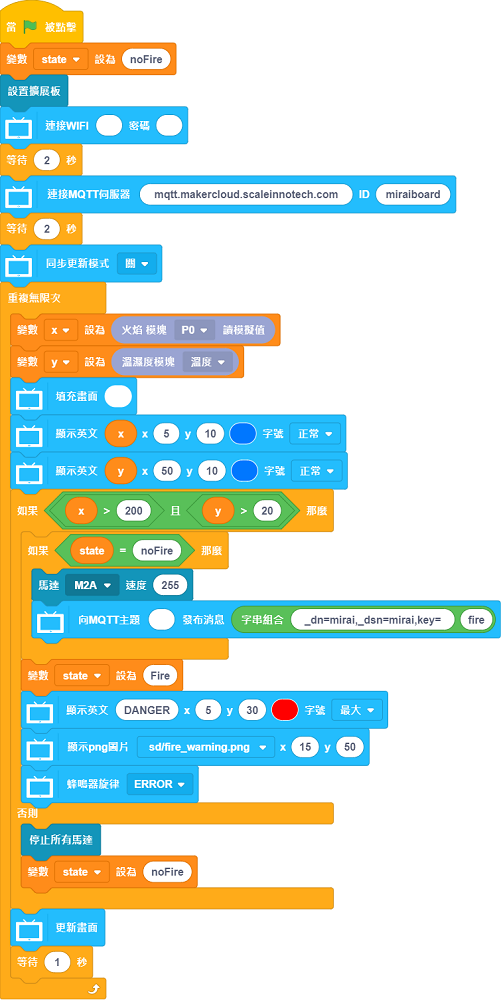

# Safety Gas Stove

System will send an alert to the user when fire breaks out and will put out the fire.

## Building Instructions

[Building Instructions]()

## Sample Program

### For Micro:bit

[Sample Program](https://makecode.microbit.org/_Abo2V2PDdY5R)

### For FutureBoard

[Sample Program]()

## Demonstration Video

[Demonstration Video](https://www.youtube.com/watch?v=n7rE02r8EJo)