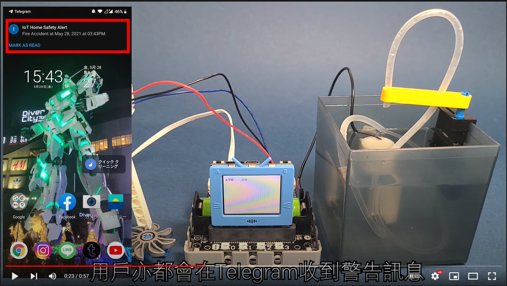

# Safety Gas Stove

System will send an alert to the user when fire breaks out and will put out the fire.

## Building Instructions

[Building Instructions](https://github.com/kittenbothk/kittenbothk-Eng/raw/master/Kits/smart_home_iot/images/window.pdf)

## Sample Wiring

## MakerCloud Version

### Micro:bit

[Sample Program](https://makecode.microbit.org/_3UcLxDX53MJu)

### Futureboard

[Sample Program](https://github.com/kittenbothk/kittenbothk-Eng/raw/master/Kits/smart_home_iot/instructions/smartStove_makercloud.sb3)

[Sample Image Files](https://github.com/kittenbothk/kittenbothk-Eng/raw/master/Kits/smart_home_iot/instructions/stovepic.rar)

## ObjectBlocks Version

### Micro:bit

[Sample Program](https://makecode.microbit.org/_adD1DLHuChzq)

### Futureboard

[Sample](https://github.com/kittenbothk/kittenbothk-Eng/raw/master/Kits/smart_home_iot/instructions/smartStove_objectblocks.sb3)

[Sample Image Files](https://github.com/kittenbothk/kittenbothk-Eng/raw/master/Kits/smart_home_iot/instructions/stovepic.rar)

## ThingSpeak Version

### Micro:bit

[Sample Program](https://makecode.microbit.org/_FLJUbz7JUi1T)

### Futureboard

[Sample Program](https://github.com/kittenbothk/kittenbothk-Eng/raw/master/Kits/smart_home_iot/instructions/smartStove_thingspeak.sb3)

[Sample Image Files](https://github.com/kittenbothk/kittenbothk-Eng/raw/master/Kits/smart_home_iot/instructions/stovepic.rar)

## Demo Video

[Demo Video](https://www.youtube.com/watch?v=n7rE02r8EJo)