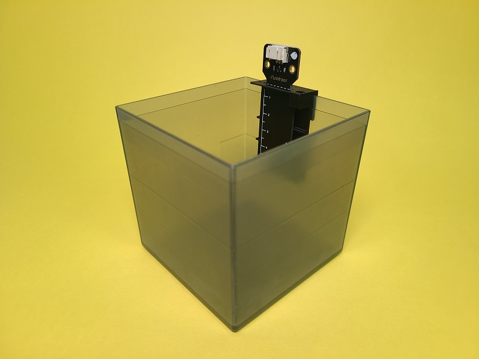
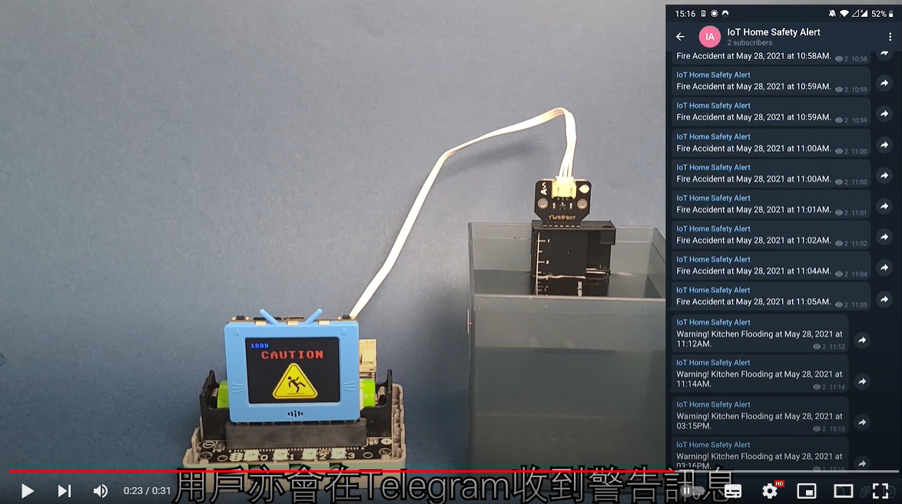

IoT Made Easy Smart Home Education Kit

IoT Made Easy Smart Home is an education kit based around the concept of IoT and smart home. 4 example use cases is included with topics focusing on Bathroom, Kitchen and Windows.

KittenBot aims to teach students the working principles of common household IoT appliances and to increase their awareness for household safety.

## Special Features

- IoT for beginners
    - Students can easily grasp the concepts of IoT
- Hands on construction
    - Students can understand the workding principle of common appliances
- Graphical Programming Interface
    - Lowers the entry barrier for beginners
- Supports IFTTT
    - Develop smart applications using IFTTT
- Adopts Sugar Series
    - No more wiring issues
- Adopts Robotbit Edu
    - No more wiring issues
    
## Kit Set Contents

- Futureboard /Micro:bit x1 (Optional)
- WifiBrick (For Micro:bit only)
- 4Pin to Dupont Cable (For Micro:bit only)
- Robotbit Edu x1
- 18650 Lithium Ion Battery x1
- GeekServo 9G Servo x1
- Sugar Magnet Sensor x1
- Sugar Infrared Sensor x1
- Sugar Flame Sensor x1
- Sugar PIR Sensor x1
- Sugar Rain/Water Sensor x1
- Sugar Environment Module x1
- All In One Water Tank+Pump x1
- 3D Printed Part x1
- Plastic Building Bricks Bag x1
- Mini Magnet x1
- 3Pin Cable x2
- 4Pin Cable x1

## Examples Showcase

### Remote Window

Control the opening and closing of the window through an IoT platform.

[示範短片](https://www.youtube.com/watch?v=nLj0LCgN1Uk)

### 防浸洗手盤

假如水位超出安全水平將會透過IoT平台通知用家。

[示範短片](https://www.youtube.com/watch?v=LwzhAub01sQ)

### 平安浴缸

假如偵測到用家在浴缸中昏迷就會透過IoT平台警告家人。

[示範短片](https://www.youtube.com/watch?v=tRQiIUIZCpo&t=1s)

### 安全爐具

能夠在失火時立即透過IoT平台通知用家，並且撲滅火焰。

[示範短片](https://www.youtube.com/watch?v=n7rE02r8EJo)