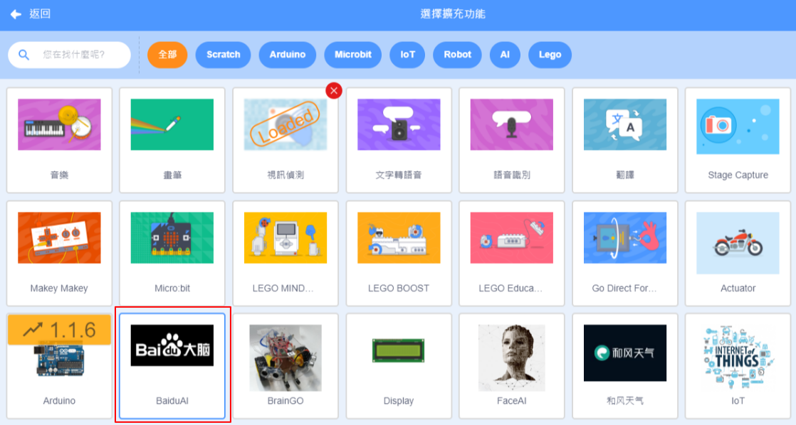
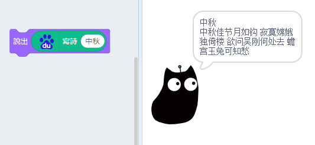
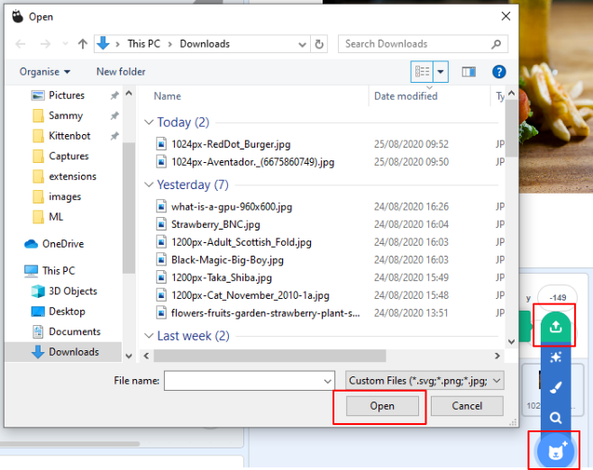
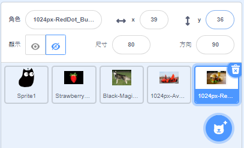
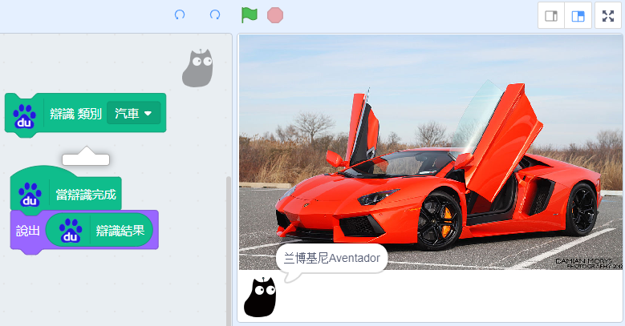
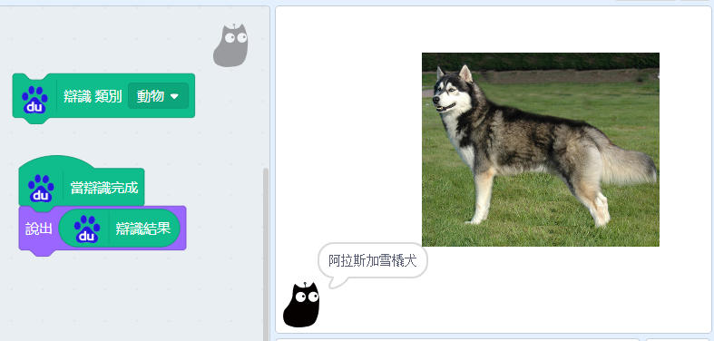
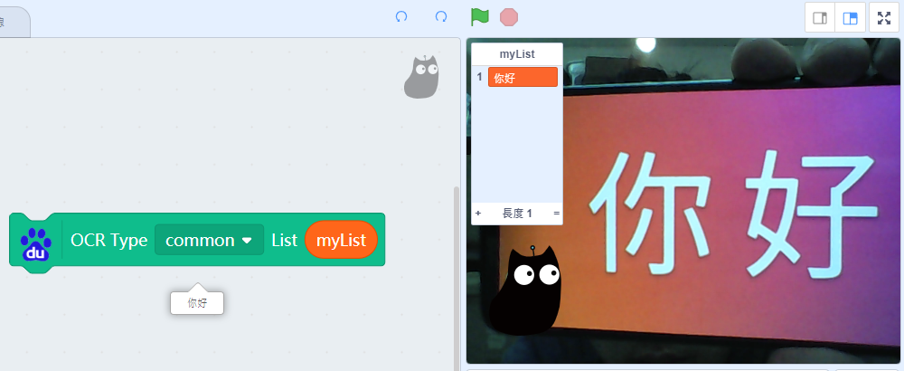
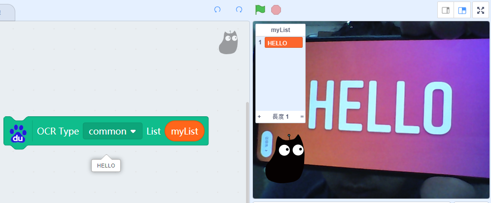

# BaiduAI

BaiduAI is an AI service by Baidu, some of its features can be accessed from Kittenblock so everyone can try out their functions without much hassle.

## Loading the extension for Baidu AI

Open up the extension page.

Select BaiduAI.

New programming blocks will be added.

## Using BaiduAI

There are serveral functions in BaiduAI.

### Creating Literature

Literature such as poems and couplets can be generated.

Example 1: Creating a couplet.

Example 2: Creating a poem.

### Text to speech

BaiduAI can also read out texts.

Example 1: Reading out Chinese.

Example 2: Reading out English.

### Voice Recognition

BaiduAI can understand speech.

Currently BaiduAI can understand Putonghua.

### Object Recognition

BaiduAI is able to recognize different objects in multiple categories.

Upload some pictures to be recognized.

Hide the pictures on canvas.

Select the category an unhide the picture.

Example 1: Recognizing foods.

Example 2: Recognizing cars.

Example 3: Recognizing animals.

### Optical Character Recognition

BaiduAI is able to read Chinese and English characters.

    The Video Sensing extension is used here.
    
Example 1: Recognizing Chinese characters.

Example 2: Recognizing English characters.

### Smart Talk

BaiduAI has the ability to chat with you.

## References

    By Damian Morys from New York City, United States - Aventador., CC BY 2.0, https://commons.wikimedia.org/w/index.php?curid=41292267

    By Hongreddotbrewhouse - Own work, CC BY-SA 3.0, https://commons.wikimedia.org/w/index.php?curid=33551162

    By Prathyush Thomas - Own work, GFDL 1.2, https://commons.wikimedia.org/w/index.php?curid=37417848
    
    By User:Magicwolf - https://i.imgur.com/jn0fLtw.jpg, CC BY-SA 3.0, https://commons.wikimedia.org/w/index.php?curid=5110106