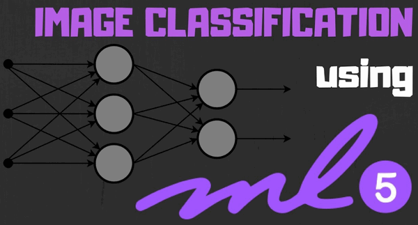
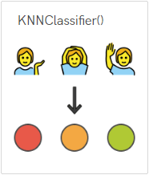
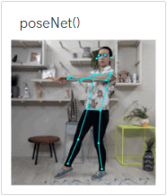
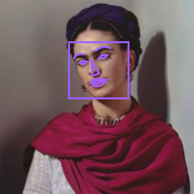

# Machine Learning 5

Machine Learning 5 is a machine learning extension originated from ml5.js, its main goal is to make machine learning accessible to everone.

Based on Google's TensorFlow platform, Machine Learning 5 offers reliable and robust features.

[ML5 Website](https://ml5js.org/)

## Functions Showcase

### Image Classification

Images can be classified using ML5's built-in model.

### Feature Extraction and Detection

Building your own model for image classification is also possible.

### SketchRNN

SketchRNN can draw pictures about a topic.

### poseNet

poseNet can estimate the posture of a human.

### Face Detection

ML5 can detect faces and its facial features.

## Loading the extension for Machine Learning 5

Open up the extension page.

Select Machine Learning 5.

New programming blocks will be added.

