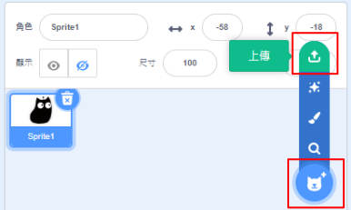
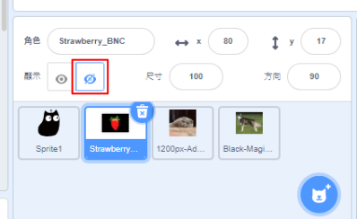
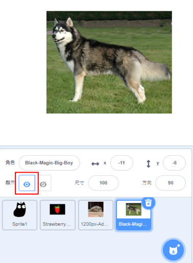
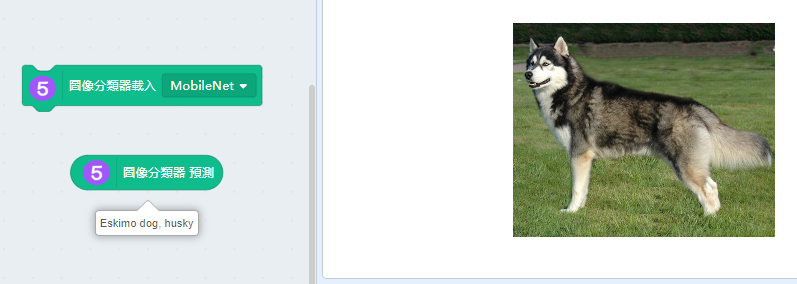
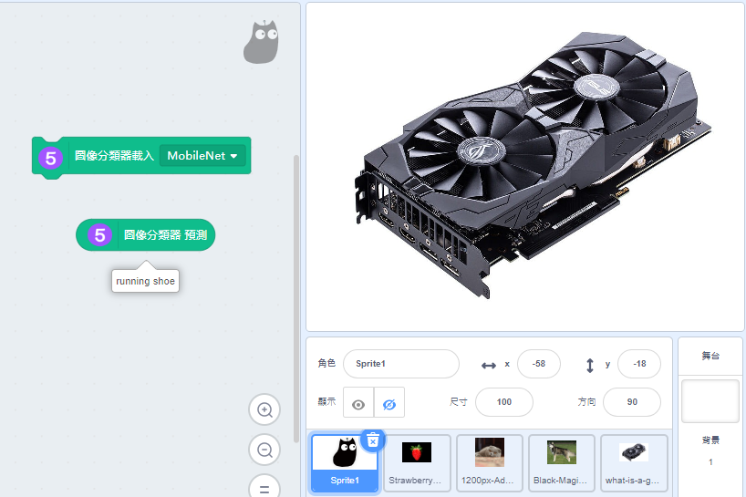

# Machine Learning 5 Image Classification

Images can be classified using ML5's built-in model.

## Loading the extension for Machine Learning 5

Open up the extension page.

Select Machine Learning 5.

New programming blocks will be added.

If your computer has a low specification(e.g. lacks a discrete GPU), its performance maybe enhanced by using CPU mode.

## Classifying Images

Upload the pictures onto Kittenblock.

Hide the pictures.

Start programming the main character.

MobileNet has better performance but needs an internet connection, MobileNetLocal does not need an internet connection but it is not as powerful.

Unhide the picture you wish to classify.

Example 1: Recognizing pictures

MobileNet is only able to recognize objects that are commonly seen.

## References

    https://www.hellotech.com/blog/whats-a-gpu-what-gpu-do-you-have
    
    By Prathyush Thomas - Own work, GFDL 1.2, https://commons.wikimedia.org/w/index.php?curid=37417848
    
    By User:Magicwolf - https://i.imgur.com/jn0fLtw.jpg, CC BY-SA 3.0, https://commons.wikimedia.org/w/index.php?curid=5110106

    By Psihopat - Own work, CC BY-SA 3.0, https://commons.wikimedia.org/w/index.php?curid=12724979