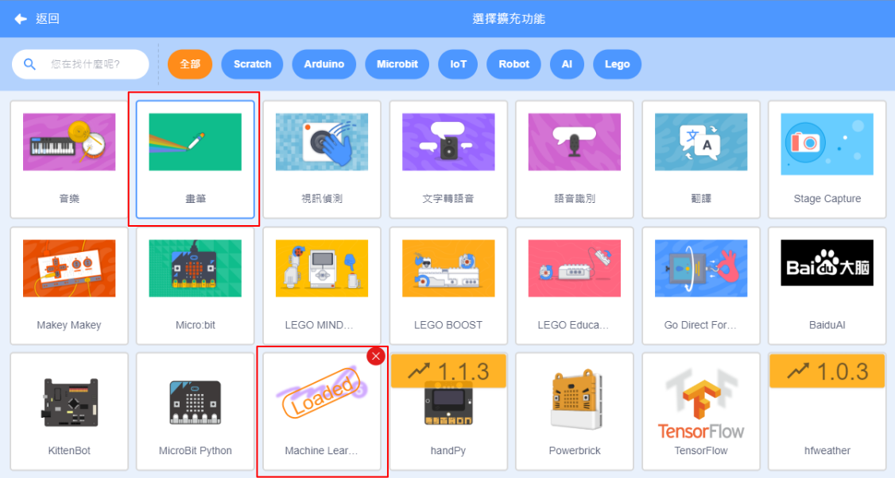
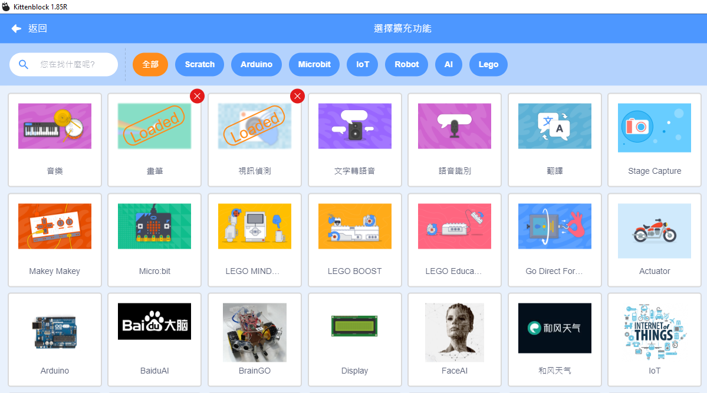
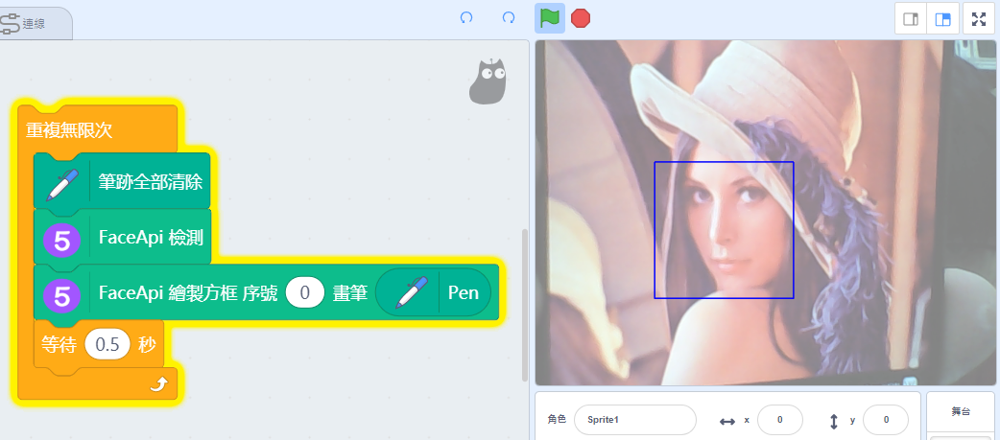
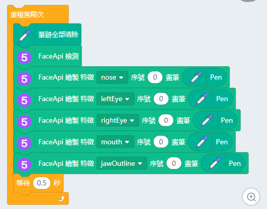
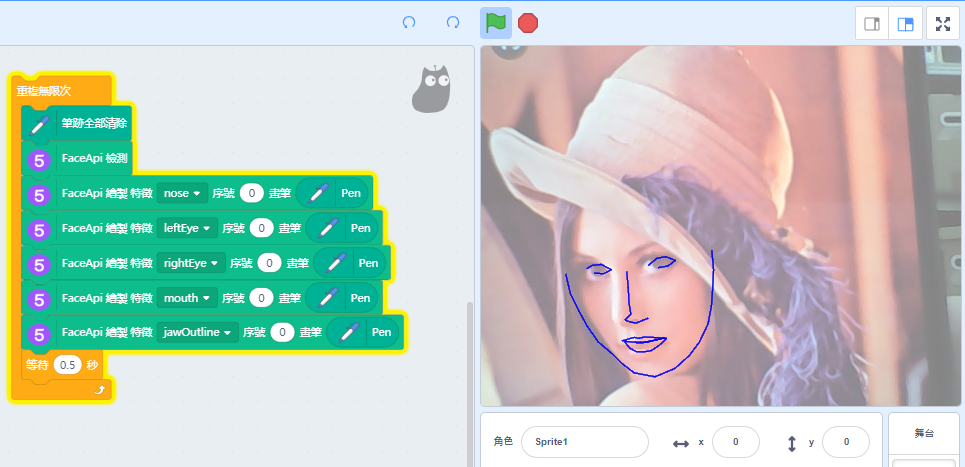

# Machine Learning 5 FaceAPI

Machine Learning 5's FaceAPI is a face detection tool.

## Loading the extension for Machine Learning 5
    
    The Video Sensing extension is also used in this tutorial.

Open up the extension page.

Select Video Sensing, Machine Learning 5 and the Pen extension.

New programming blocks will be added.

If your computer has a low specification(e.g. lacks a discrete GPU), its performance maybe enhanced by using CPU mode.

## Detecting Faces

The Face model must be initialized before any faces can be detected.

Example 1: Detecting a face.

Example 2: Tracking facial features.

