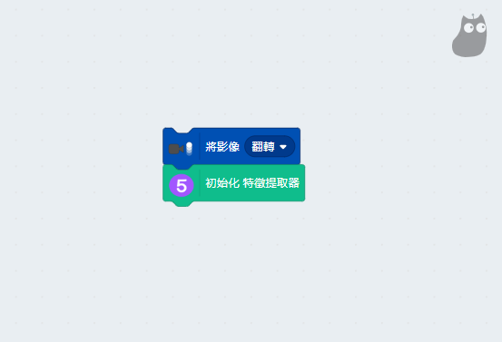
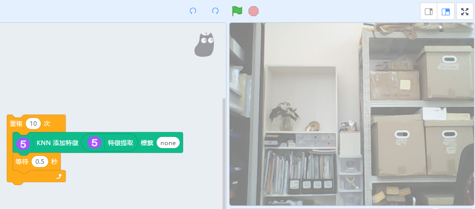
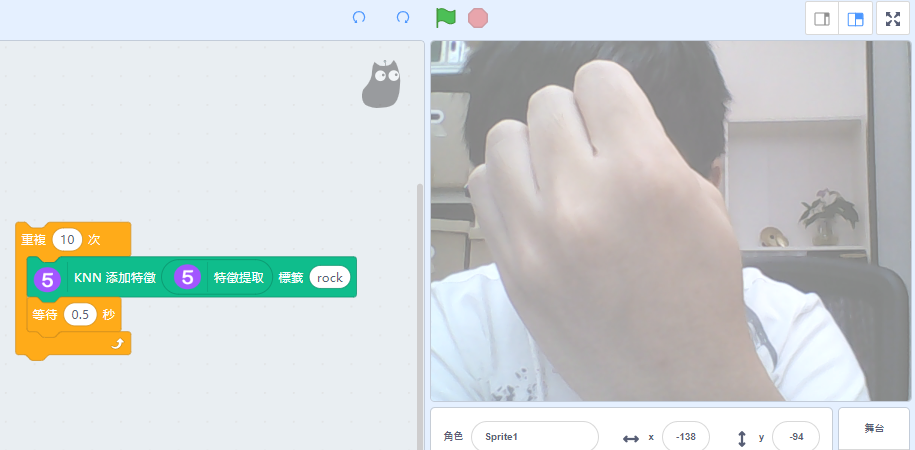
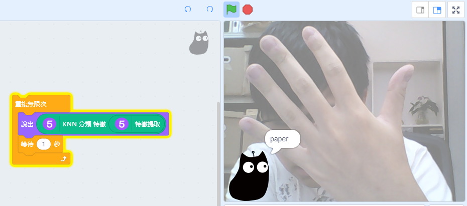
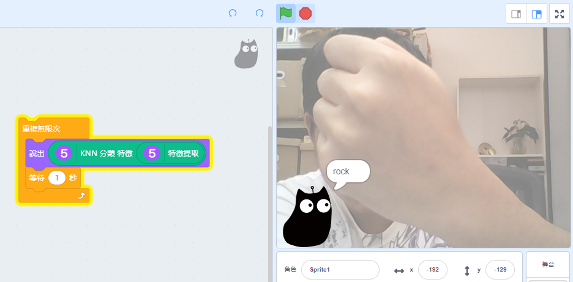
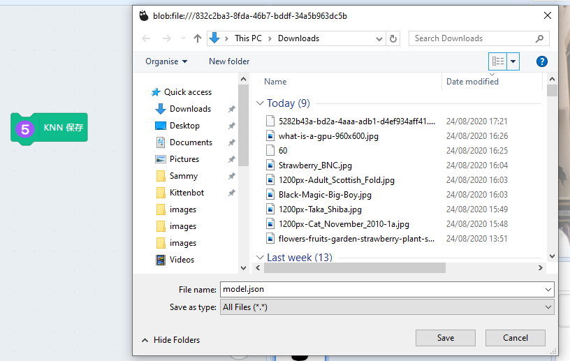
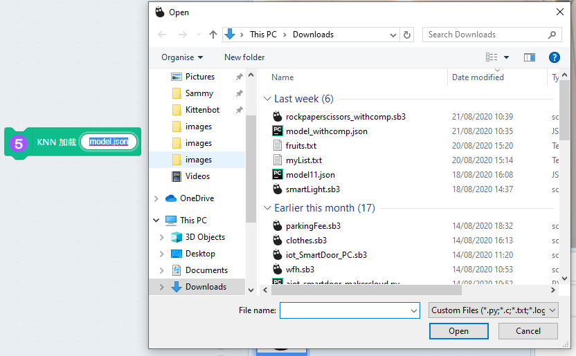

# Machine Learning 5 特徵提取器

利用分類器，讓人們能自行訓練自己專屬的機器學習模型。

## Loading the extension for Machine Learning 5
    
    The Video Sensing extension is also used in this tutorial.

Open up the extension page.

Select Video Sensing, Machine Learning 5 and the Pen extension.

New programming blocks will be added.

If your computer has a low specification(e.g. lacks a discrete GPU), its performance maybe enhanced by using CPU mode.

## Feature Extraction

### Example 1: Rock Paper Scissors

Turn on the camera and initialize the feature extractor

Teach the program to recognize the background.

Teach the program to recognize rock.

Then teach the program to recognize paper and scissors.

The program is now able to recognize these gestures.

The trained model can be saved as a json file for use in other programs.

We can load a model from before.

