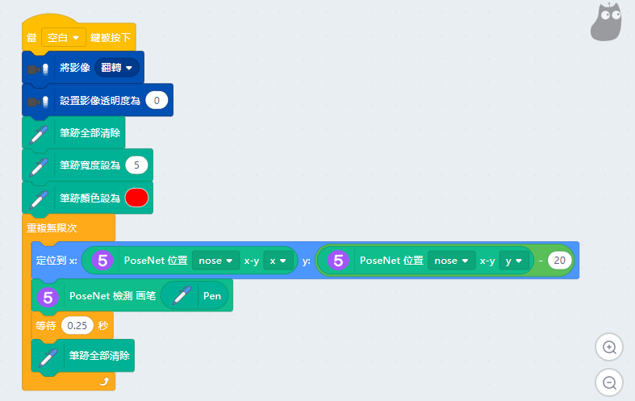
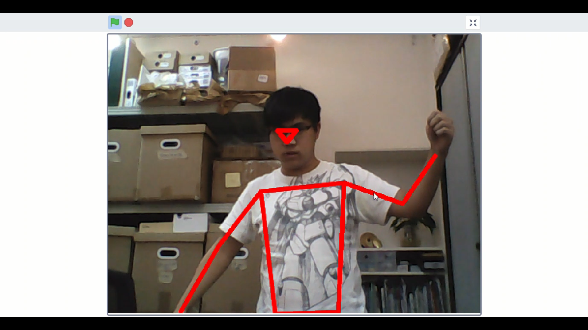

# Machine Learning 5 PoseNet

Machine Learning 5's poseNet can estimate the posture of a human.

## Loading the extension for Machine Learning 5
    
    The Video Sensing extension is also used in this tutorial.

Open up the extension page.

Select Video Sensing, Machine Learning 5 and the Pen extension.

New programming blocks will be added.

If your computer has a low specification(e.g. lacks a discrete GPU), its performance maybe enhanced by using CPU mode.

## Tracking a Skeleton

The PoseNet model must be initialized before using.

Example 1: Trace the skeleton of a human.

