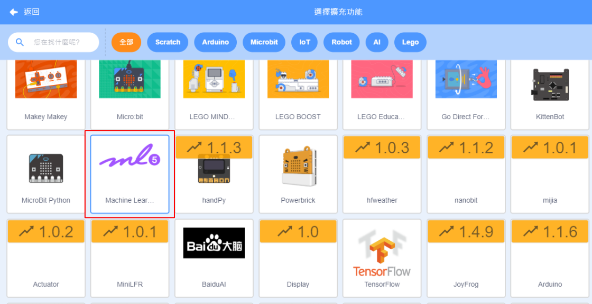
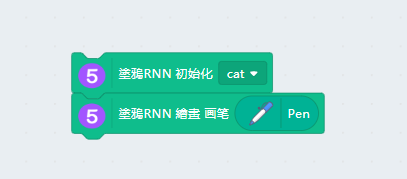
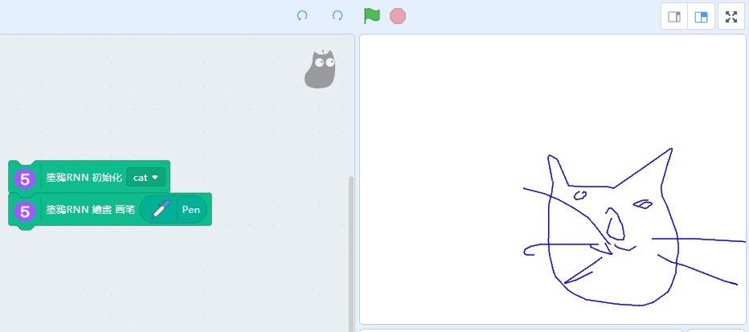
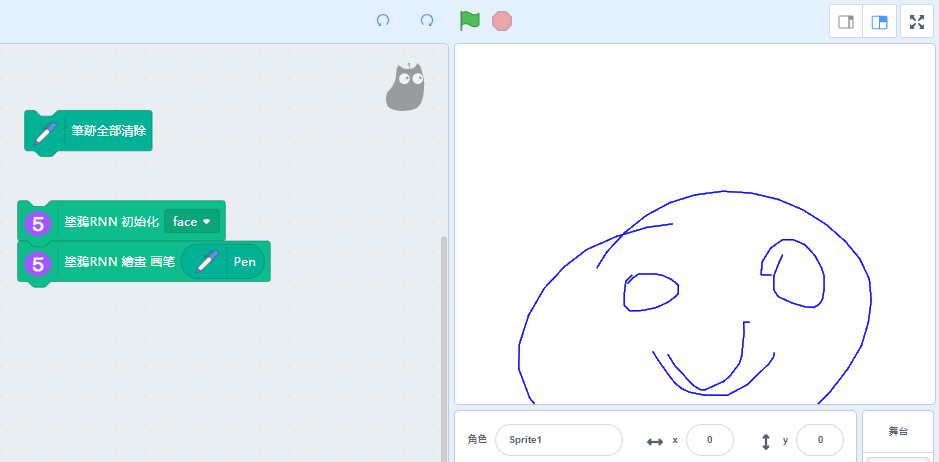

# Machine Learning 5 SketchRNN

SketchRNN can draw pictures about a topic.

## Loading the extension for Machine Learning 5

Open up the extension page.

Select Machine Learning 5 and the Pen extension.

New programming blocks will be added.

## Drawing sketches

Example: Drawing a cat

Example: Drawing a face

