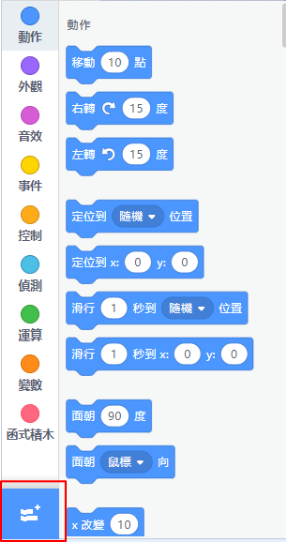
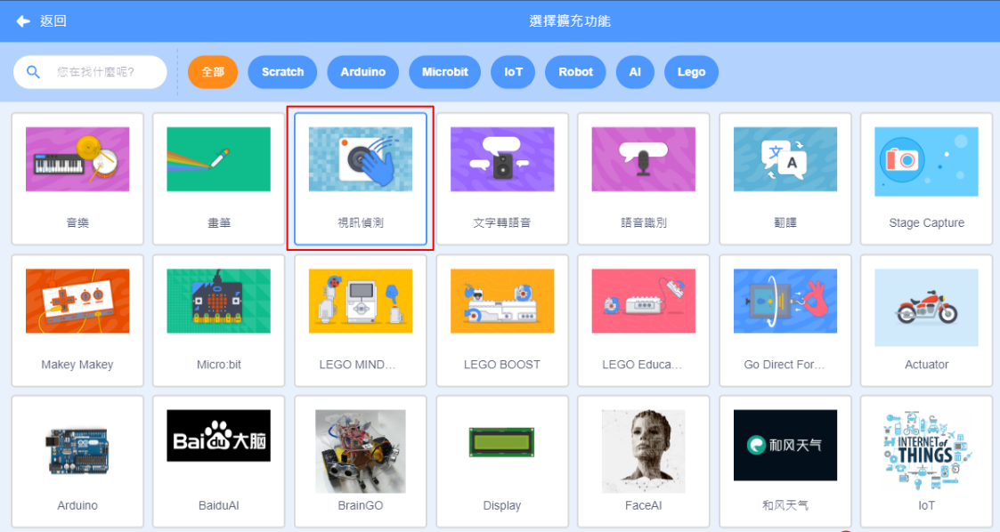
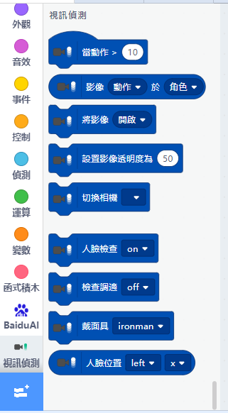
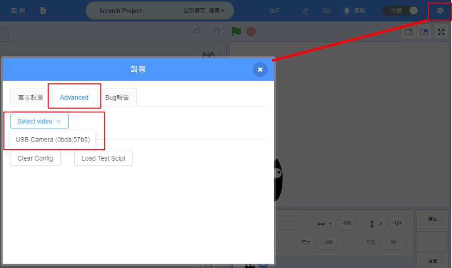
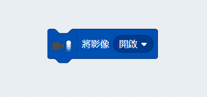
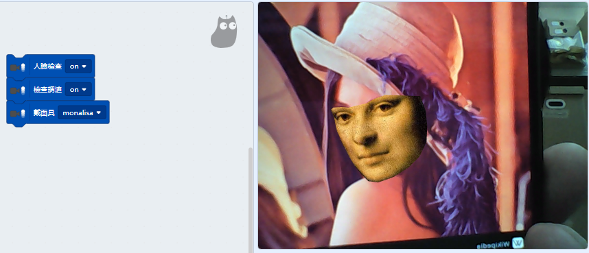
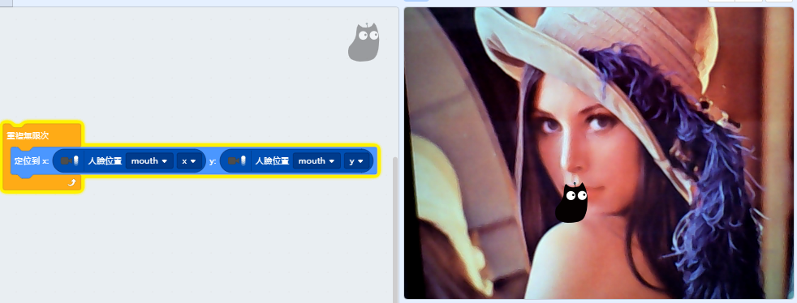
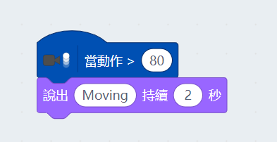
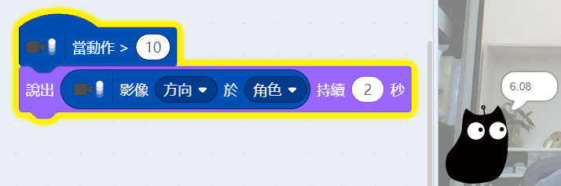
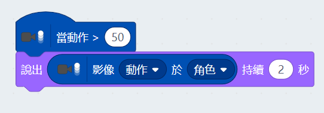

# Video Sensing

The Video & Detection Plug-in allows Kittenblock to use the webcam to produce various effects.

## Add the Video Sensing Extension

Open up the extension page.

Select Video Sensing.

New programming blocks will be added.

## Video Sensing

You can also use a USB webcam by enabling this option in settings.

We use this block to turn on or off the camera.

### Face Detection

Example: Detecting a face and putting a mask on it.

Example: Tracking Facial Features

### Motion Detection

Example: Detecting movement

The threshold(0-100) determines how large the movement should be for the event to be triggered.

Example: The direction of movement can also be obtained(-180~180).

Example: Obtaining the velocity of the object in move.

