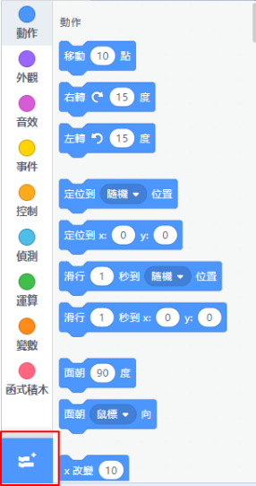

# Internet of Things

Internet of Things is a hot topic in today's society. Kittenblock already comes with an easy-to-use IoT extension for you to learn and experience IoT.

## Load the extension for IoT

Open up the extension page.

Select IoT.

New programming blocks will be added.

## Using IoT Extension

Kittenblock comes with a local IoT server.

Navigate to local server and switch the server on.

The IP address of your local server is seen on this page.

We can now use our local IoT server for MQTT operations. Type the IP adress of your local server into the MQTT host parameter.

Example: Publishing and Subscribing to a topic on our local server

Multiple computers or devices can connect to the local server as long as they are connected to the same local network, i.e. the same WiFi network.

For example, in this figure, all 3 computers are on the same Wifi network, with computer A hosting the server with 192.168.0.117 while B and C connecting to it. The 3 computers can communicate with each other as they publish and subscribe to the same topic.

