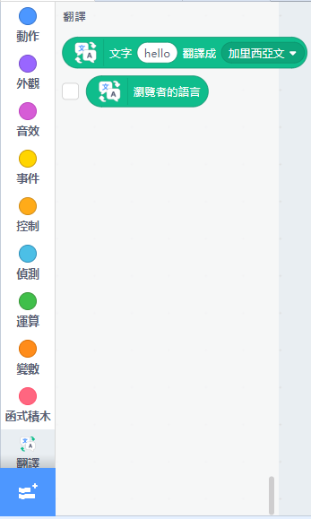
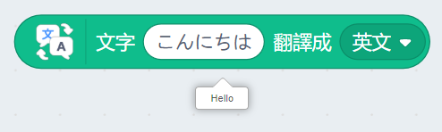

# Translation

Text can be translated into different languages with the Translation addon.

## Load the extension for translation

Open up the extension page.

Select Translation.

New programming blocks will be added.

## Translating Text

Example: Translating text into English.

Example: Translating text into the system language.

