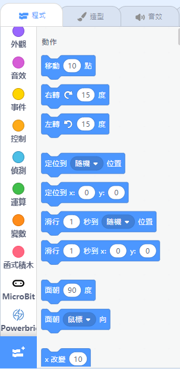
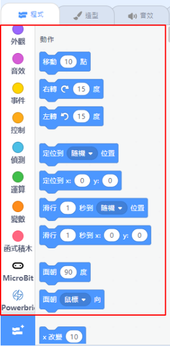
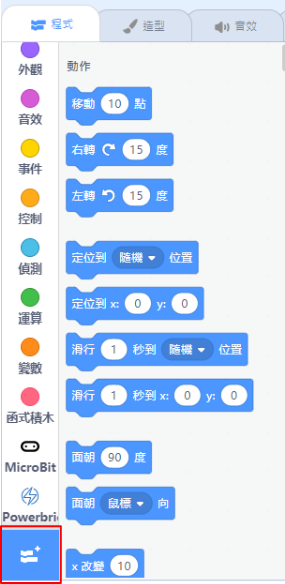
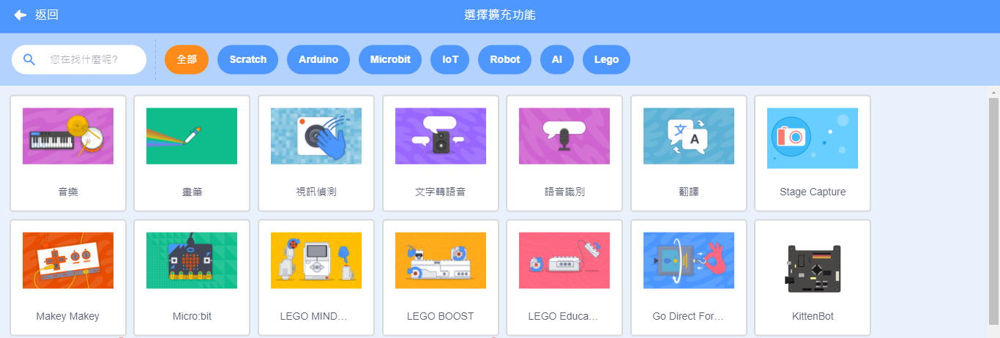

# Blocks Menu

## Kittenblock Blocks Menu

This is the menu for selecting different coding blocks.

### 1. Coding Blocks Menu

All coding blocks will be found here, the blocks are color coded for easy understanding.

### 2. Extension Menu

Load various extensions in this page.

## Stage-only Blocks and Hardware-only Blocks

2 kinds of blocks are present in Kittenblock:
- Stage-only Blocks
- Hardware-only Blocks

These 2 kinds of blocks determine whether your program can be uploaded to the control board.

There are shared blocks too, so it is important to distinguish the 2 kinds of blocks.

### Stage-only Blocks

In Stage Mode, all blocks are accessible.

We can see the blocks available from the menu.

Both Stage-only Blocks and Hardware-only blocks can be used in this mode.

### Hardware-only Blocks

In Coding Mode, only hardware-only blocks are accessible.

From the menu, we can see that the blocks available are reduced when in coding mode.

The blocks here are hardware-only.

