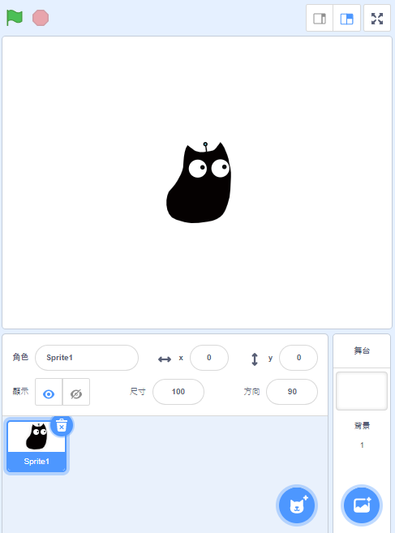
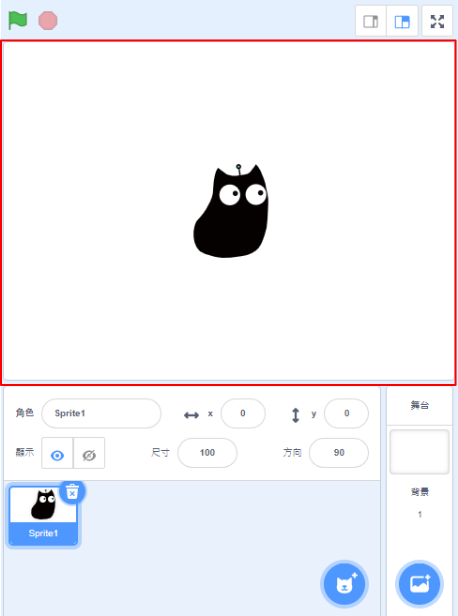
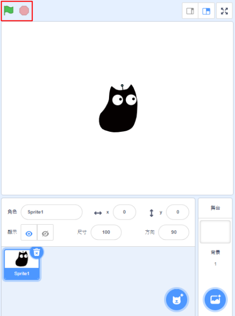
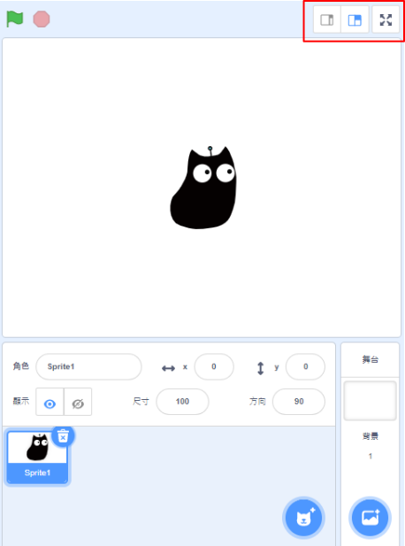
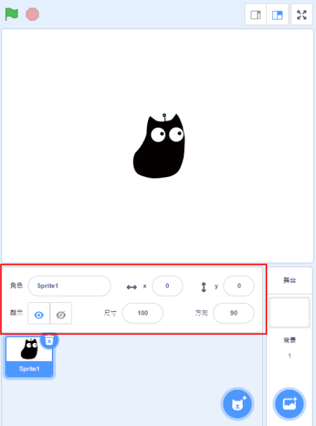
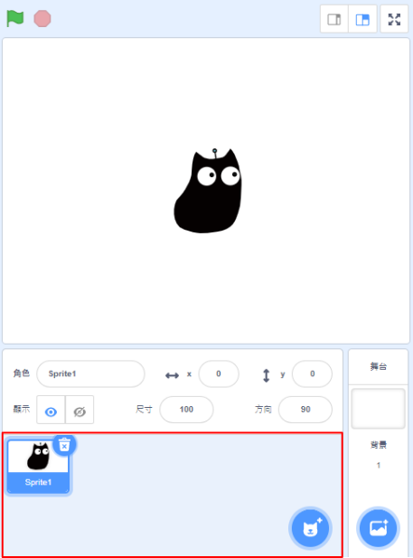
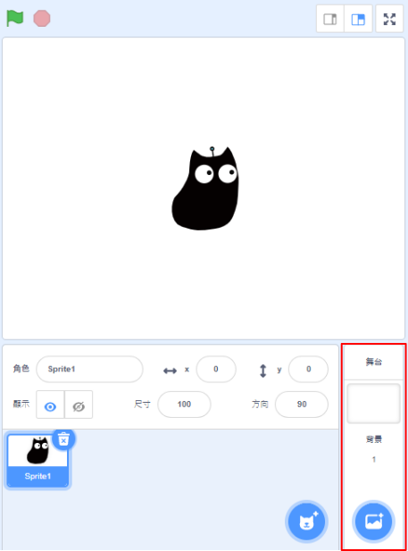

# Stage

## Kittenblock Stage

This is the stage in Kittenblock.

### 1. Main Stage

Characters can be dragged around or selected in this main stage.

### 2. Start and Stop Buttons

Clicking the Green Flag starts the program and the Red Button stops the program.

### 3. View Selection

You can adjust the size of the stage here.

### 4. Character Parameters

Parameters for characters can be set, such as coordinates, rotation, size.

### 5. Character Selection

Select, add or delete characters from here.

### 5. Background Selection

Select, add or delete backgrounds from here.

