# Kittenblock Main UI

## Kittenblock Main UI

This is the Main UI of Kittenblock, the most frequently used functions will be discussed here.

Kittenblock 1.84Z

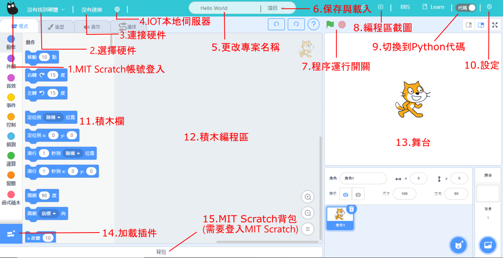

Kittenblock 1.85R

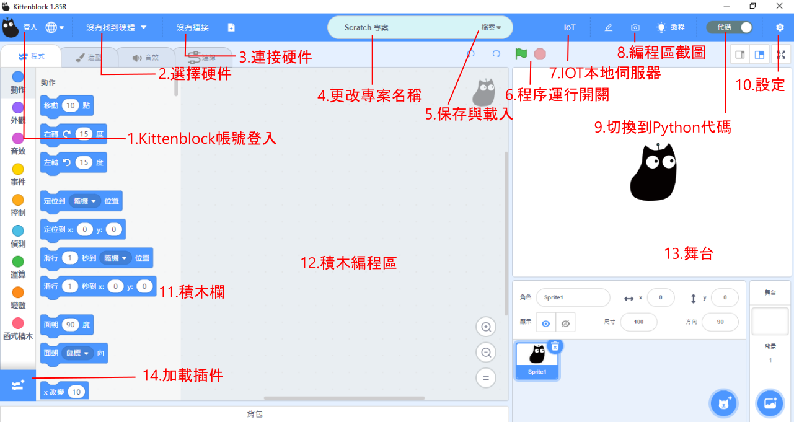

## Kittenblock Toolbar

Let's take a close look at the toolbar on the top of Kittenblock.

### 1. Log In to Kittenblock

Log in or create your Kittenblock account.

Logging in allows you to:
1. use Kittenbot's cloud IoT server.
2. freely use Kittenbot's AI functions.
3. share your project with others on the forum.
4. save the project on the cloud.

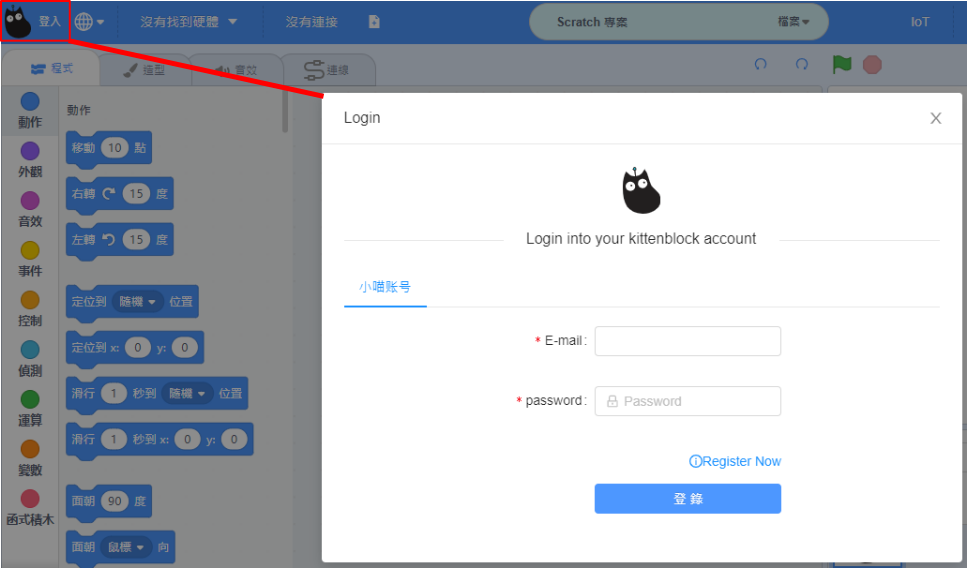

### 2. Select Language

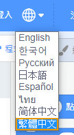

### 3. Select Hardware

### 4. Connect to Hardware

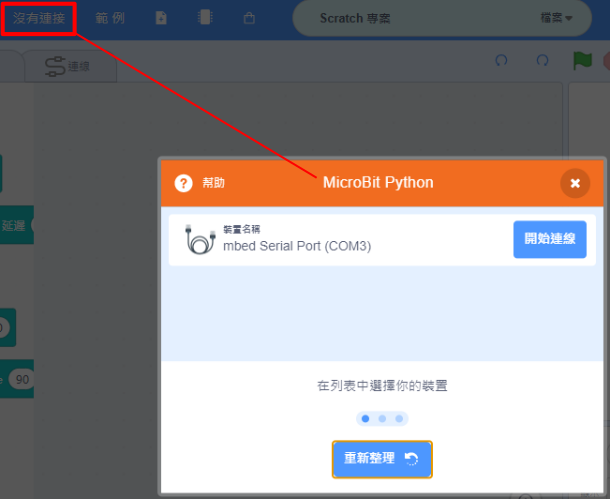

### 5. Sample Programs

### 6. Firmware Upgrade

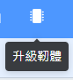

### 7. Edit Project Name

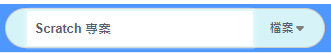

### 8. Save and Load

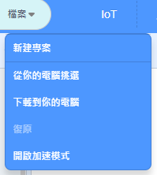

### 9. IoT Local Server

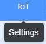

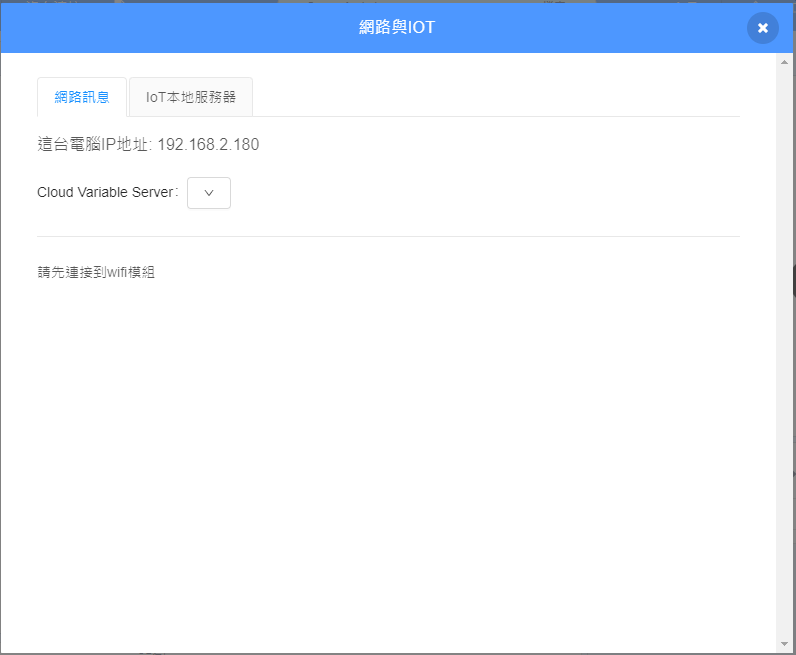

### 11. Coding Area Screenshot

### 12. Switch to coding mode

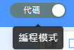

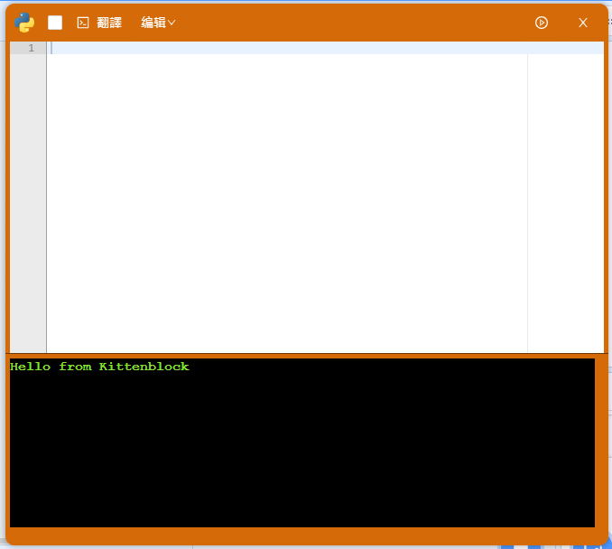

### 13. Settings

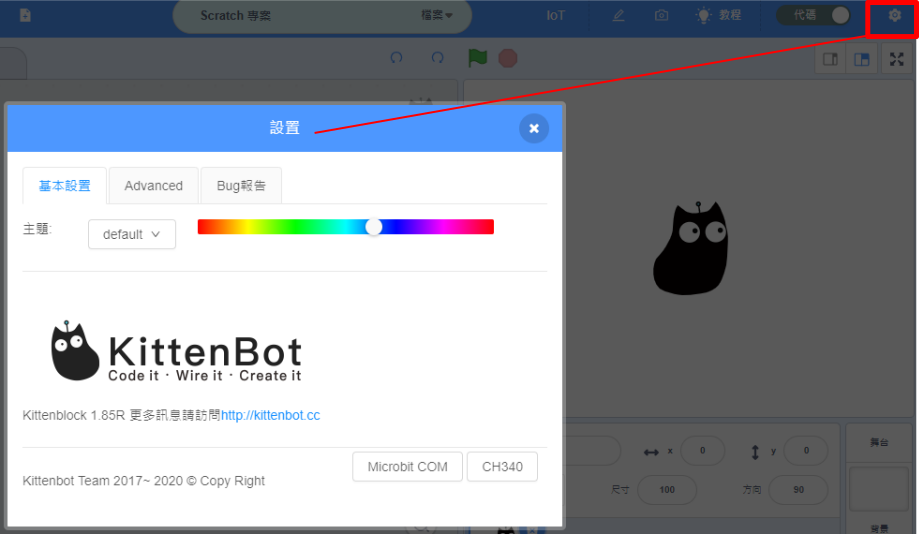