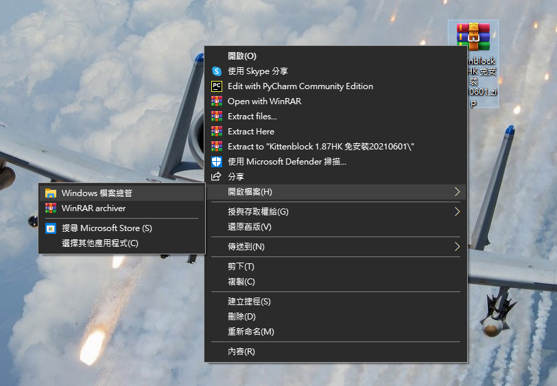
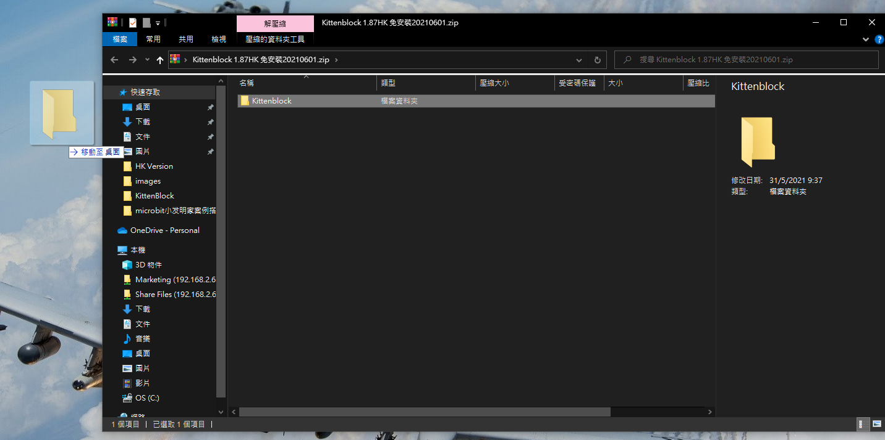
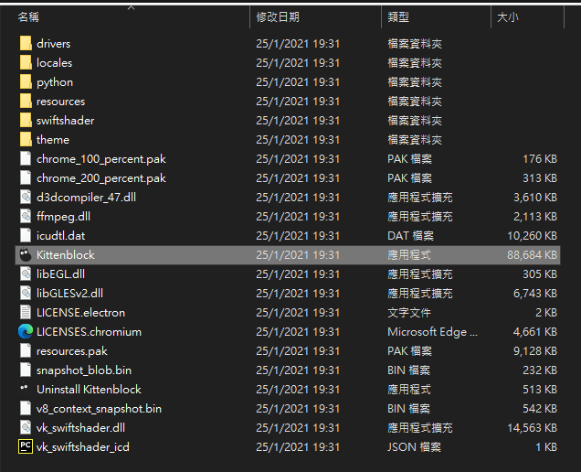

# Installing KittenBlock

KittenBlock is the programming platform developed by Kittenbot for STEM Education.

## Setting Up KittenBlock on your machine

### Download Site

For Windows 10:

Download the Google Drive Folder from [Download Kittenblock 1.87](https://drive.google.com/file/d/1rM3ByEvJRCVqOo1O06LcZqTOC8nu1kZi/view?usp=sharing).

  

### Installing KittenBlock

Right Click the zip file and choose open the file with Windows Explorer.

    You can also use programs such as WinRar.

Extract the contents to your desktop.

    Beware! Please do not place the contents in another folder!

Double-click on KittenBlock.exe to launch KittenBlock.

## Installing the Extensions

Open up the settings menu by clicking on the gear.

Install Microbit COM and CH340 extensions. It should take less than a few minutes.

## Trouble Shooting

### 1. KittenBlock launches to a blue or white screen.

The permissions have to be updated.

### Right-click on Kittenblock.exe and tick run as administrator.

### 2. No hardware is displayed in the hardware menu

### Close KittenBlock and open KittenBlock again