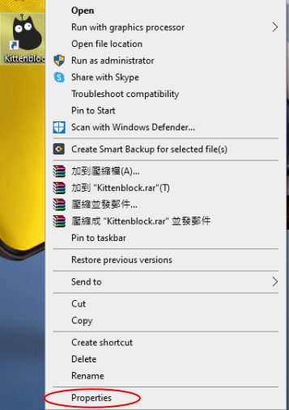

# Installing KittenBlock

KittenBlock is the programming platform developed by Kittenbot for STEM Education.

## Setting Up KittenBlock on your machine

### Download Site

For Windows 10:

[Download Kittenblock 1.89](https://bit.ly/KittenblockHK18911)

For MacOS(Intel):

[Kittenblock 1.89 下載](https://bit.ly/KittenblockHK18911Mac)

  

### Installing KittenBlock(Windows)

Unzip the rar file.

    Winrar or similar programs can be used to unzip.

A folder named KittenBlock will be extracted from the archive.

Launch KittenBlock.exe from the folder.

#### Installation Demo

[Windows Installation Demo](https://www.youtube.com/watch?v=sU0zmLy1aQ8)

## Installing the Extensions

Open up the settings menu by clicking on the gear.

Install Microbit COM and CH340 extensions. It should take less than a few minutes.

## Installing KittenBlock(Mac)

Unzip the KittenBlock zip file and launch the KittenBlock application.

#### Installation Demo

[MacOS Installation Demo](https://youtu.be/U8nrqviWDlI)

## Troubleshooting

### 1. KittenBlock launches to a blue or white screen.

The permissions have to be updated.

### Right-click on Kittenblock.exe and tick run as administrator.

### 2. No hardware is displayed in the hardware menu

### Close KittenBlock and open KittenBlock again