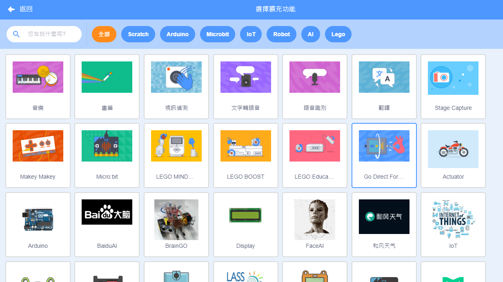
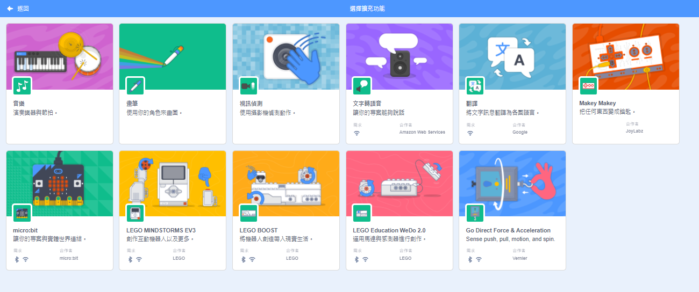
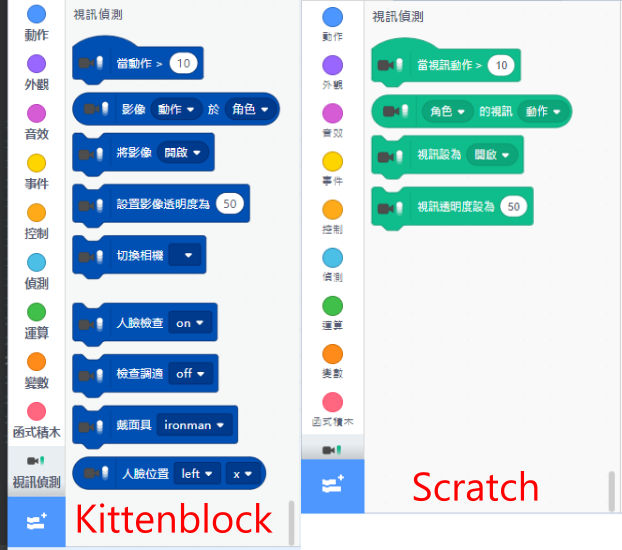
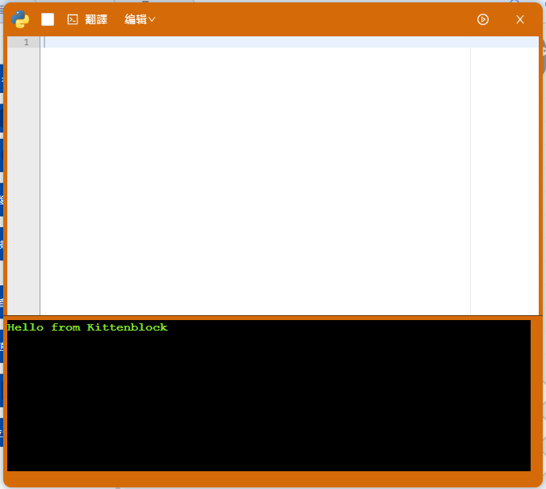
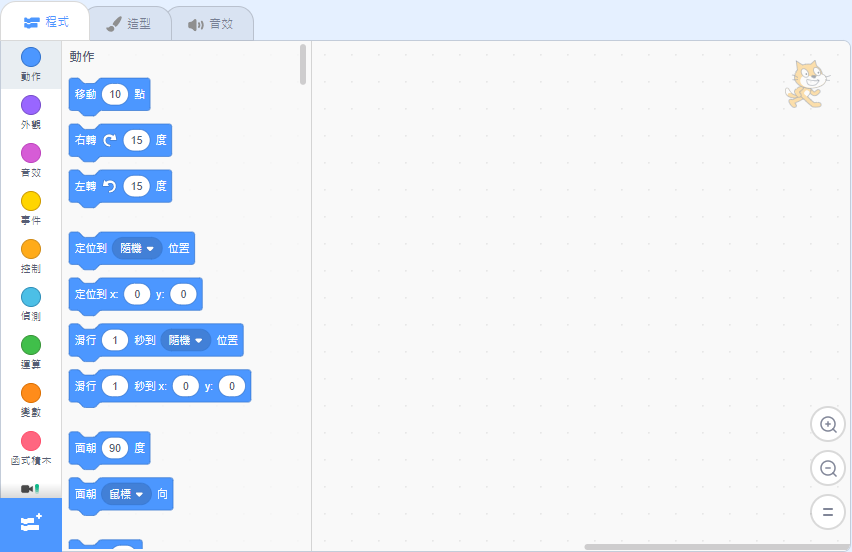
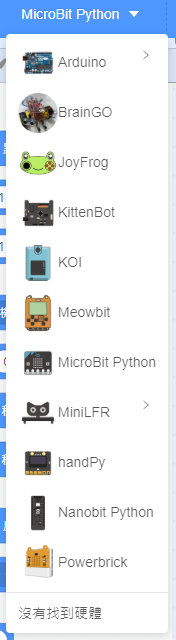
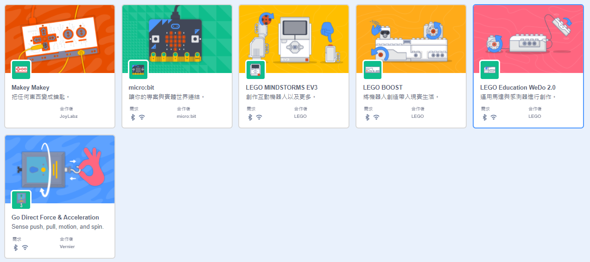
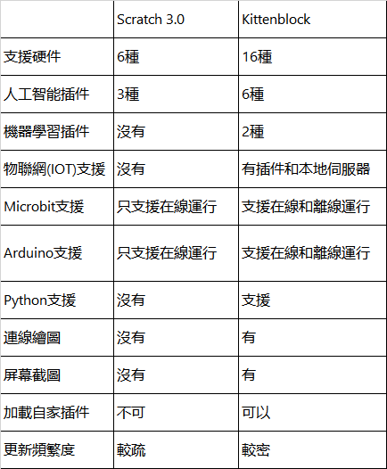

# Kittenblock VS Scratch 3.0

As Kittenblock is based on Scratch 3.0 from MIT, you may ask what is the difference between Scratch and Kittenblock?

Compared to Scratch, Kittenblock has the advantage of more functions and extensions.

The special features of Kittenblock are shown below.

## Feature 1: Extensions

Kittenblock has more extensions than Scratch by including different powerful extensions for AI and Machine Learning.

Kittenblock has more extensions, supporting various kinds of hardware and technologies.

Scratch has fewer extensions and supports not as many hardware.

Even in the same extension, Kittenblock's version may have some improved features.

## Feature 2: Up-to-date Programming

As STEM education moves onto AI, IOT and even text coding with Python, Scratch 3.0 seems inadquate to satisfy the current edcation needs.

However Kittenblock is up-to-date, offering extensions for AI, IoT and Machine Learning, together with text coding capabilities, makes Kittenblock more suitable for education needs.

Python Editor inside Kittenblock:

Scratch only offers block-based coding.

## Feature 3: Supports More Hardware

Scratch currently only supports Lego Mindstorm, Lego Boost, Makey Makey and Micro:bit.

In contrast, Kittenblock adds the support for all Kittenbot products as well as Arduino boards and even XiaoMi smart home.

Comparison between hardware supported:

## Feature 4: Supports Uploading Programs

One of the advantage in programming a control board is that programs can be uploaded to the board thus allowing it to run the code on its own.

However this function cannot be done in Scratch, control boards can only be used in online mode.

This function is implemented in Kittenblock, allowing for more flexibility for your creations.

## Feature 5: More Built-in Functions

In order to provide a richer user experience, Kittenbot has implemented multiple new functions that are built in Kittenblock.

These new functions include an IoT server, a Python Editor, a Wiring Diagram Maker as well as Code Snapshots.

These functions are documented in this section: [New Functions in Kittenblock](./kittenbot_function/index)

## Feature 6: Importing Extensions

It is impossible to add your own extensions in Scratch as it only allows users to use the ones provided by MIT.

But it Kittenblock, this feature has been opened up to the users. Providing advanced users a way to write their own extensions then import it in KittenBlock.

## Feature 7: Frequent Updates

If you are familiar with Scratch 2.0, you will know that Scratch 3.0 is not that much different from Scratch 2.0 and updates are also few and far between.

For Kittenblock, the developers are hard at work at improving Kittenblock by rolling out updates frequently, often enhancing features while adding new ones.

## Kittenblock VS Scratch

