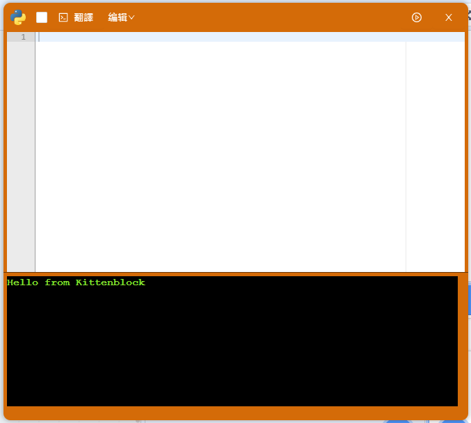
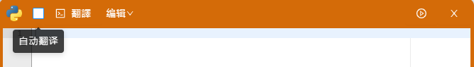
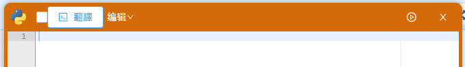
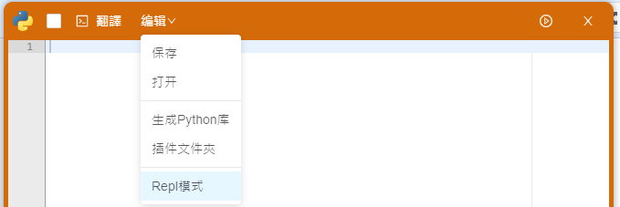
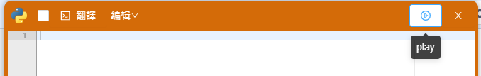
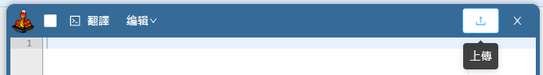

# Python Editor

The Python Editor allows easy coding with Python on KittenBlock. Let's take a closer look at the features it provides.

### 1. Auto Translation

Programming blocks are automatically translated into Python code when this box is ticked.

### 2. Manual Translation

Press this button to translate the programming blocks into Python code.

### 3. Edit

Open or save the Python file.

### 4. Run/Upload

Run the code or upload the code to the hardware.

