# Wiring Diagram Maker

Making Wiring Diagrams can make it easy for us to share our designs.

## Making Wiring Diagrams

Open the Wiring Diagram Tab

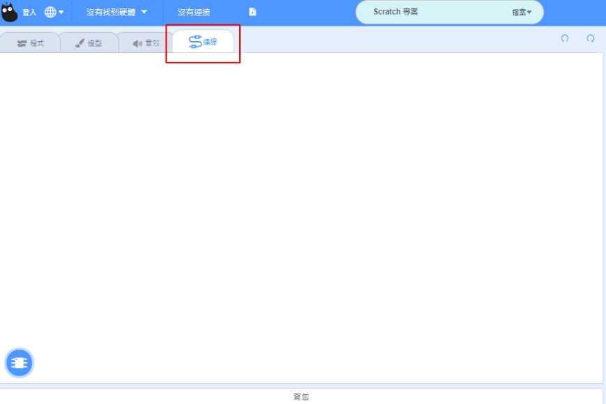

### 1. Adding components

You can select the components here.

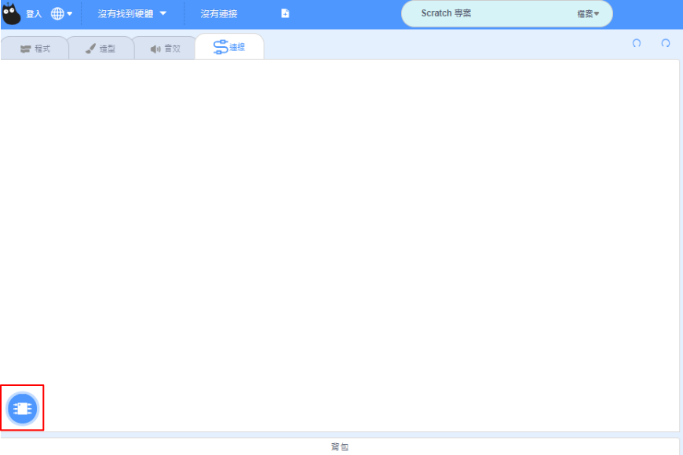

#### Select from library

You can select the components from the library.

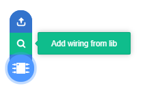

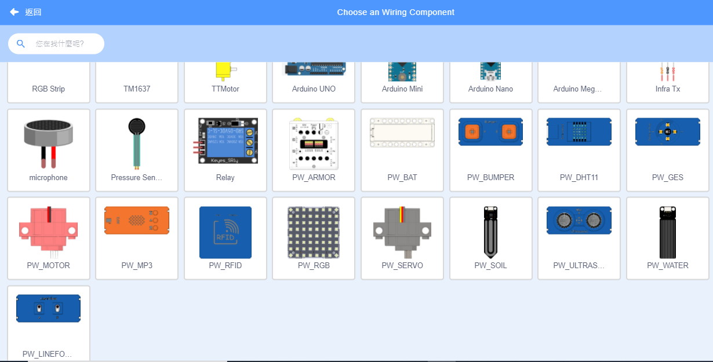

#### Upload own component

You can upload your own hardware as an image.

### 2. 硬件接線

選擇硬件之後就可以開始接線。

我們可以選擇個別硬件，調教大小、角度和位置等。

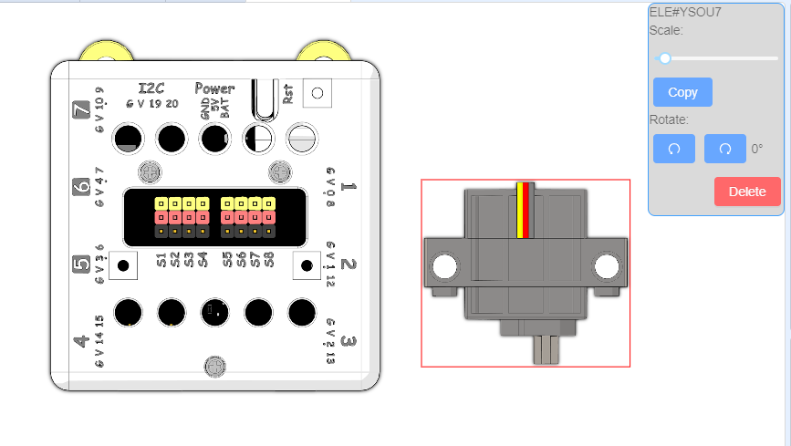

在硬件上雙擊，建立接線點。

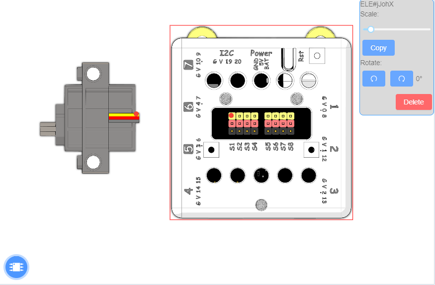

點選接線點之後我們可以更改顏色。

由接線點拖曳出線段，連接到另一個接線點。

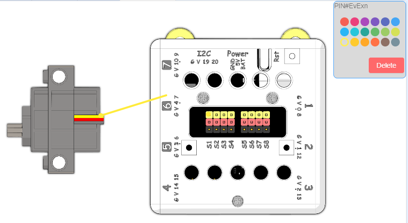

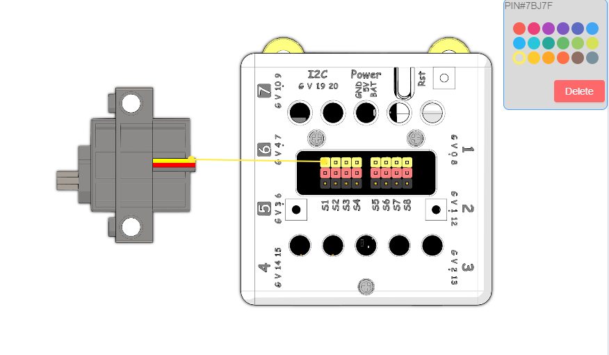

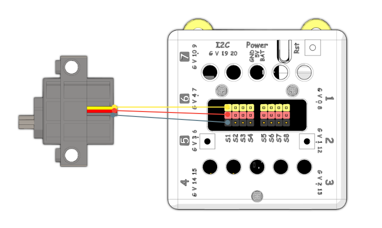

接線之後，我們可以移動硬件，接線不會因此斷開。

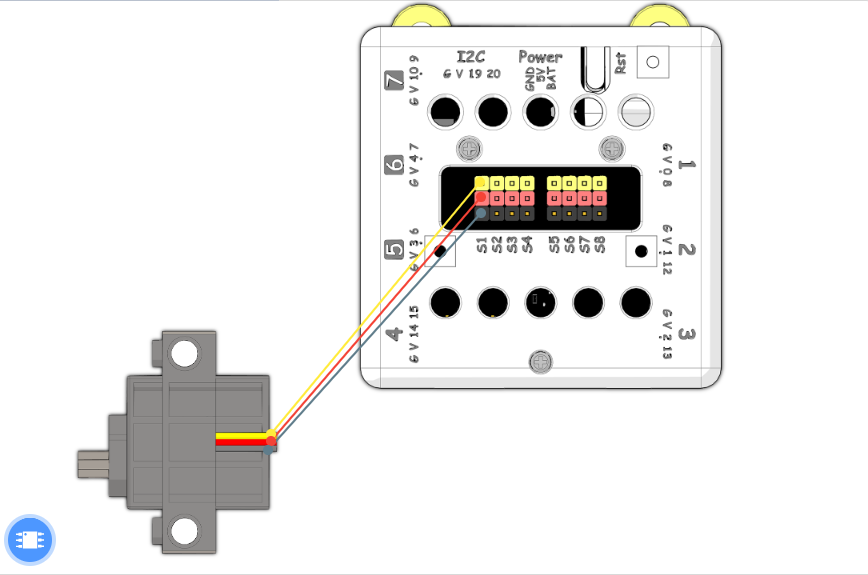

我們也可以繪製彎曲的接線。

在線段上雙擊，建立接線點。

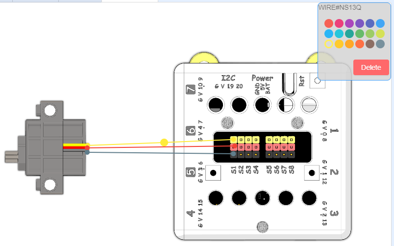

拖曳接線點，拖出曲線。

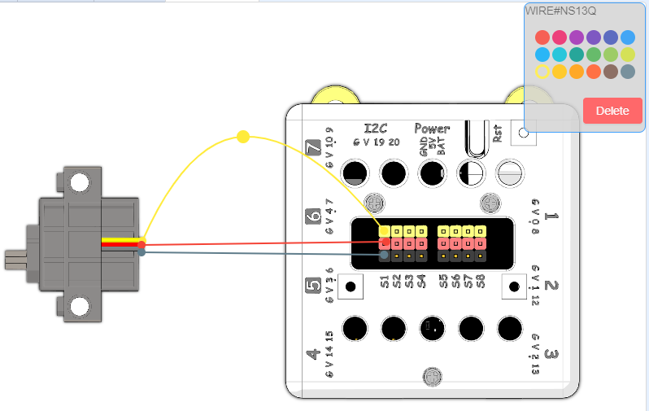