# Kittenblock Installation

KittenBlock is a programming platform developed by Kittenbot.

## Kittenblock Download

### Downloading Kittenblock:

Windows 10:

Please navigate to: [http://www.kittenbot.hk](http://www.kittenbot.hk/software/platform/), select the Windows version and click download.

MacOS:

Please navigate to: [http://www.kittenbot.hk](http://www.kittenbot.hk/software/platform/), select the MacOS version and click download.

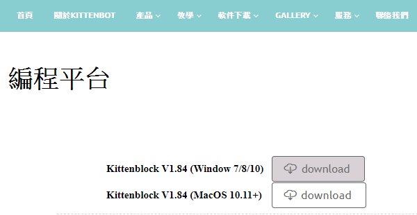  

Click this button to download the installation program.

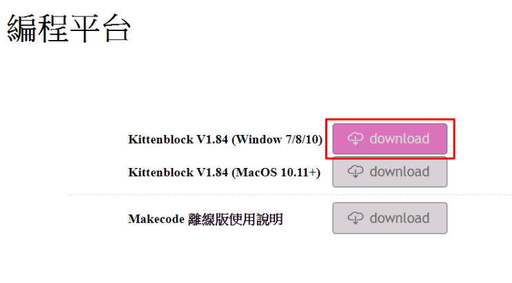 

### Installing Kittenblock:

Double Click the file to install Kittenblock.

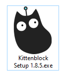  

Please allow Windows to run this program.

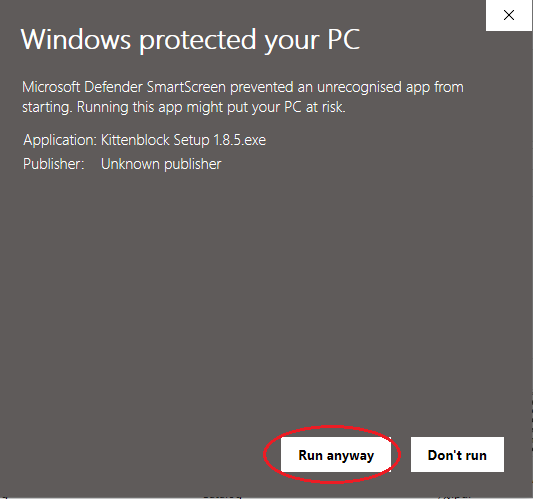

Choose a destination folder, please do not use a path with any Chinese characters to prevent problems.

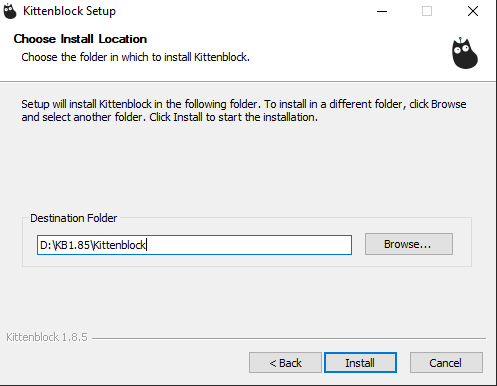

### Opening Kittenblock

Open Kittenblock.

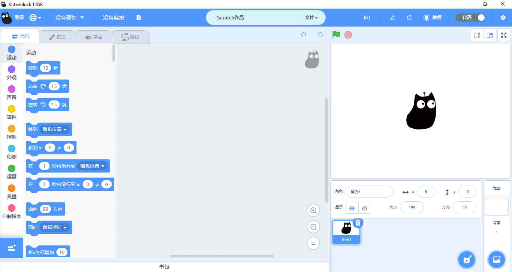

## Installing  drivers

Open the setting menu, install Microbit COM and CH340.

It may take a few minutes to install the necessary drivers.

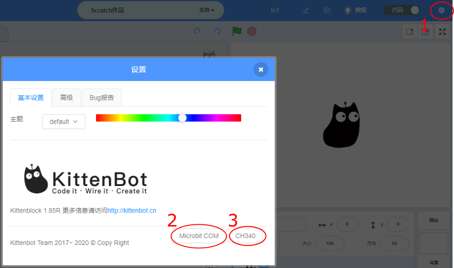

## Kittenblock Updates

As Kittenbot continues to improve Kittenblock, there maybe updates periodically.

A notice will pop up when a new update is valid.

A rocket icon would appear, click this icon to begin the update.

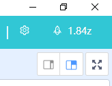

Press OK and Kittenblock will restart to complete the update.

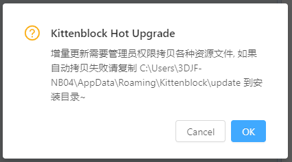

## Troubleshooting:

### 1. KittenBlock displays a white or blue screen after launching.

The user rights is not enough.

### Right click Kittenblock and click "Properties", modify the compatibilty and rights.

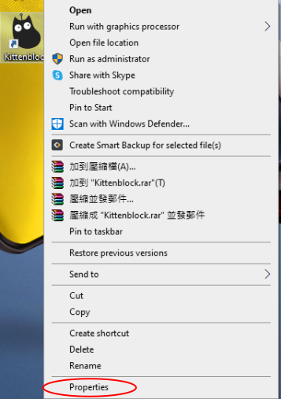

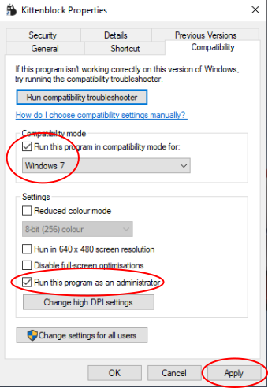

### 2. No response when installing drivers.

Kittenblock maybe restricted by system rights.

### Install the drivers manually.

Navigate to Kittenblock's directory.

For example: D:\Program Files (x86)\Kittenblock\drivers

Double click to install the drivers.

### 3. Kittenblock does not restart after updating.

Kittenblock does not have the administrator rights.

### Launch Kittenblock with adminstrator rights/

Right click and select "Run as adminstrator".

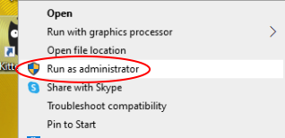