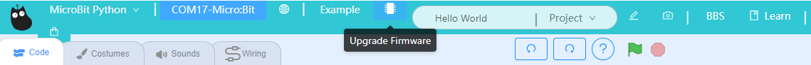
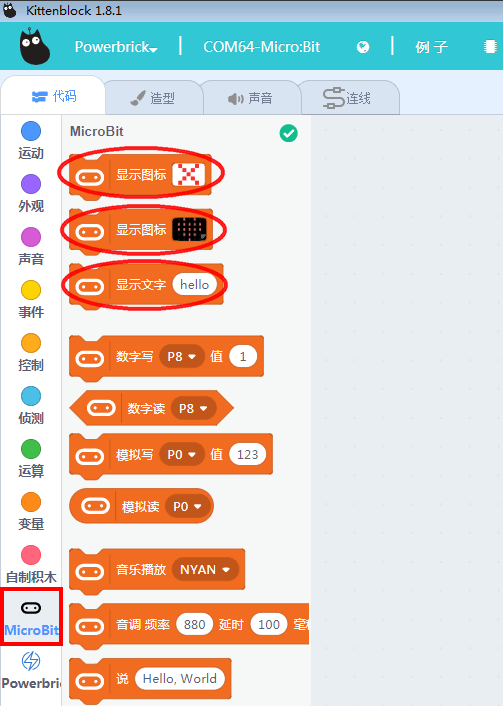
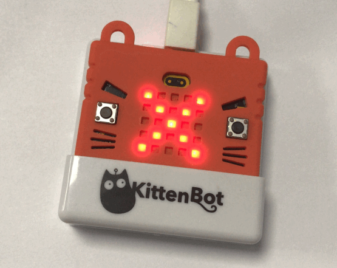

# Micro:bit & Kittenblock

Micro:bit can be used on Kittenblock.

## Using USB cable.

Connect a Micro:bit to the computer with an USB cable.

Select your hardware from the hardware menu to load the necessary extensions.

    PowerBrick is used as an example, you should choose MicroBit Python when using Robotbits.

Select "Serial" for USB connection.

Click the Exclamation Mark Icon.

Select your device and click "Connect".

Wait for a few seconds and this pop up should show.

Micro:bit should display a heart icon when connected.

If it doesn't, click upload firmware and wait for it to finish.

## Using Bluetooth Adapter

Plug in the Kittenbot Bluetooth Adapter.

Connect your Micro:bit using a USB cable.

Select Settings and choose the "Advanced Tab", enable the option for USB BLE.

    Do not forget this important step!!

Open up the hardware menu and select BLE.

    Powerbrick is used as an example only.

Press the Exclamation Mark Icon.

Connect to the Micro:bit.

Go back to the editor after it successfully connected.

Click Upgrade Firmware.

A string will appear on your Micro:bit, this is the Bluetooth ID of your Micro:bit.

You can now disconnect the Micro:bit.

Go back to the connection page.

Select your device and click "Connect".

Wait for a few seconds and this pop up should show.

Micro:bit should display a heart icon when connected.

If it doesn't, click upload firmware and wait for it to finish.

## Testing the connection

Click any blocks from the Micro:bit menu, your Micro:bit should respond immediately.

## Uploading programs

### Attention: Programs can't be uploaded under a bluetooth connection!

### Attention: Programs can't be uploaded under a bluetooth connection!

Uploading a program to your Micro:bit allows it to run the program without being connected to the computer.

Switch to coding mode by click this switch at the top right corner.

Click "Translate" to translate your blocks into Python code.

Click "Upload" and wait for it to finish.

## FAQ

1: My Micro:bit does not respond to my blocks.

Make sure the Micro:bit is connected in Kittenblock and

2: My Micro:bit cannot be found in bluetooth mode.

Make sure the bluetooth adapter is updated correctly and follow the instructions.