# Micro:bit Coding & Kittenblock

With the Micro:bit connected, programming can start.

## Kittenblock Coding Modes

There are 2 modes for coding in Kittenblock.

### 1. Online Mode

In this mode, Micro:bit is connected with Kittenblock at all times but the advantage is that the Micro:bit can react with Kittenblock in real-time. Which means Micro:bit and Kittenblock can interact with each other, allowing Micro:bit to control Kittenblock and vice versa.

All programming blocks can be used in this mode, Micro:bit and Kittenblock are able to respond to programming blocks in real-time.
 
### 2. Offline Mode

Similar to MakeCode, programs can be uploaded to Micro:bit so that it can run without being connected to the computer.

Only programming blocks that are specifically for the hardware can be used in this mode, and Kittenblock cannot interact with Micro:bit and vice versa in this mode.

Please refer to this page for more explanation on programming blocks: [Coding Blocks](../interfaceIntro/codingblocks)

## Coding Example 1: LED Matrix

#### Connect Micro:bit to the computer.

#### Online Mode

Let's make a simple program to show some icons on the Micro:bit.

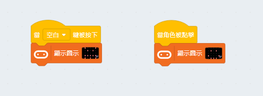

Press the spacebar or click the charater on the stage, Micro:bit will respond immediately.

As shown in this example, we can control Micro:bit via Kittenblock in Online Mode.

#### Offline Mode

Let's make a simple program to show some icons on the Micro:bit.

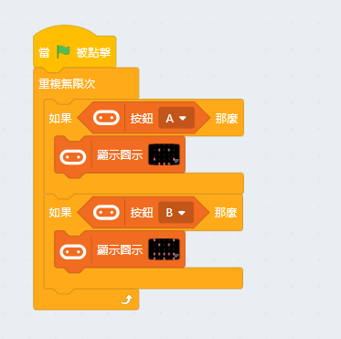

Switch to coding mode and click "Translate".

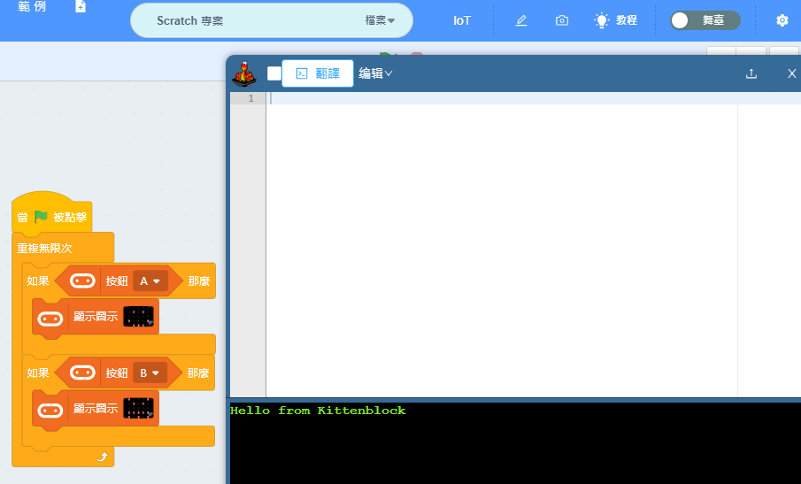

The programming blocks are translated into Python automatically, click "Upload" and wait.

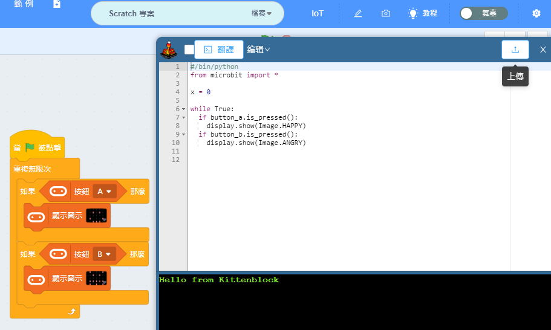

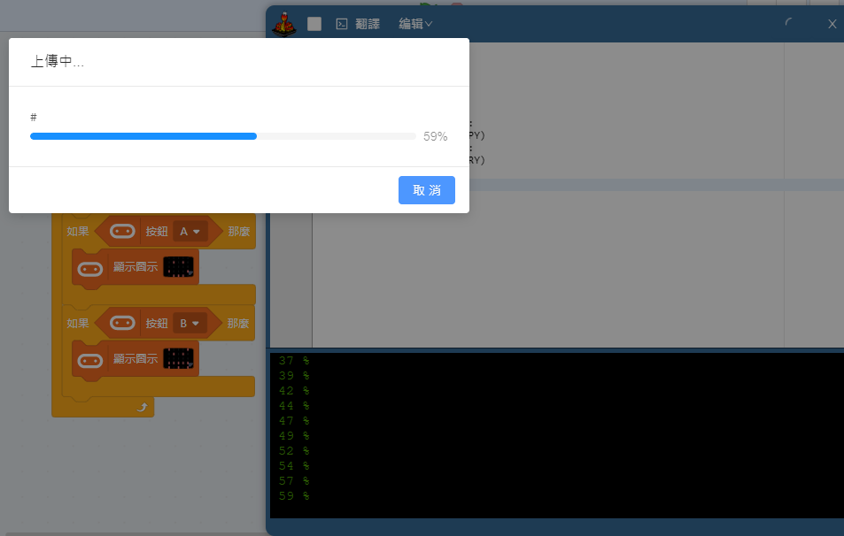

Pressing the buttons on the Micro:bit to display different icons.

Next, add the following program to make Micro:bit respond to Kittenblock.

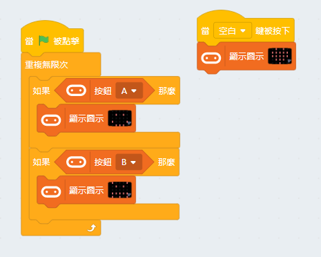

However in this case, Micro:bit does not respond to Kittenblock, this is because the program is uploaded to the Micro:bit and it is now in Offline Mode.

This shows the difference between Online Mode and Offline Mode.

## Coding Example 2: Temperature Sensor

#### Connect Micro:bit to the computer.

#### Online Mode

Create the following program to make our character tell us the reading of the temperature sensor.

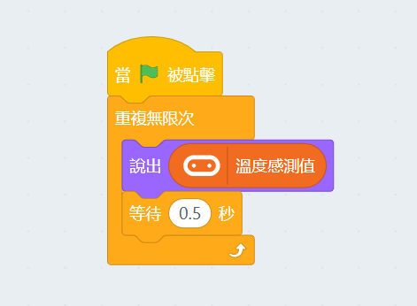

Click the green flag to activate the program.

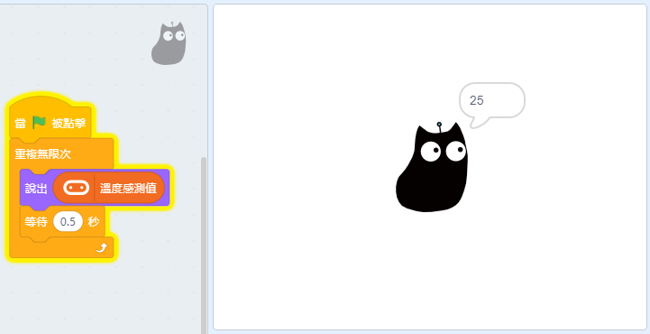

In this example, we can see that Micro:bit can also control things in Kittenblock.

#### Offline Mode

Let's try uploading the program to the Micro:bit.

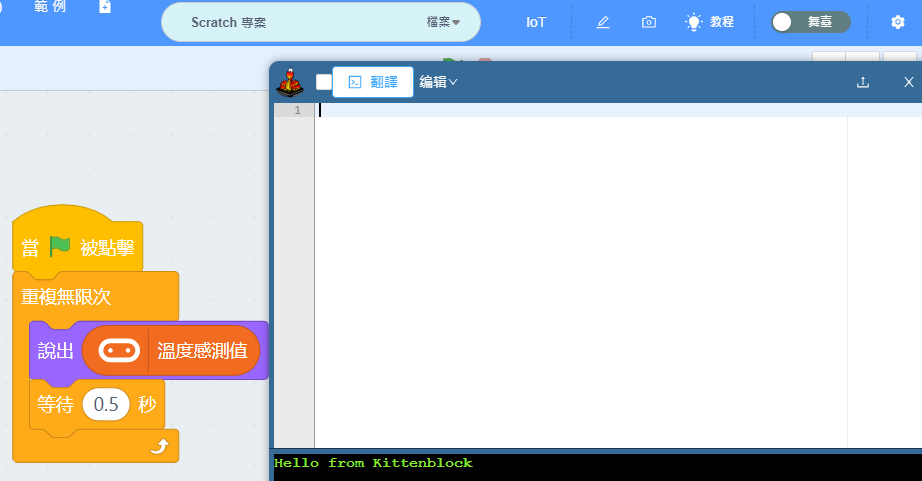

However, a warning will pop up when translating the program into Python and the incorrect blocks are highlighted in red. This is because the highlighted blocks are for Kittenblock only, and cannot be ran on Micro:bit, thus the translation would fail.

From this example we can see that for a program to be successfully uploaded to the Micro:bit, there must not be any blocks that are Kittenblock only.

Please refer to this page for more explanation on programming blocks: [Coding Blocks](../interfaceIntro/codingblocks)

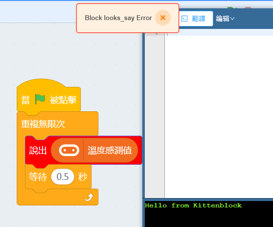

Change the highlighted block into one that Micro:bit can understand.

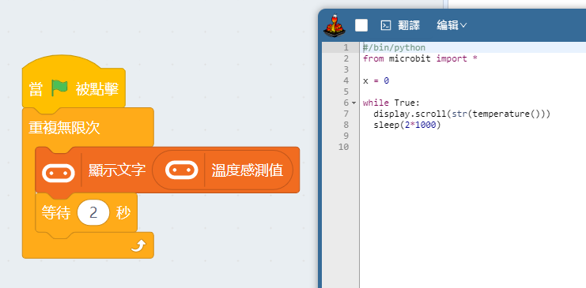

The program can be translated and uploaded to Micro:bit.

## Conclusion:

#### There are 2 programming modes in Kittenblock.

1. Online Mode
   
- Connects Micro:bit and Kittenblock, allowing interaction between the two.
- All programming blocks can be used.
    
2. Offline Mode

- Programs can be uploaded to the Micro:bit and used without being connected to the computer.
- Only blocks compatible with Micro:bit can be used.