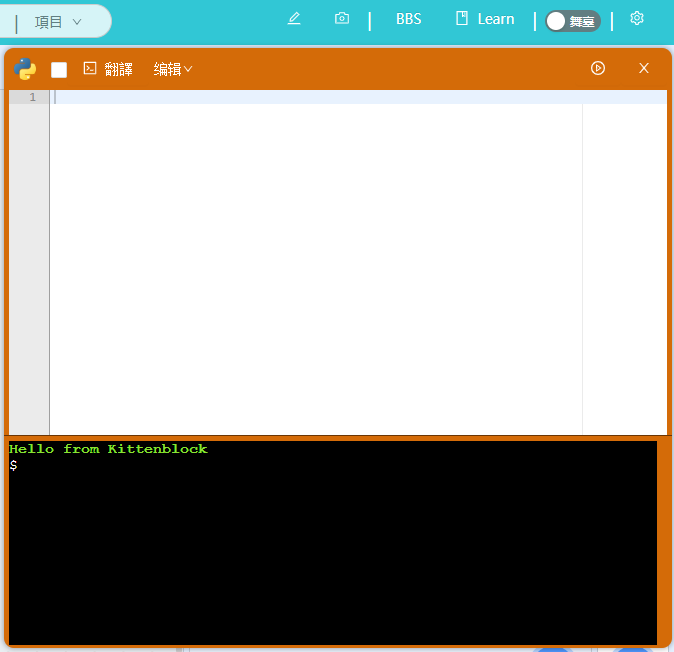
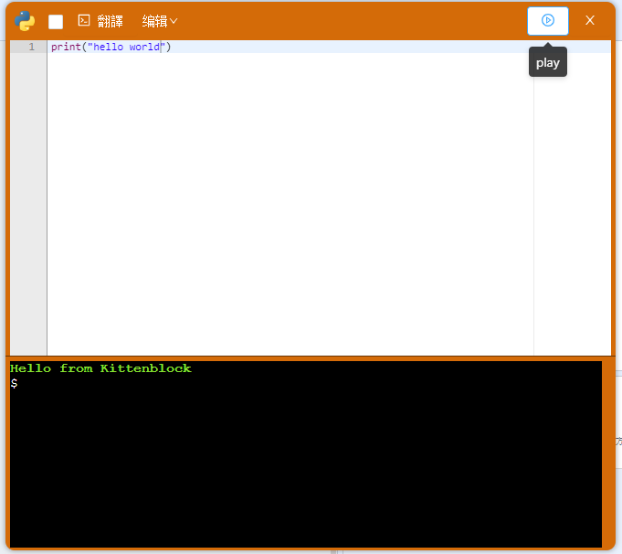
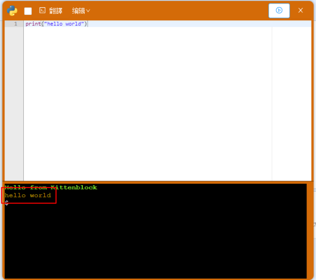
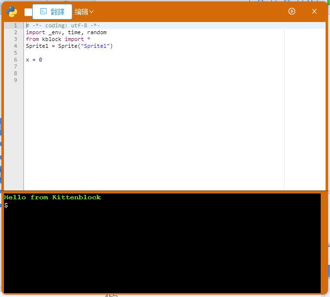
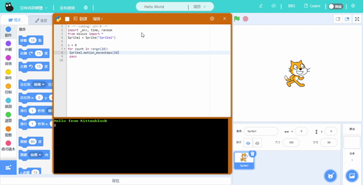

# Learning Python 3 with Kittenblock

A Python editor has been integrated into KittenBlock, while many programming blocks are powered by Python code.

If you wish to learn Python, this Python editor is a good start.

## Using the Python Editor

Read [Python Editor Interface](../kittenbot_function/kittenpython.md) to learn the interface of the editor.

Click the switch in the upper right corner to toggle Python mode.

Type in the Python code in this editor.

Click play to run the code.

## Python and Programming Blocks

The programming blocks can be translated into Python code with just one-click of a button. This can be very useful in learning the the indentations, logic or language of Python.

Python code can also be generated by directly dragging the programming blocks into the editor.

The programming results can be represented by the stage for visual feedback.

